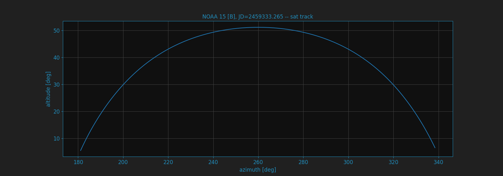
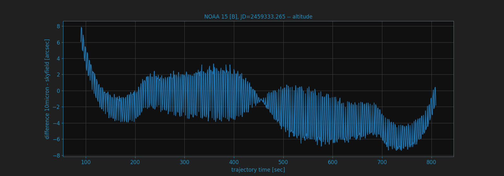
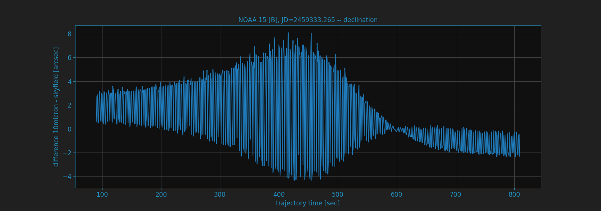
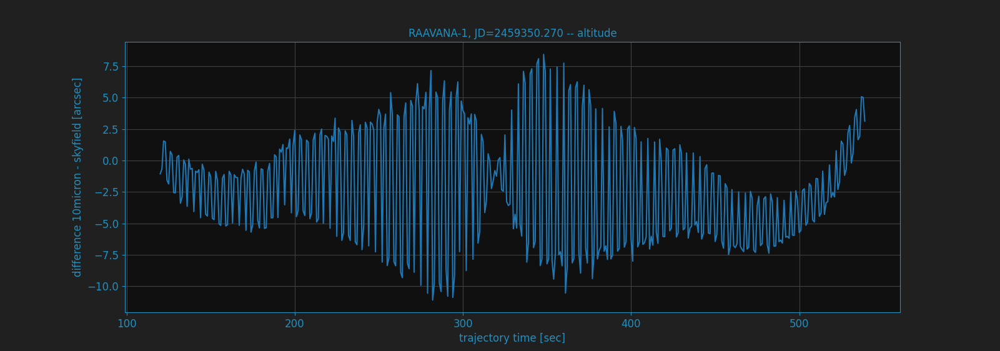
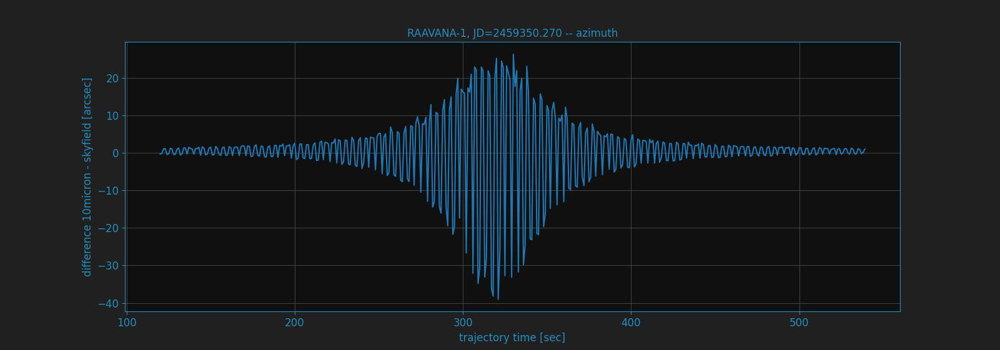
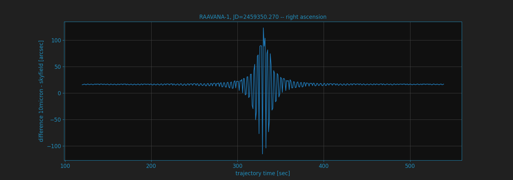
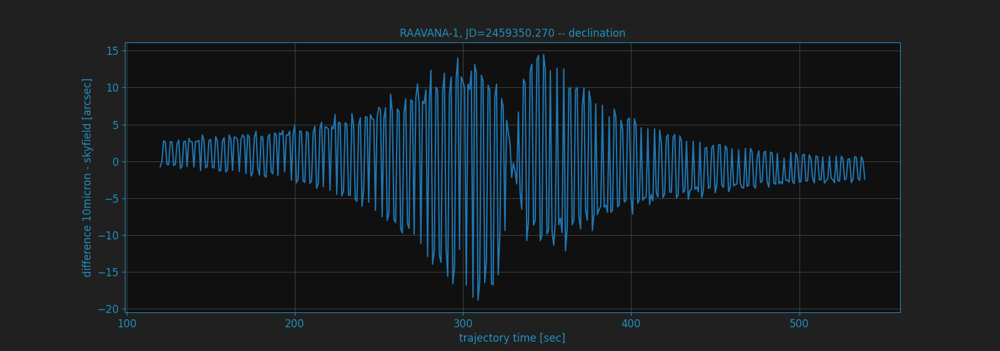

Precision of internal calculations
==================================

MountWizzard4 is using for all calculations the skyfield 
(https://rhodesmill.org/skyfield/) from Brandon Rhodes. As for the new command 
set offered with 10microns FW3.x it needs to calculate the alt/az coordinates 
for a satellite track each second for the entire track. As you would like to 
follow the as precise as possible I made some comparisons between the internal 
calculations done in 10micron mount and the results provided by skyfield.

In skyfield there is a chapter about satellite calculations and precision:
https://rhodesmill.org/skyfield/earth-satellites.html#avoid-calling-the-observe-method
Despite the fact that the observe method is expensive the difference in calculation
time for a 900 step track is on my computer 120ms (using more precise observe
method) to 7ms (using the less precise difference).

Brandon writes about it:

.. epigraph::

    While satellite positions are only accurate to about a kilometer anyway,
    accounting for light travel time only affected the position in this case by
    less than an additional tenth of a kilometer. This difference is not
    meaningful when compared to the uncertainty that is inherent in satellite
    positions to begin with, so you should neglect it and simply subtract
    GCRS-centered vectors instead as detailed above.

Here the charts for NOAA 15 [B] at julian date JD=2459333.26498 for the transit
happening. The used TLE data was:

.. code-block:: python

    NOAA 15 [B]
    1 25338U 98030A   21104.44658620  .00000027  00000-0  29723-4 0  9990
    2 25338  98.6888 133.5239 0011555 106.3612 253.8839 14.26021970192127

You could see the alt/az of the sat track.

the difference for altitude between 10micron and skyfield

the difference for azimuth between 10micron and skyfield

.. image:: image/sat_azimuth.png
    :align: center

the difference for right ascension between 10micron and skyfield

.. image:: image/sat_ra.png
    :align: center

the difference for declination between 10micron and skyfield

There is a set of plots for another satellite, which shows the same behavior. The
used TLE data was:

.. code-block:: python

    RAAVANA-1
    1 44329U 98067QE  21134.29933328  .00044698  00000-0  30736-3 0  9995
    2 44329  51.6342 100.9674 0004554 122.3279 237.8162 15.74179130108776

You could see the alt/az of the sat track.

.. image:: image/sat2_track.png
    :align: center

the difference for altitude between 10micron and skyfield

the difference for azimuth between 10micron and skyfield

the difference for right ascension between 10micron and skyfield

the difference for declination between 10micron and skyfield

For all calculations is valid:

- they are using refraction correction with the same values.

- the coordinates from 10micron are gathered with :TLEGEQJD#, :TLEGAZJD# commands

- julian date is in UTC time system

- 10micron firmware 3.0.4

- skyfield version 1.39
