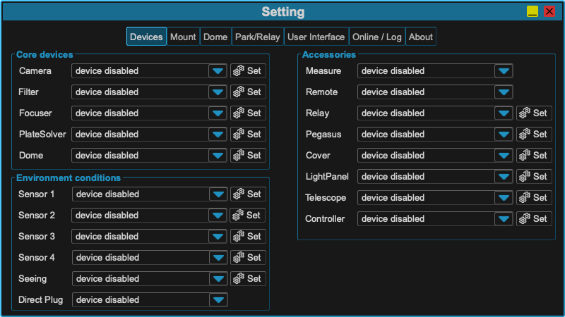
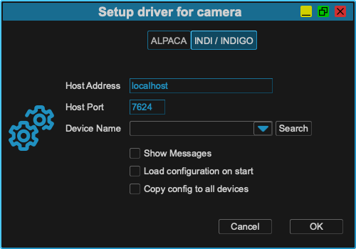
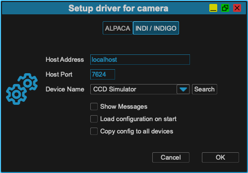
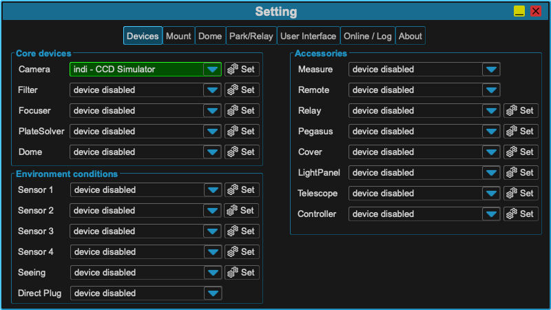
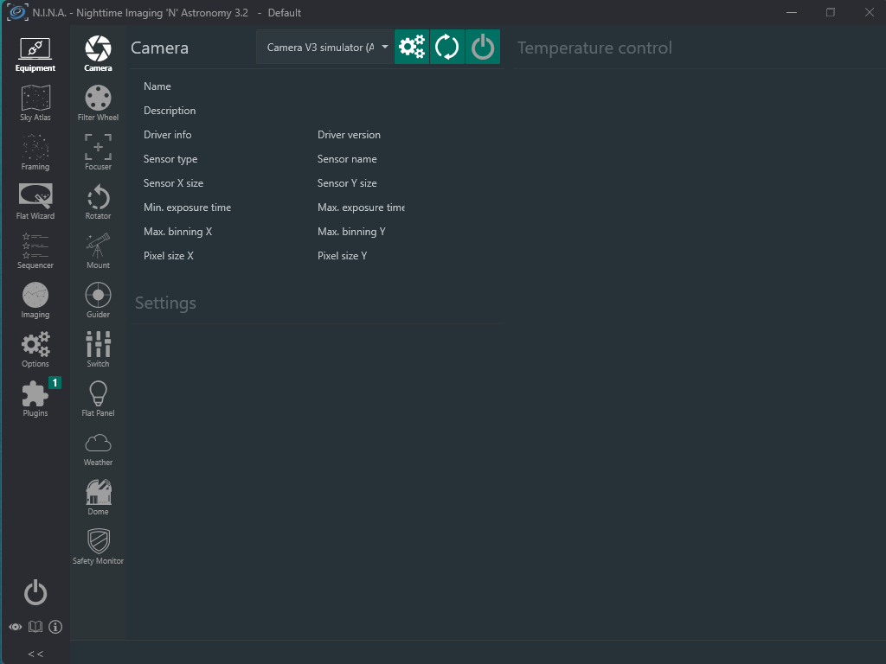
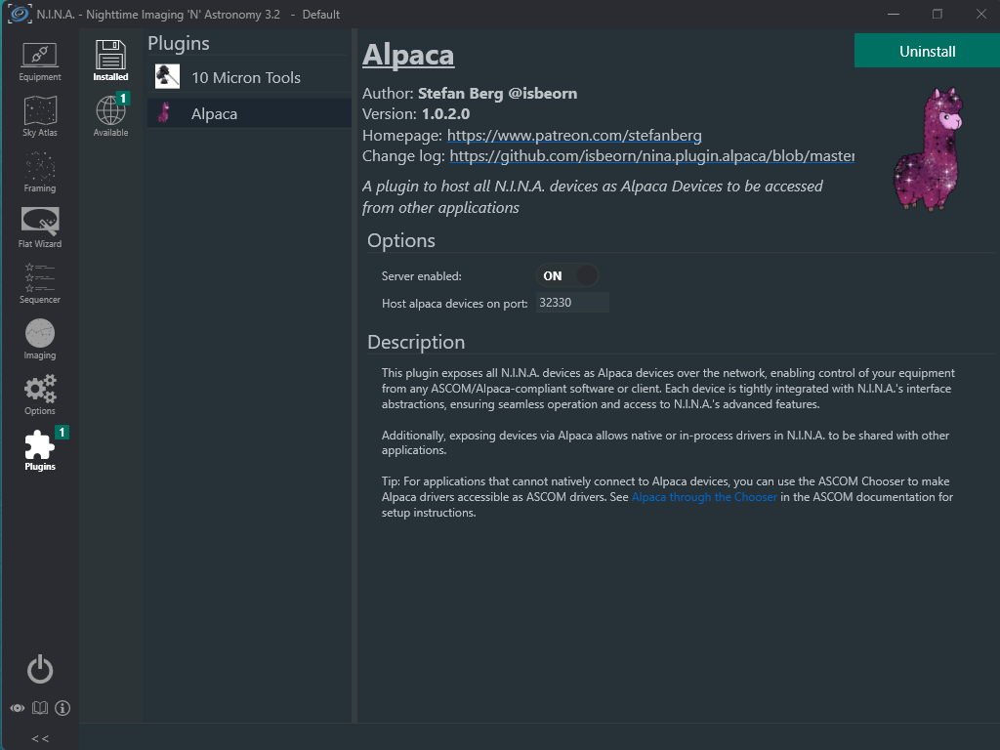
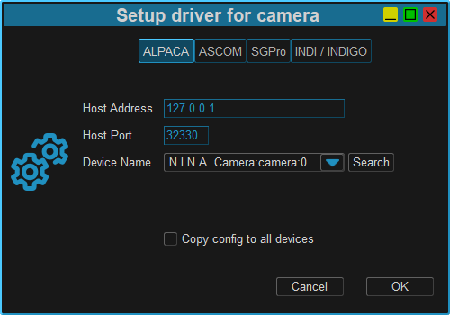
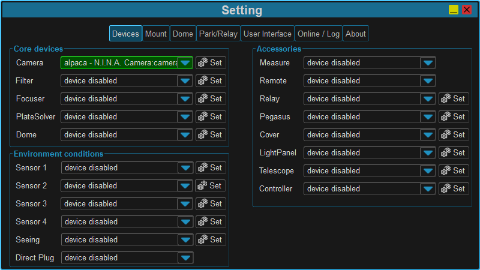

Adding the camera
=================
For adding devices like the camera select the Sett. / Conf. tab in the main menu
and there select the devices tab. For the following explanation we would like to
connect a camera, a filter and adding a link to the mount as well. The mount link
is only used for reading the parameters of the mount driver of your setup (e.g.
focal length, aperture).

In core devices select Setup für Camera. A popup shows up. Please fill in the ip
address of the INDI or ALPACA server, where your devices are connected to.

If you are using INDI, you search for INDI camera devices by clicking on the
search button. Once you finished searching by pressing OK button, a list of
available devices will be populated. From the list choose the device and finish
the setup with OK button.

The selected camera will be highlighted green in the drop down menu and in the
status as well. Once you configured the camera, the selection list will be stored
for later use. If you want to disable the camera, please select device disabled
in the menu.

MountWizzard4 will now try to connect to the device and show green light
whenever a connection is established.

Do the steps 1 - 5 for all devices you need to configure. All configuration are
save when leaving MountWizzard4 with Save/Quit button or just when saving the
profile. You can add or change any config later on at any time.

Using N.I.N.A. as device
------------------------
please install the ALPACA plugin for N.I.N.A. and enable it. This will allow
you to use N.I.N.A. as a device in MountWizzard4. Beside the camera you could
also use other devices than cameras, e.g. filter wheel, focuser, dome as well.

Alpaca plugin for N.I.N.A. is available.

Please enable the plugin and configure the port for the Alpaca server. The
default port is 11111. but you could choose it freely. Please note that the port
must be the same as in MountWizzard4 an need to be entered in the camera setup
as well. The IP address of the computer running N.I.N.A.

After closing the setup window, the N.I.N.A. device in the camera setup should be
available:

