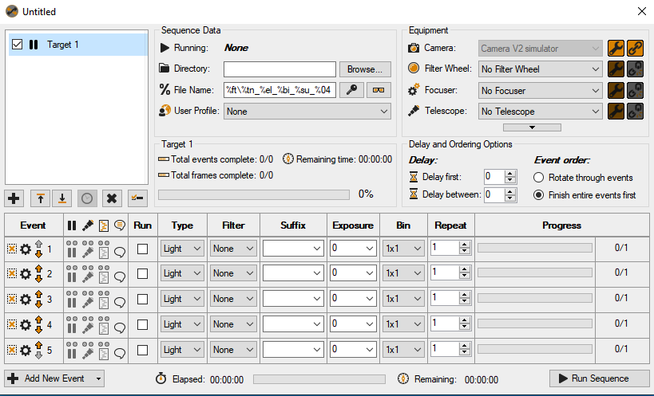
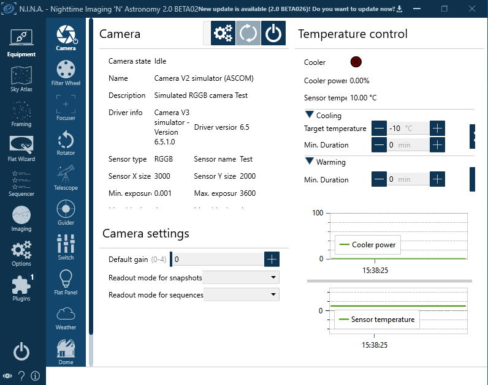

Adding the camera
=================
For adding devices like the camera select the Sett. / Conf. tab in the main menu
and there select the devices tab. For the following explanation we would like to
connect a camera, a filter and adding a link to the mount as well. The mount link
is only used for reading the parameters of the mount driver of your setup (e.g.
focal length, aperture).

In core devices select Setup für Camera. A popup shows up. Please fill in the ip
address of the INDI or ALPACA server, where your devices are connected to.

.. image:: image/camera_02.png
    :align: center
    :scale: 71%

If you are using INDI, you search for INDI camera devices by clicking on the
search button. Once you finished searching by pressing OK button, a list of
available devices will be populated. From the list choose the device and finish
the setup with OK button.

.. image:: image/camera_03.png
    :align: center
    :scale: 71%

The selected camera will be highlighted green in the drop down menu and in the
status as well. Once you configured the camera, the selection list will be stored
for later use. If you want to disable the camera, please select device disabled
in the menu.

MountWizzard4 will now try to connect to the device and show green light
whenever a connection is established.

Do the steps 1 - 5 for all devices you need to configure. All configuration are
save when leaving MountWizzard4 with Save/Quit button or just when saving the
profile. You can add or change any config later on at any time.

Using SGPro or N.I.N.A. as camera
---------------------------------
In addition to the standard frameworks to interface to devices, MountWizzard4
could use Sequence Generator Pro (SGPro) an Nighttime Imaging (N.I.N.A.) as a
camera driver for devices attached to them. Unfortunately they support only a
minimum set of devices through their API and only with a limited feature set.
But the provided basic API is sufficient to do the modeling job.

.. note:: MountWizzard4 uses all necessary data from the FITS of the images
          taken by the external apps. Please make sure, that the FITS header
          contains this information, especially the focal length, the pixel
          size. Otherwise plate solving will fail. As both applications do not
          transfer their images to MountWizzard4, you have to ensure that the
          FITS files are stored on your local disk and MountWizzard4 has access.

Basically MountWizzard4 interface these apps in two different modes:

- App controlled mode
- MountWizzard4 controlled mode

In App controlled mode, selection and connecting the devices have to be done
manually in the regarding application. MountWizzard4 just recognizes of a device
is connected or not and if connected uses it as is.

In MountWizzard4 controlled mode you could do a selection from all device the
application offers. Once selected, MountWizzard4 will enforce the application to
switch to the desired camera and tries to connect automatically to it.

App controlled mode in SGPro
----------------------------
First in camera driver setup you choose to use the SGPro controlled mode:

.. image:: image/driver_sgpro_controlled.png
    :align: center
    :scale: 71%

You recognize the setting in device tab:

.. image:: image/imaging_sgpro_controlled.png
    :align: center
    :scale: 71%

Once you connect a camera in SGPro

the status in MountWizzard4 will change to connected as well.

MountWizzard4 controlled mode in SGPro
--------------------------------------
If search for devices first in camera driver setup menu, you will get a list of
available cameras you could choose from. Please select one and accept selection.
In driver tab you will see the selected camera and MountWizzard4 tries to switch
to this camera and connect automatically to it.

.. image:: image/imaging_sgpro_connected.png
    :align: center
    :scale: 71%

App controlled mode in N.I.N.A.
-------------------------------
First in camera driver setup you choose to use the N.I.N.A. controlled mode, you
recognize the setting in device tab:

.. image:: image/driver_nina_controlled.png
    :align: center
    :scale: 71%

Once you connect a camera in N.I.N.A.

the status in MountWizzard4 will change to connected as well.

MountWizzard4 controlled mode in N.I.N.A.
-----------------------------------------
Similar to SGpro.

.. image:: image/imaging_nina_connected.png
    :align: center
    :scale: 71%

