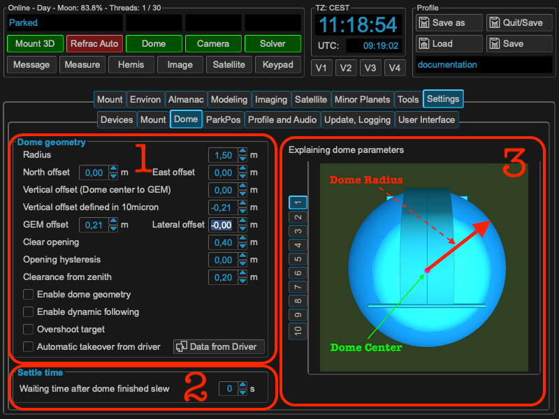
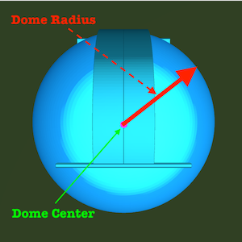
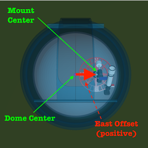
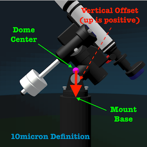
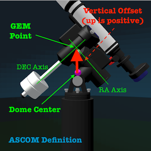
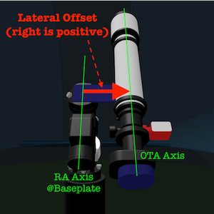
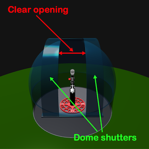
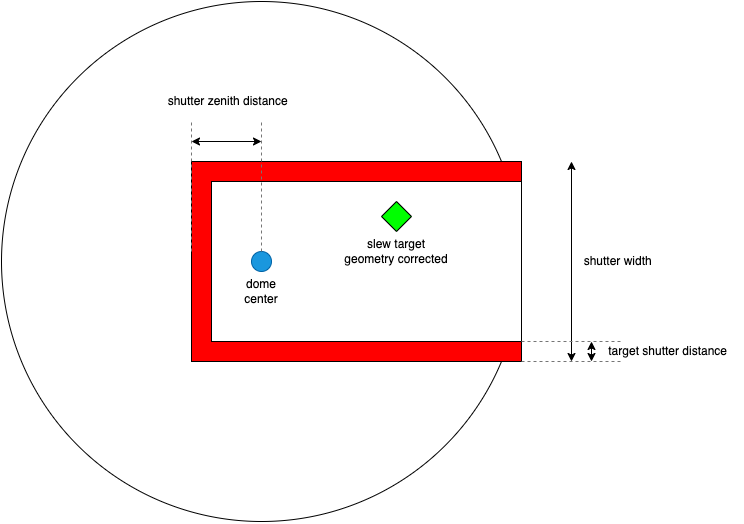
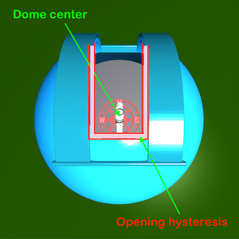
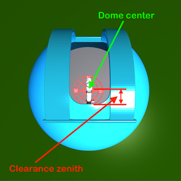

Configuring dome geometry
=========================
If you using dome, you should set up the parameters to get a good
performance of the slew calculations. To use the calculations, please check the
"Enable dome geometry offset calculations". If checked, MW4 will calculate th
correct dome azimuth in relation to the desired target of the mount. It take the
pierside already into account, so you could slew mount and dome at the same time.

Area 1: dome geometry parameters
--------------------------------
I this section the geometry parameters of the dome and mount in relation to the
dome are set. The dome center - the center point of the dome hemisphere - is
always the reference point from where the measurements are taken. All measure are
in meters. It starts with the radius

followed by the displacement of the mount in north and east direction. A
displacement to the north is treated positive as well as a displacement to
the east.

.. image:: image/north.png
    :align: center

For the vertical displacement you have to take car about different definitions of
how to measure this value. A common way many ASCOM drivers do is measuring the
distance between the dome center and the GEM point of the mount. The GEM point of
the mount is the intersection of the RA and DEC axis. Ideally you will have that
point fitting to the dome center. In the 10micron handbook, the measurement is
done between the dome center and the base of the mount. This value is mostly
negative, because the mount base level is on lower height than the dome center.

If you have mor than one telescope mounted, you will experience a lateral
displacement of the OTA you would like to use for reference. The measurement is
taken from base plate of the mount to the OTA axis. Displacement to the right
(east) is treated positive.

Area 2: dome shutter
--------------------
If you have a dome driver setup, MW4 could open and close the shutter.
Last, but not least the dome shutter width for calculating the open FOV of the
telescope.

Area 3: dome geometry help
--------------------------
As geometry parameters are difficult to remember, MW4 will show you a short
explanation picture of the parameter you are currently changing.

Area 4: dome settle time
------------------------
With the dome settle time you define the waiting time from reaching the target
azimuth until the dome emits slew finished. This could be used for avoiding
mechanical influence on the mount. This settle time in handled in MW4 only. If
you could enter a settle time in your dome driver etc. the times will add up.

Dome dynamic follow
-------------------
For satellite tracking moving the dome adequately is very important. If you have
following on your dome controller, you might have set a hysteresis to avoid
continuous dome movements. These values normally are between 1 and 3 degrees.
MW4 could handle this different. If you set your dome geometry correctly, you
could add parameters for target shutter distance (better terminus ???) and shutter
zenith distance (better terminus ???). With these parameters MW4 will calculate if
the viewing spot of you telescope moves with the next slew command in the "red
zone". If so, the dome azimuth will be corrected and the dome will slew to it's
new centered position. If there is still a reasonable distance, your telescope
still could view your target and no dome movement is necessary.

.. hint:: See also on youtube: https://youtu.be/ZmDz-rtvFzc

Top view of your dome setup:

