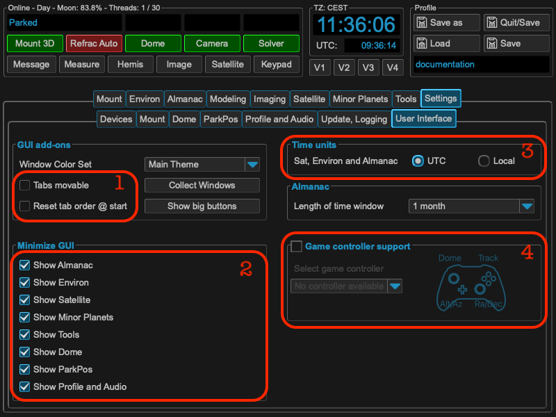
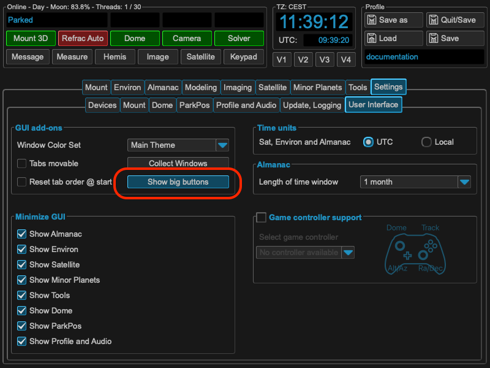
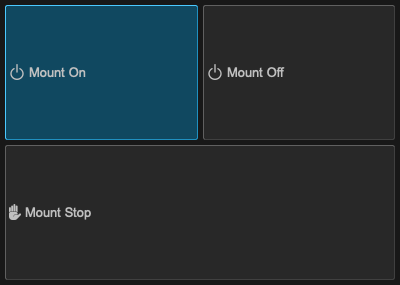

Configuring GUI
===============
The GUI of MountWizzard4 could be configured to your needs in many ways. You
could reorder your tabs (1) or disable not needed menu parts to get a much
simpler interface (2)

Depending on your usage, all times could be display in local time or in UTC
(3). In addition for some functions you could add a game controller to move
your mount (4).

If you ar using a touch based system, the main GUI elements could be shown in a
separate window.

You open this window by clicking on the "Show big buttons"
button.

