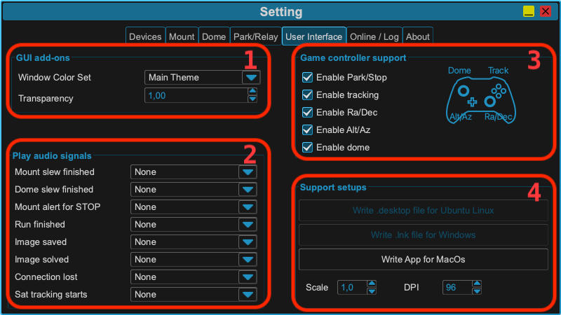

GUI adaptations
===============
The GUI of MountWizzard4 could be configured to your needs in many ways. You
could set your theme (1) or to setup audio signals (2) for some events. There
is also a game controller support to move your mount (3) and you write standard
setup files for your used OS (4).

