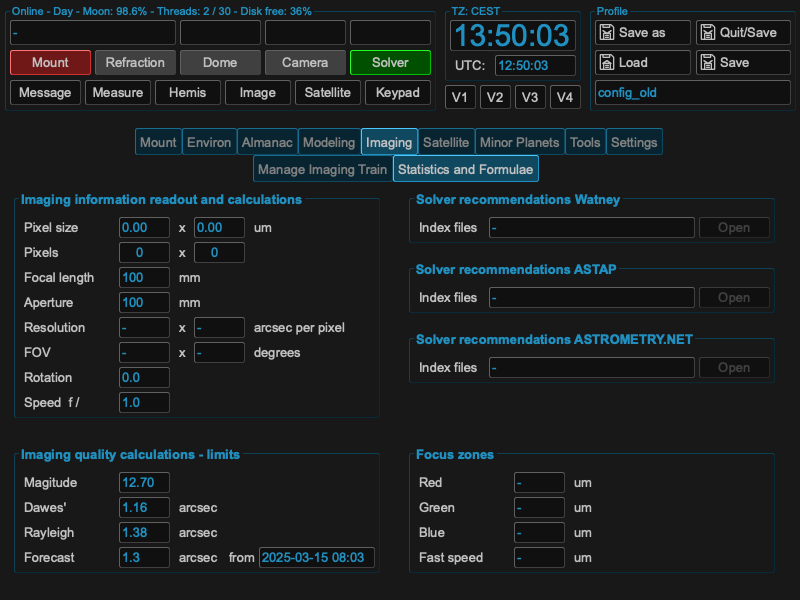
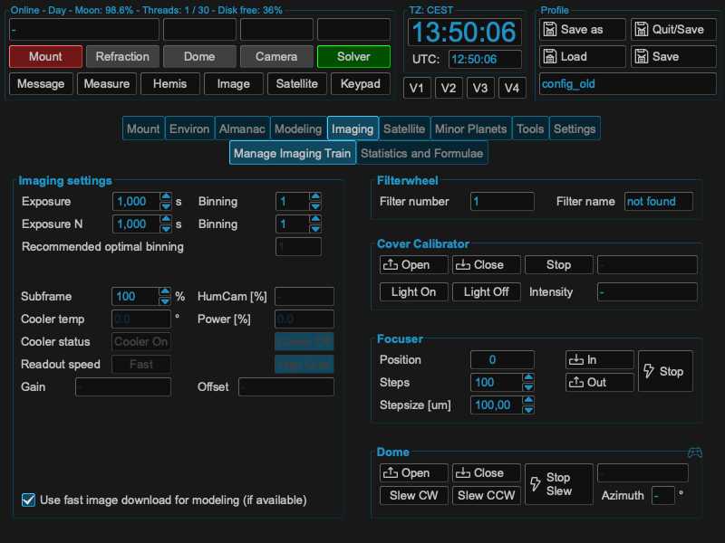

Imaging setup
=============
For setting up your imaging configuration, you have to enter the following
parameters or ensure that these are set correctly: pixel size, pixel count, focal
length, aperture. If you have some glitches there, plate solving will not work
afterwards in the process. You could check the parameters in the following page:

In addition MountWizzard4 allows you to control some devices related to imaging
once they were configured in the device manager:

For exposure control you could set the following parameters: exposure time,
binning, subframe, gain, offset. Please take into account that the exposure time
and binning is split for cyclic exposures (ExposureN) and single ones. The Gain,
Offset ans some more control only appear enabled if the driver and device allows
accessing them.