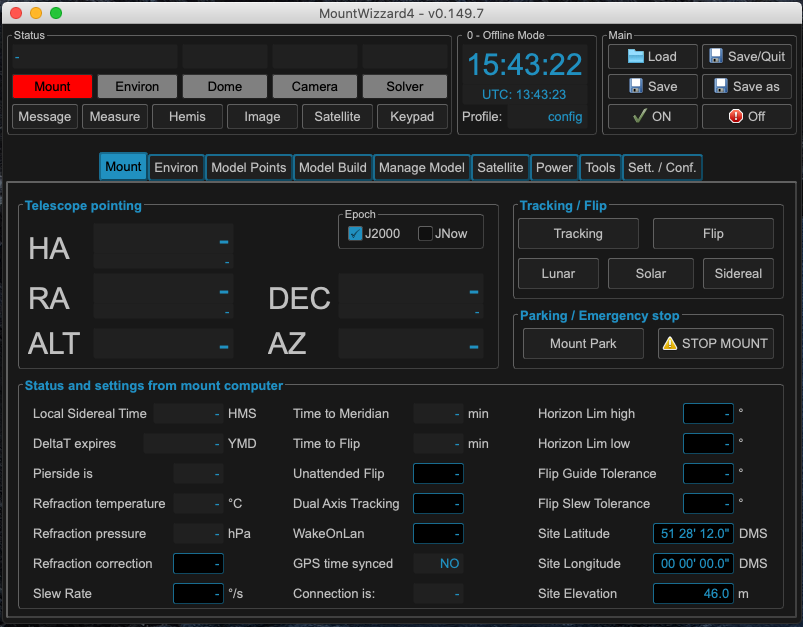
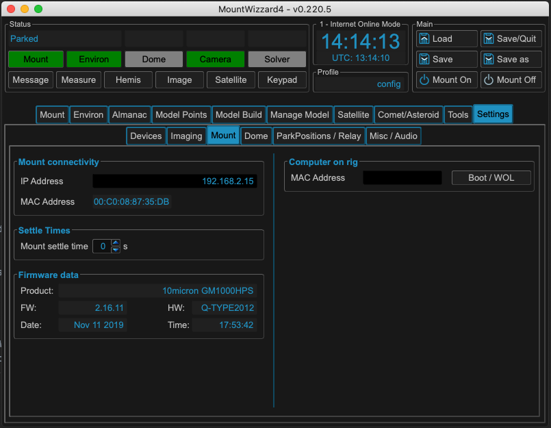
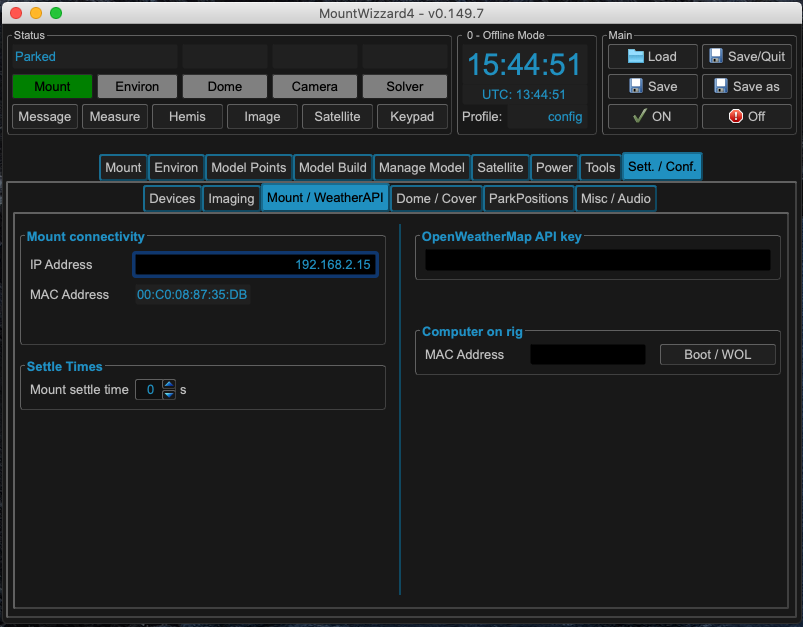
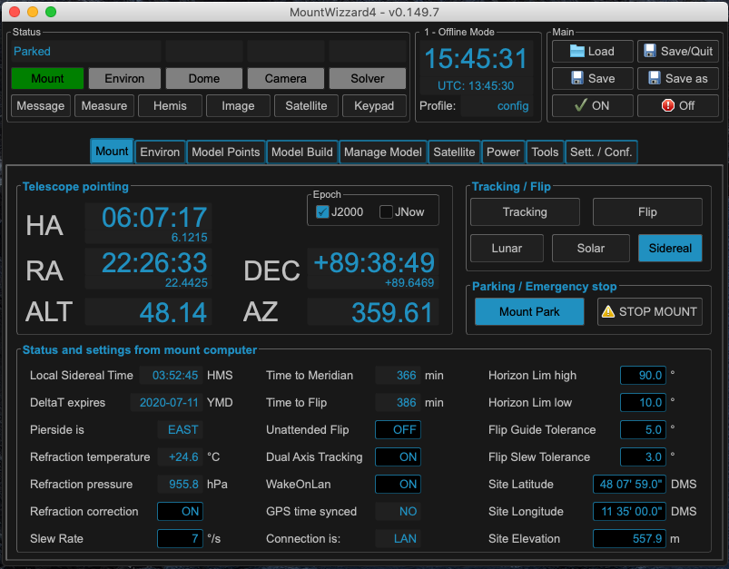
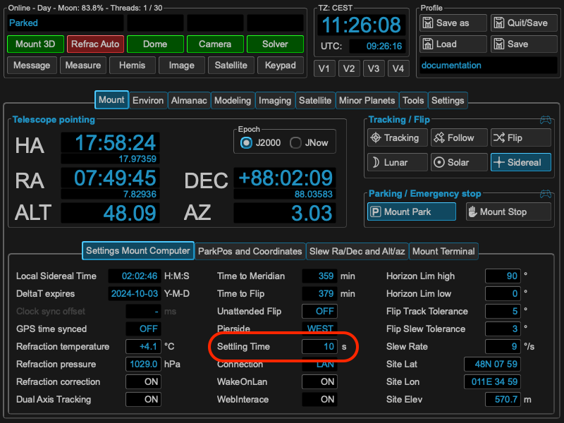
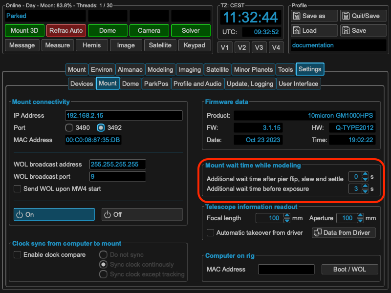

Mount basic connectivity
========================

With the first start you have a clean installation. First step should be to enable
the mount connectivity.

In the Sett./Conf. tab goto Mount / WeatherAPI and enter under Mount connectivity
the IP address of you mount. Boot the mount manually and wait until the mount
computer is ready.

MW4 will show for Mount connection a green light and enters the MAC Address for
remote boot via wake-on-lan (WOL).

You should go to the main tab back and select the Mount tab and enable WakeOnLan
in the menu.

All configuration are save when leaving MW4 with Save/Quit button or just when
saving the profile. You can add or change any config later on at any time.

.. toctree::
    :maxdepth: 2

    settlingTime

Settling Time / Waiting Time
============================

To accommodate several different use cases MountWizzard4 implements additional
waiting times to the core settling time, which is implemented and user directly
from the mount computer. The following image shows the setting of this parameter,
which could be also set and altered through 10micron tools.

This settling time is valid for all slews and movements of your mount once set.
Please have a look to the 10micron spec where this behaviour has to be taken into
account. Nevertheless for the modeling part MountWizzard4 add two more parameters
as the modeling process need heavy movement of the mount. Therefore MountWizzard4
call  these parameters not settling time but waiting time. These parameters could
be  set under the mount parameters:

The working principle is as follows: MountWizzard4 initiates a slew. This
command is run by the mount computer and takes the internal settling time into
account. This means after the mount came to physical stop, the mount computer
will send the signal slew finished after this time period (upper image). This is
the case in all used cases and will applied also during modeling process.

For the modeling process MountWizzard4 **adds** a waiting time before moving
on after slew, which means waiting the addition set time before starting a next
exposure (you know that MountWizzard4 runs asynchron for slew, expose and plate
solve to improve speed). The wait is only applied during the modeling process.

Furthermore MountWizzard4 will differentiate if the mount starts and stops on
the same pierside or if the was a meridian flip of the mount. For both cases you
could set the waiting time.