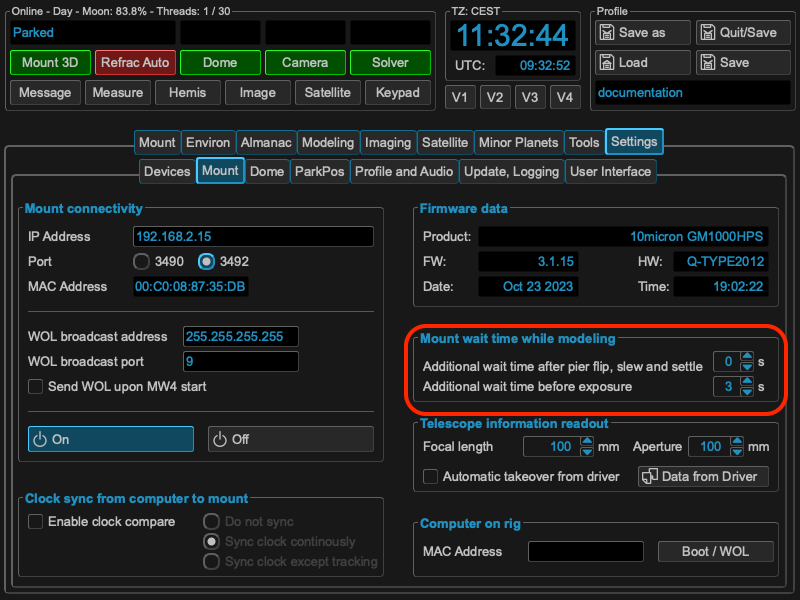

Settling Time / Waiting Time
============================

To accommodate several different use cases MW4 implements additional waiting
times to the core settling time, which is implemented and user directly from the
mount computer. The following image shows the setting of this parameter, which
could be also set and altered through 10micron tools.

.. image:: image/mountSettlingTime.png
    :align: center

This settling time is valid for all slews and movements of your mount once set.
Please have a look to the 10micron spec where this behaviour has to be taken into
account. Nevertheless for the modeling part MW4 add two more parameters as the
modeling process need heavy movement of the mount. Therefore MW4 call these
parameters not settling time but waiting time. These parameters could be set
under the mount parameters:

The working principle is as follows: MW4 initiates a slew. This command is run by
the mount computer and takes the internal settling time into account. This means
after the mount came to physical stop, the mount computer will send the signal
slew finished after this time period (upper image). This is the case in all used
cases and will applied also during modeling process.

For the modeling process MW4 **adds** a waiting time before moving on after slew,
which means waiting the addition set time before starting a next exposure (you
know that MW4 runs asynchron for slew, expose and plate solve to improve speed).
The wait is only applied during the modeling process.

Furthermore MW4 will differentiate if the mount starts and stops on the same
pierside or if the was a meridian flip of the mount. For both cases you could set
the waiting time.

