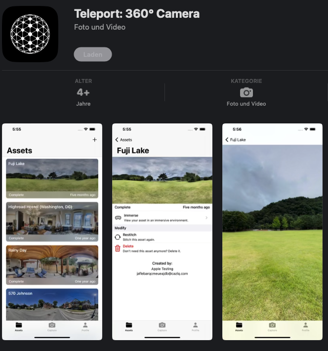
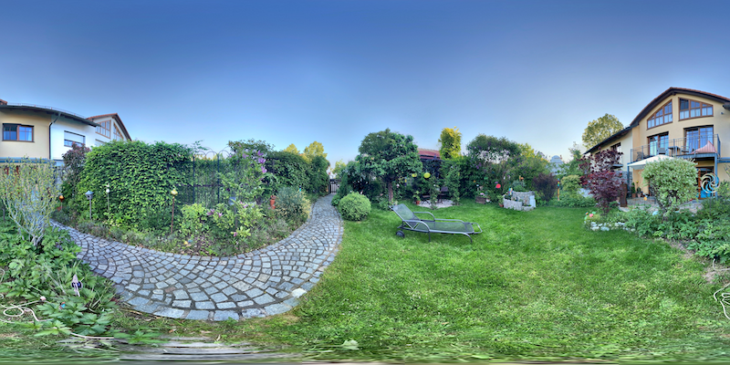
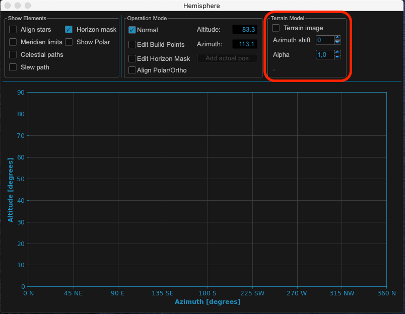
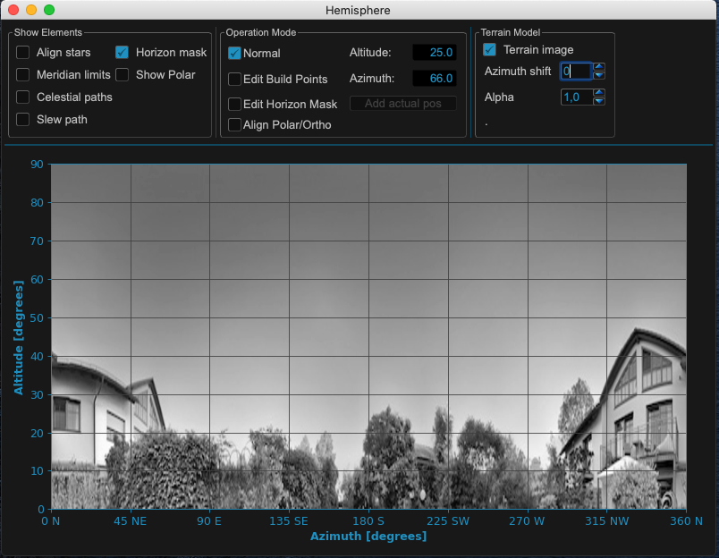
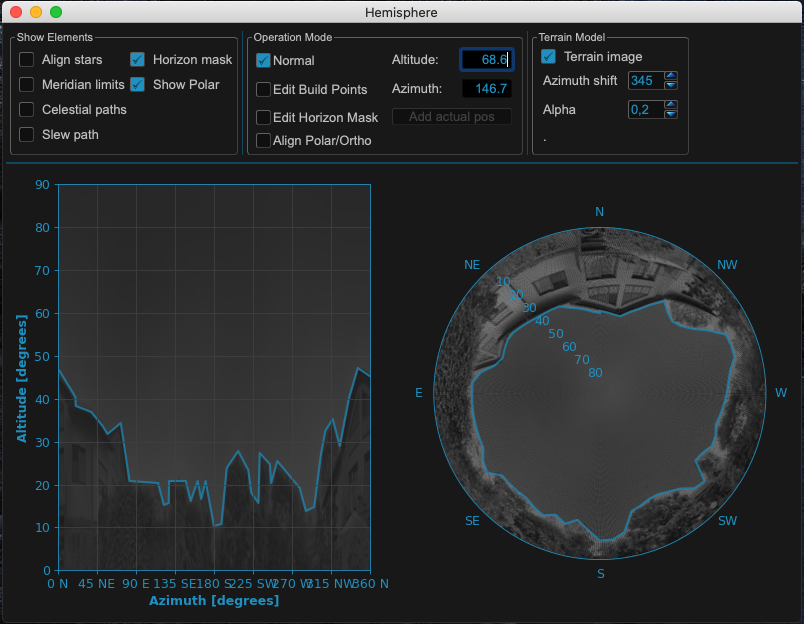
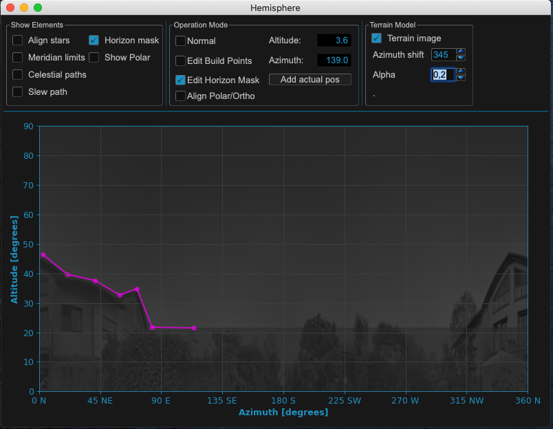

Terrain image & horizon mask
============================
For an optimal use of model points, slew path etc. it is necessary to define a
horizon mask for the use in MountWizzard4. There are several way to define and
use a mask based on your actual environment

.. hint:: See also on youtube: https://youtu.be/EqDNNMNMS0w

Using terrain image from Teleport: 360 app
------------------------------------------
Please use Teleport: 360 app to generate a 360 degrees image around your mount
rig. You can save as a .jpeg then rename it to terrain.jpg. I then had to adjust
the azimuth paying attention to high points using compass readings.

If you finished the image and transferred it to you computer it might look like:

Please put this image to you config dir in your MountWizzard4 working folder.
The file format output from streetview is 4096 X 2048 pixel color as JPG. The
horizon for altitude 0 degree cuts the image in an upper and lower half.
MountWizzard4 uses only the upper half of the image as it expects the image to
be taken at the height of the horizon line.

.. note:: The image file has to be named to: **terrain.jpg** and should be in
          JPG format.

MountWizzard4 will use the image as greyscale image. You could play around how
you prepare the image before you copy it to the config directory. Good ideas of
improving the image are: make the sky transparent, equalize gamma / lightness
settings to avoid highlights in the image, etc. Once you open the hemisphere
window you see the setups for the terrain background.

After **use terrain** is checked and a terrain.jpg image is available in config
directory, the image will be shown as background of hemisphere.

The image will also show up in polar diagram!

Two adjustments could be changed to make the image fit for use: Most important
the azimuth adjustment.

* You shift the image by a number of degrees (0 - 359) to get your image fit to
  the cardinal points of the hemisphere.
* You could change the alpha channel of the image to get a nice view on your
  screen.

Then you could add the horizon mask quite easily:

.. note:: The horizon line (altitude = 0) is set within streetview. Please try
          to shoot the image at the height of your mount to make it fit. Still
          there might be some deviations from "real life".

.. warning:: All calculations which respect a horizon mask reference to a given
             mask not the image itself. So even if you have an image set, you
             need to define horizon mask points!
