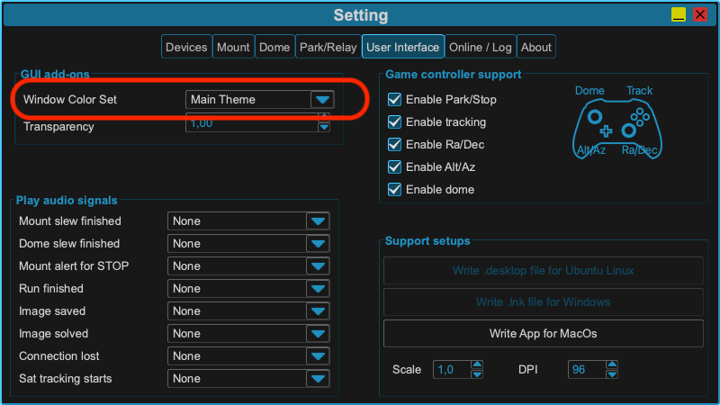
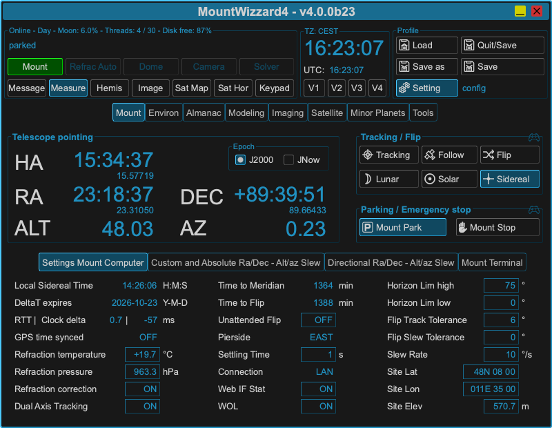
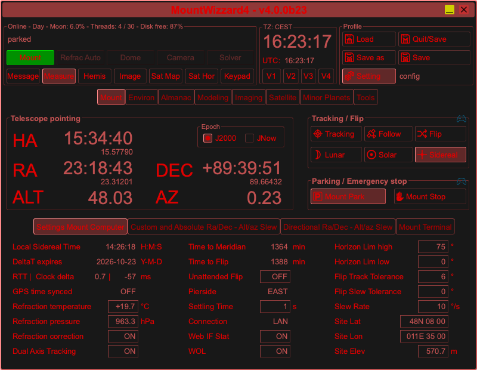
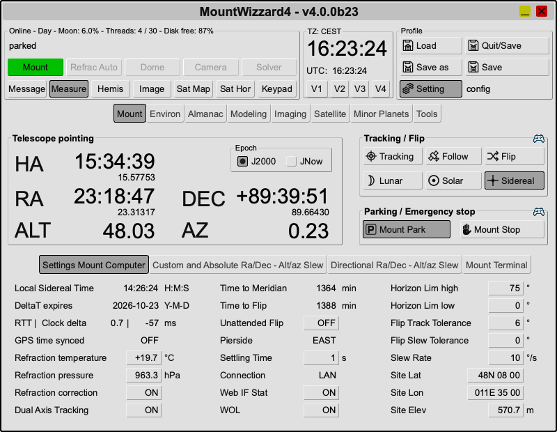
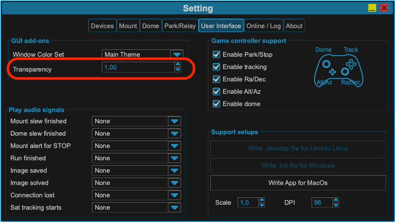
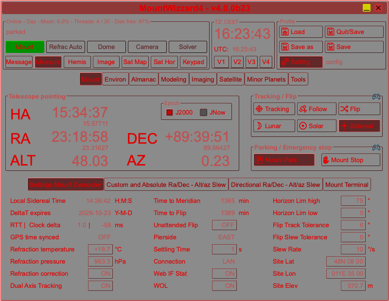
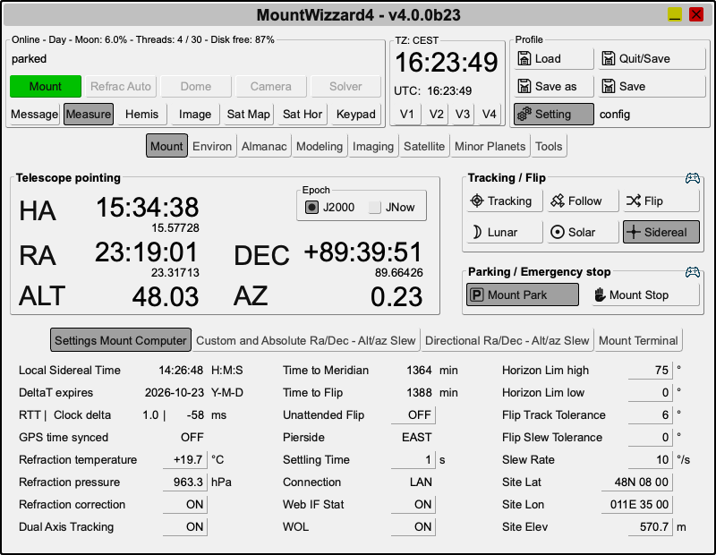
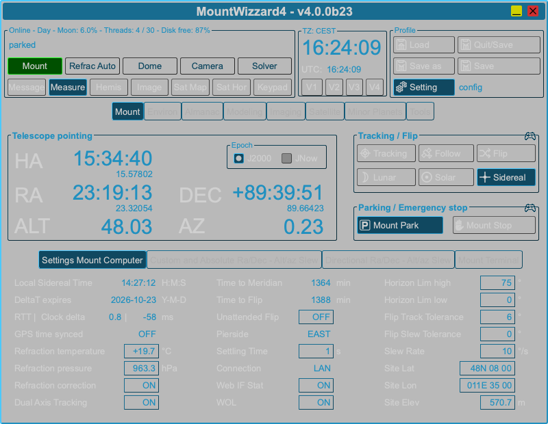

Themes selection
================
MountWizzard4 supports 3 different color sets. These could be selected in
settings:

and will be persisted after closing the application. They could be changed
during runtime.

Main theme
----------
It the theme which was present from the beginning on.

Red night theme
---------------
Getting a nor dim color set for those, who use the application in the field.

Light day theme
---------------
For those ones who sit more inside and like lighter themes as well, but need not
to take care about brighter coloring.

Transparent theme
-----------------
For those ones who like to see the background of the application.

This adds-on to any existing theme and could be combined with any
of the above mentioned themes. It will be also stored persisted after
closing the application and could be changed during runtime.

The following image shows the themes with the transparent add-on and
set alpha to 50%:

and the following image shows the main theme with the transparent add-on and
set alpha to 30%:

