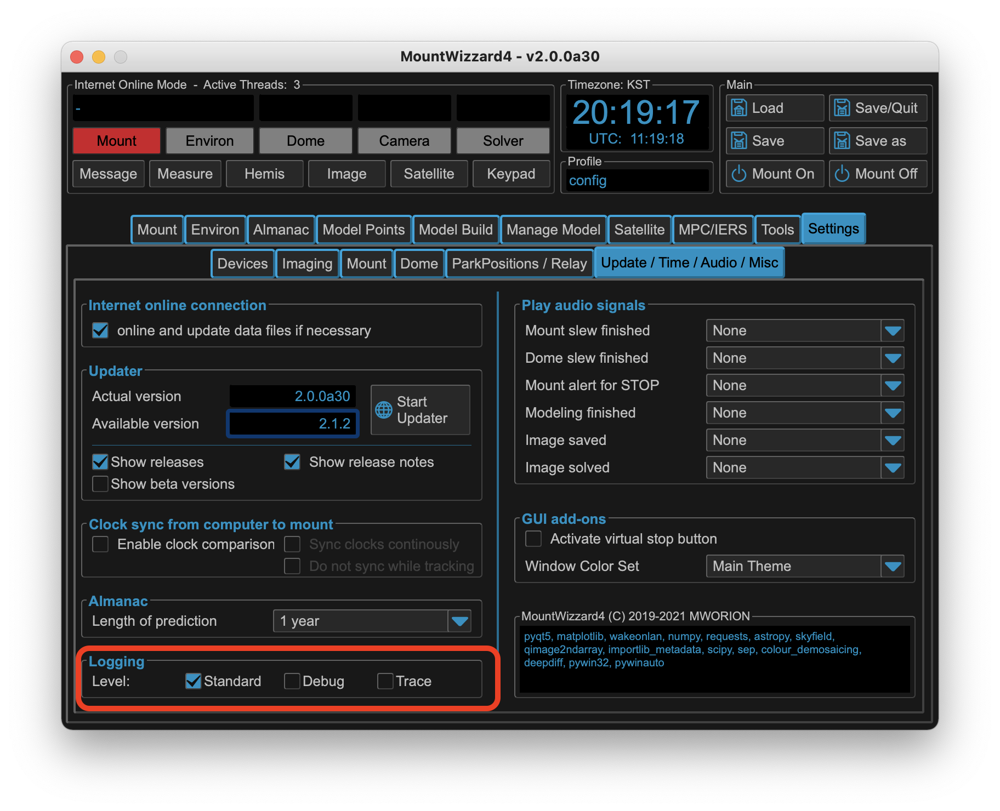

Troubleshooting Q&A and hints
=============================
Based on many feedbacks and solved issues, please check first if your question
already has some answers or at least some hints how to improve the situation.

Installation
------------
Despite MountWizzard4 will run on many platforms, your setup might have some
special constrains which need to taken into account. In the following I try to
refer to the important ones.

Python
^^^^^^
MountWizzard4 version 4 runs on python 3.10 - 3.13. On other versions scripts
will fail and MountWizzard4 will not run.

On windows, you need to select if you are using 32bit or 64bit python depending
on drivers you are using for your devices. 32bit and 64bit could not be mixed !

Normally you will use a preinstalled python version (if that fits) or use a python
version from python.org. Please do not use other sources.

As MountWizzard4 lives in a virtual environment, updating python does not
automatically update the virtual environment. If you need to update python for
any reason there are two possibilities: New install of MountWizzard4 in a new work
dir or deleting the venv folder in your actual work dir and running the install
script again.

MountWizzard4 App
^^^^^^^^^^^^^^^^^
There is no need for running MountWizzard4 with admin rights. If so, something
is wrong. MountWizzard4 will run in a virtual environment. Please do not try to
install MountWizzard4 as a system application as this might interfere with other
installations.

MountWizzard4 does not behave as expected: please post a log and describe the
procedure in steps. If you could add screen shots this helps a lot.

MountWizzard4 Updating does fail
^^^^^^^^^^^^^^^^^^^^^^^^^^^^^^^^
Since v2 MountWizzard4 should be able to handle all updates / downgrades with
the internal updater. From v1 to v2 windows needs the MountWizzard4_Update.bat
script as the internal updater can't free used windows libraries. MacOSx and
Linux should be fine.

Scripts
^^^^^^^
Installation does not need admin rights. If so, please check the folder locations.
In windows10 desktop and some other folder are not writable for applications.

The scripts do nothing special, you could use for many topics manual commands as
well. Unfortunately the scripts could not manage all special setups, but feel
free to change them accordingly.

Mount connectivity
------------------
MountWizzard4 only supports IP links. As data latency is a critical topic, please
use a wired connection to the mount. Wireless connection might have some drops in
connections (you will see this with mount button switching red / green multiple
times)

Please check your IP settings, gateways if first connections fail.

If your WOL does not work, please check MAC address, WOL being enabled. If you
switched your mount manual off and cut the power supply, sometimes WOL does not
work the first time. You need a redundant path if you are in a remote site!

Basically multiple instances of MountWizzard4 could be up and running, but
MountWizzard4 take up to 6 parallel connections to the mount. The documentation
allows in total 10 connection each of the two ports (3490, 3492). This might
overload the 10 micron system.

Device connectivity
-------------------

ASCOM Device does not work / connect
^^^^^^^^^^^^^^^^^^^^^^^^^^^^^^^^^^^^
ASCOM uses different types of drivers for the devices. Some of them need an
environment in 32bit or 64bit like you application. So if you are using an 64bit
application for imaging your drivers will be 64bit compatible. In this case the
python installation also needs to be 64bit. Otherwise the connection will fail.

Modern CMOS cameras with large sensors normally work on 64bit mode.

Many device driver only support one connection at the same time. So if you imaging
application already *took* a device, MountWizzard4 might be not able to connect
anymore.

Please test your setup running with ASCOM suite (included in ASCOM platform
installation) or any other programs you good know to test device functions
outside MountWizzard4.

Model building
--------------

Updating IERS/SAT/MPC data
--------------------------

Data could not be fetched from internet
^^^^^^^^^^^^^^^^^^^^^^^^^^^^^^^^^^^^^^^

You need an internet connection and set MountWizzard4 in online mode to download
new data for upload.

Tracking satellites
-------------------

Logfiles and reports
--------------------

Where could I change the log level ?
^^^^^^^^^^^^^^^^^^^^^^^^^^^^^^^^^^^^
The log level could be changed under settings misc. The default setting is warning.
If you need analyzes, please go to debug. If a driver or mount connectivity is
related as well, please go to trace. Please be aware that log file especially in
trace mode could become big.

