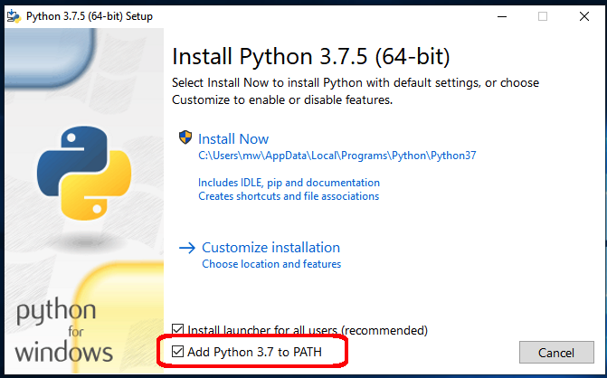

Install Python
==============
MW4 is a python3 application based on some python libraries and uses Qt as
framework for GUI. Different to past versions of MW there will be no one box
solution (MAC bundle, EXE File, etc.) available. As MW4 is python3 and comes with
internal update functionality, it uses a standard python3 environment. Ideally it
is recommended in a virtualenv.

MW4 is tested on python 3.8 - 3.10. The first step is to install the python3
.8.x package if not already installed. For all platforms there is an installer
available. Please follow the descriptions that comes with the installers. To give
a short overview here are some quick installation hints for all platforms. The
installers for Windows and OSx can be downloaded from python.org.

.. warning::
    Please do not use a newer version of python than 3.9 if you would use MW4 on
    other platforms than Windows, Mac or x86 Linux. Some libraries bring
    precompiled binaries with them and they might not be available for a newer
    python version.

If you already have python 3.8 - 3.10 installed, you can skip this section
and go directly to the MW4 installation process. If you have to install python3.8
this has to be done only once for as many MW4 installations you might want.

There is a video on youtube with the install process python: https://youtu.be/xJxpx_SmrVc.

.. note::
    On windows there are some new features which supports comet,
    earth rotation and asteroids update for the mount. These functions are
    available from python 3.8.2 on. Earlier python versions have issues. If you
    would like to upgrade an older python installation, please see the comments
    below for windows. On other OS there is no need for doing that.

Windows
-------
.. warning:: Windows makes a hard split between 32bit and 64bit versions. If your
             drivers and setup uses 64bit solutions, please install 64bit python!

Depending on your Windows version please download or directly run the web
installer from:

https://www.python.org/downloads/windows/

and follow the installation procedure.

.. warning::
    Please take care that during the installation the checkbox "Add Python Path"
    is selected and to install for a single user if you want to use the scripts.

Depending on your preference you could install python 3.10 for a single user or for
all users. MW4 does not need admin rights to run, so please choose the variant for
a single users if you want wo use the installation scripts. They depend on access
rights as a normal user and you might run into troubles using different modes!

Mac OSx
-------
Depending on your OSx version please download the installer for 3.10 from:

https://www.python.org/downloads/mac-osx/

and follow the installation procedure. Depending on your preference you could install
python3 for a single user or for all users. MW4 does not need admin rights to run,
so please feel free to choose the variant you would like to use.

.. warning::
    Using a Mac with Apple silicon need special treatment. There is rather any
    experience with these setups. Actually MW4 only support Intel architecture so
    you need to use the Rosetta emulator.

Ubuntu
------
Referring to Ubuntu 18.04 LTS as it comes with python3.6. This should work, but
you could upgrade to python 3.10. This could be done by adding an appropriate
repo, which enables this version.

.. hint::
    If you update to a higher python version, please update to python 3.10 if you
    want in a way, which fits best to your environment. There are many
    descriptions out, so please search for it in case you don't know exactly.

An example is from: https://linuxize.com/post/how-to-install-python-3-7-on-ubuntu-18-04/

.. code-block:: python

    sudo add-apt-repository ppa:deadsnakes/ppa
    sudo apt-get update
    sudo apt-get upgrade
    sudo apt-get install python3.10

Please check the right version and the availability of virtualenv in your setup. If
virtualenv is not present in your setup, please install it prior to run the install
scripts with:

.. code-block:: python

    sudo apt-get install python3-virtualenv

Updating python in your existing environment
--------------------------------------------

This is a step which should be done if you are familiar with some pc experience.
Hence the steps are not complicated, the setups of you environment might be
somehow special and need a adjusted treatment. The following steps explain a
standard procedure.

Update python version on your windows computer
^^^^^^^^^^^^^^^^^^^^^^^^^^^^^^^^^^^^^^^^^^^^^^
Please go to the python website an download the appropriate python version. On
windows please check the selection of the 32bit or 64bit correctly. It should be
the version you have already chosen.

Start the python installer. If everything went right, it will show an update offer
. If so, please chose that and you get the upgrade. If you would like to switch
from 32bit to 64bit or vice versa, the updater only shows a new install. In this
case please deinstall the old version manually. Than it's like a new python
installation, please see above.

Having your python version updated on you computer, you have to update the new
version to you work environment(s), too. There are two ways to do that. First you
could use the install script provided and install MW in a new work dir. You could
copy all you settings (except the 'venv' folder) to the new workdir. Another way
is to open a command window, change to your work directory and run the command:

.. code-block:: python

    python -m venv --upgrade venv

This will upgrade your work environment to the python version of your computer (so
the updated one)

.. note::
    Before doing any changes or updates, please do a backup of your environment to
    be safe in case of errors in the update process. This could simply be done by
    making a copy of your work folder.
