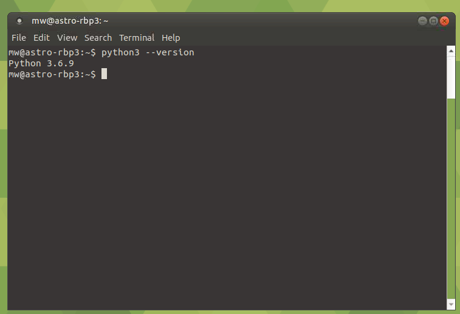
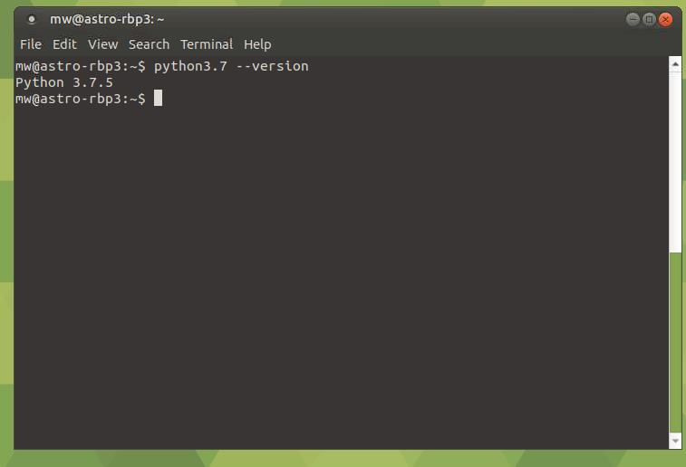
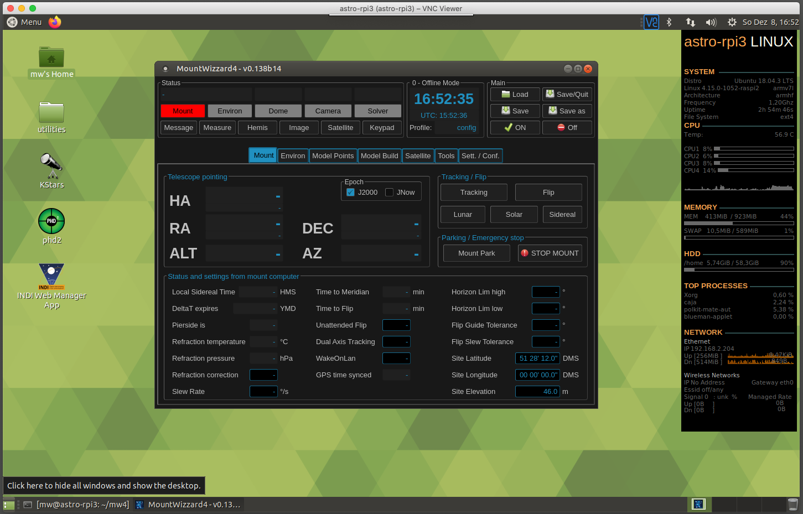

Install on RaspberryPi 3
========================

.. hint:: The simplest raspi installation for rpi3 works with astroberry

Installing Python on RPi3
-------------------------

To get MW4 installed on RPi3 you will follow the instructions of Robert Lancaste
(many thanks to him fore this work!) on https://github.com/rlancaste/AstroPi3 with
installing AstroPi3 scripts. The installation procedure I describe is based on
Raspbian Buster with desktop.
should give you the following result:

In addition you have to take care, that python3.8 is installed. The
actual Ubuntu mate 18.04.2 distribution comes with python 3.6, so we need to
update this. Please follow the description: :ref:`Ubuntu`. After that you should
get an python3.8 or newer available on your system:

If everything went fine, we can proceed to the next step.

Installing PyQt5 on RPi3
------------------------
As on arm the installation of PyQt5 could not be done through pip, the actual
tested path is to install Qt directly via apt-get on your RBP3. As result, you
cannot install MW4 easily in a virtual environment as apt-get will install all
libraries in a system path.

As there were no compiled binaries for actual Qt version available, you have to
compile it yourself.

.. code-block:: python

    sudo apt-get update
    sudo apt-get install python3.8-dev
    sudo apt-get install qt5-default
    sudo apt-get install sip-dev

    cd /usr/src
    sudo wget https://www.riverbankcomputing.com/static/Downloads/sip/4.19.19/sip-4.19.19.tar.gz
    sudo wget https://www.riverbankcomputing.com/static/Downloads/PyQt5/5.13.2/PyQt5-5.13.2.tar.gz

    sudo tar xzf sip-4.19.19.tar.gz
    sudo tar xzf PyQt5-5.13.2.tar.gz

    cd sip-4.19.19
    sudo python3.7 configure.py --sip-module PyQt5.sip
    sudo make -j4
    sudo make install

    cd PyQt5_gpl-5.13.2
    sudo python3.7 configure.py
    sudo make -j4
    sudo make install

There are in different packages to be downloaded and installed. They build on each
other, so keep the order of compiling and install. This procedure take about 2
hours or more, depending on the system.

.. warning::
    So far PyQtWebEngine does not build on RPi3! So I removed for the build from 0
    .138 on the capabilities, who need the PyQtWebEngine package. This is
    basically the Keypad. So you will have limited features!

So before you could actually run MW4 you need to install some mor libraries:

.. code-block:: python

    sudo apt-get install libgfortran5
    sudo apt-get install libjpeg-dev zlib1g-dev
    python3.7 -m pip install -U Pillow

Once you are set, make a work directory, cd to this directory and install MW4 by

.. code-block:: python

    python3.8 -m pip install mountwizzard4

and run MW4 with the command

.. code-block:: python

    python3.8 ~/.local/lib/python3.8/site-packages/mw4/loader.py

If everything went fine, you should see MW4 on RPi3:

