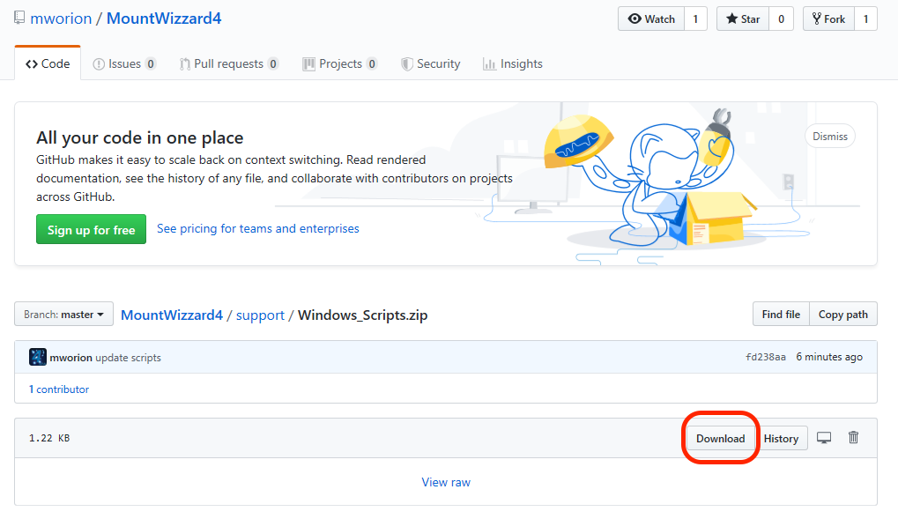
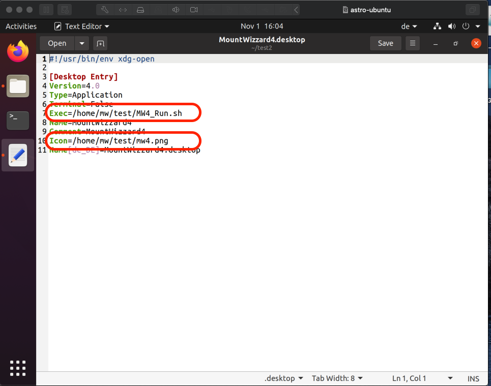
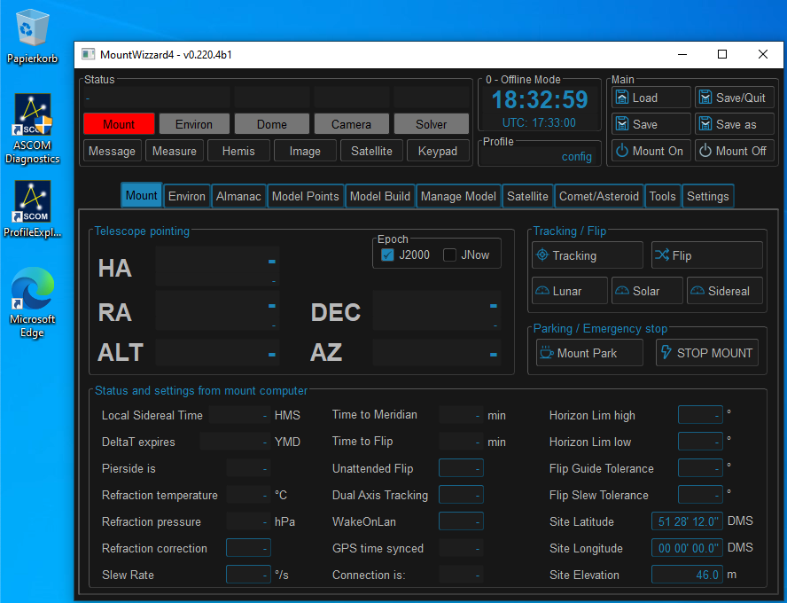
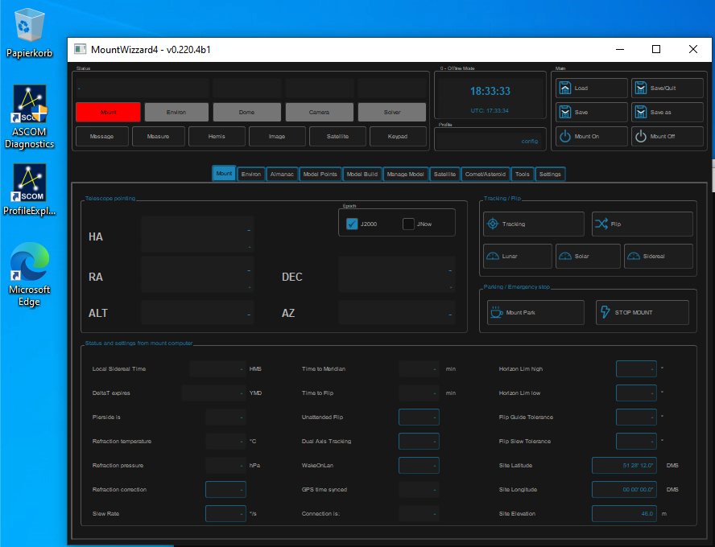

Install MW4
===========

When starting with the installation of MW4, python 3.8 - 3.10 should be successful
installed. To check, open a terminal (available on all platforms) and run the
command

.. code-block:: python

    python3 --version
    virtualenv --version

On windows you can't call python3, but you have to run the command

.. code-block:: python

    python --version

In one of the choices you should see the version number of the installed and
available packages. For python it should say 3.8.x ... 3.10.x.

.. hint::
    MW4 does not need admin rights to install or run. To avoid problems with
    accessing directories or file please ensure, that you run install and MW4
    itself as normal user!

To install MW4 on your computer, there are some support available for Windows, OSx
and Ubuntu to make it a little bit easier to install and run MW4. The scripts are
online, and available from Github.

Installing with installer version 3.x:
--------------------------------------
The install procedure also got improved: You will have only a single compressed
python script (startup.pyz) which is valid for all platforms and does all things
the different existing scripts stand for. Please download the package and unzip it
to get the content. You will find three files:

- startup.pyz -> the script for doing all the work
- mountwizzard4.desktop -> support for ubuntu / linux running the script
- mw4.png -> icon for mountwizzard4.desktop
- mw4.ico -> icon to customize the link in windows for running the script

https://github.com/mworion/mountwizzard4/blob/master/support/3.0/startupPackage.zip?raw=true

On windows you should be able to start the script just be double click on it,
in all other platforms you start it with:

.. code-block:: python

    python3 startup.pyz

On windows please use the command:

.. code-block:: python

    python startup.pyz

.. warning::
    The new script 3.x supports only Windows, Mac and x86 Linux distributions!
    This is valid also for the support of MW4 v3.x
    If you need support other platforms, please use the actual scripts 2.x. and
    MW4 v2.x versions.

Downloading the zip files
-------------------------
Please click the link and press download from the page:

There is a video on youtube with the install process for Mac:
https://youtu.be/xJxpx_SmrVc.

Short videos for installation
-----------------------------
For a better impression of how MW4 could be installed, there are some special
videos showing a installation on different platforms.

.. hlist::
    :columns: 1

    * Windows10: https://youtu.be/q9WbiHhW5NU
    * Mac OS Catalina: https://youtu.be/bbZ9_yLm1TU
    * Ubuntu 18.04: https://youtu.be/kNfLrtJtkq8

Step 1
------

Please create a working directory of your choice and location. For MacOSx I would
recommend not using a location on the desktop as it might cause troubles with
execution right in newer OSx installations. The directory can be renamed later on,
it also can also be moved to any other location. Copy the scripts for your
platform into this directory.

.. hint::
    Over time, there might be some improvements also made for these scripts.
    So if you had installed MW4 some time ago and will install new setups,
    it might be helpful to check if some new scripts are available for better
    handling.

the directory should than for OSx look like:

.. image:: image/mac_1.png
    :align: center
    :scale: 71%

In Windows10 it looks like:

.. image:: image/win_1.png
    :align: center
    :scale: 71%

.. warning::
    Please closely check if your working directory is writable. Otherwise MW4 could
    not work properly!

.. image:: image/win_1.png
    :align: center
    :scale: 71%

Windows10 might as you the first time of execution the following question:

.. image:: image/win_a.png
    :align: center
    :scale: 71%

and you could accept that by clicking "addition information" and than execute:

.. image:: image/win_b.png
    :align: center
    :scale: 71%

Step 2
------

Run one of the scripts following script. During installation a terminal window
might and shows the progress of installation.

.. code-block:: python

    MW4_Install.bat         # Windows
    MW4_Install.sh          # Ubuntu
    MW4_Install.command     # OSx

With the script a virtual environment for python is installed in your working dir
under the name "venv". After that it installs all necessary libraries and MW4
itself into this virtual environment. So any other installation of python
applications is not influenced by MW4 install.

After running the install script the directory should for OSx look like:

.. image:: image/mac_2.png
    :align: center
    :scale: 71%

In Windows10 it looks like:

.. image:: image/win_2.png
    :align: center
    :scale: 71%

In Windows10 for the first time you might be asked again for permission (see above).

Please use for the following step the install marked in red.

MW4 is already installed inside the virtual environment venv in your work dir.

.. warning::
    Please check if an online connection is available on your computer during
    installation as the libraries and MW4 is installed from online sources.

Step 3
------

Run one of the scripts

.. code-block:: python

    MW4_Run.bat         # Windows
    MW4_Run.sh          # Ubuntu
    MW4_Run.command     # OSx

This script will start MW4 for the first time and it will create some
subdirectories in your working folder. When starting, a splash screen show the
progress of it's initialization. After first start the directory should for OSx
look like:

.. image:: image/mac_3.png
    :align: center
    :scale: 71%

In Windows10 it looks like:

.. image:: image/win_3.png
    :align: center
    :scale: 71%

In Windows10 for the first time you might be asked again for permission (see above).

With the first run you will see a log file written and you should have a first
window from MW4 open. Please notice that there will be no visible terminal window,
but a minimized power shell in the menu. This might take some seconds before MW4
comes up with the splash screen:

.. image:: image/first_run.png
    :align: center
    :scale: 71%

If you see the upper window, you succeed and from now on you are able to customize your
setup of MW4 and it's features.

Setting up Ubuntu
-----------------
For Ubuntu the scripts also include an icon file (mw4.png) as well as a desktop
description file (MountWizzard4.desktop). In order to use this add-on, please
adjust the directories used in this file:

Unfortunately this is broken un Ubuntu 20.04LTS, see (including the workaround):

https://askubuntu.com/questions/1231413/basic-desktop-actions-are-not-available-on-ubuntu-20-04

If you install nemo (hint as workaround) as file manager, the desktop icons will work.

DPI scaling on Windows
----------------------
If you are running a windows machine with setting the zoom factor for you display
settings different to 100%, you might notice inadequate font sizes etc.
Unfortunately this could not be worked around within MW4 itself, but you could
change some environment variables to omit this problem. The actual script already
contain some setting to keep the resolution to 100% even if you choose to increase
this value for other applications. You want to play with these settings to make
the appearance correct:

.. code-block:: python

    SET QT_SCALE_FACTOR=1
    SET QT_FONT_DPI=96

Here some examples of the settings: Normal scaling (scale = 1, dpi = 96)

Small fonts (scale = 1, dpi = 48)

Bigger scale (scale = 1.5, dpi = 96)

.. image:: image/scale_1_5.png
    :align: center
    :scale: 71%

If you would like to have MW4 displayed bigger than 100%, please increase the
QT_SCALE_FACTOR to the value desired. A value of 1 means 100%, so 2 means 200%.
You will experience to set the font adequately.

DPI scaling on Ubuntu
---------------------
This is quite similar to windows. You have to set the environment variables
QT_SCALE_FACTOR and QT_FONT_DPI accordingly. They are already part of the
MW4_Run.sh scripts.

Installation on Apple Silicon
-----------------------------
For software that is not yet updated, Apple has built in translation software
called Rosetta 2. Rosetta 2 will interpret  traditional Intel-based code and make
it look like ARM-based code. And it does this pretty well. Generally speaking as a
user it is very difficult to distinguish between apps that have ‘native M1
support’ to traditional Intel-based apps.

But for any apps that are run from the command-line in Terminal, this standard
Rosetta 2 translation does not happen. Within Astrophotography it is not uncommon
to have apps that run from the command-line. Please hav a look to:
https://www.astroworldcreations.com/blog/apple-silicon-and-legacy-command-line-software

Update manually
---------------
If you plan to upgrade MW4 to the newest release, MW4 has it's own internal
updater and using the script is not necessary. In some circumstances this might
be necessary. In these cases you could use on of the

.. code-block:: python

    MW4_Update.bat         # Windows
    MW4_Update.sh          # Ubuntu
    MW4_Update.command     # OSx

scripts. The command script updates to the latest release.

.. note:: You only could update to official releases. Beta's are not supported.

