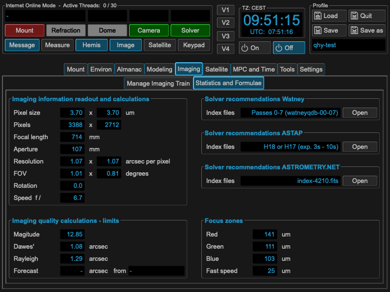

Install Plate Solvers
=====================
Supported platesolvers are astrometry.net, ASTAP and Watney. All solvers should be
installed locally. There is no support for astrometry.net online. If you install a
plate solver, please be reminded that you have to install their index files as
well. Unfortunately all are using different index files and methods, also
depending on your optical setup. MW4 helps you in finding the necessary index
files for your setup:

Based on optical and Sensor data. MW4 will make a prognosis, which index selection
might be good. You also have direct internet links to the sources.

Astrometry.net
--------------
Astrometry.net is useful on Linux and Mac installations. On Windows there is no
good setup possible. There are many solutions available (e.g. ANSRV), but these
could not be used through MW4. You will find astrometry.net here:

http://astrometry.net

ASTAP
-----
ASTAP is an application available for all platforms from Han. Great software! It
is available as application with GUI and as pure command line interface solution
(CLI). If you don't use ASTAP for other things as well, I would recommend
installing the CLI version locally in a folder of your choice. You find all
information on:

https://www.hnsky.org/astap.htm

Watney
------
Watney is a new solver from Jusas, based in the algorithm Han published for ASTAP.
It is available as API and command line interface (CLI) version for all platforms.
For the use with MW4, please install the CLI version in a folder of your choice.
You will find all information on:

https://github.com/Jusas/WatneyAstrometry

and

https://watney-astrometry.net
