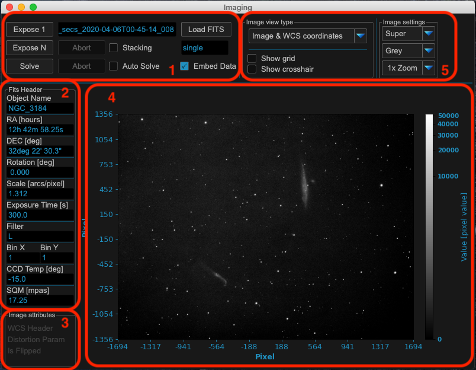
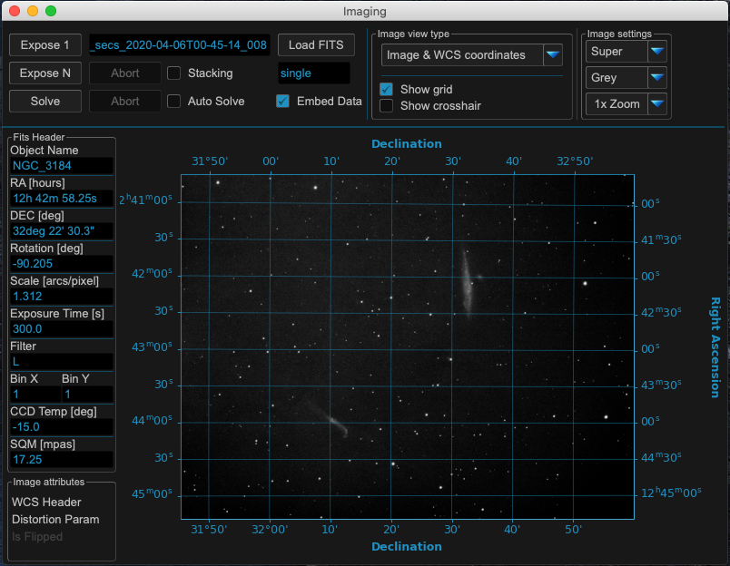
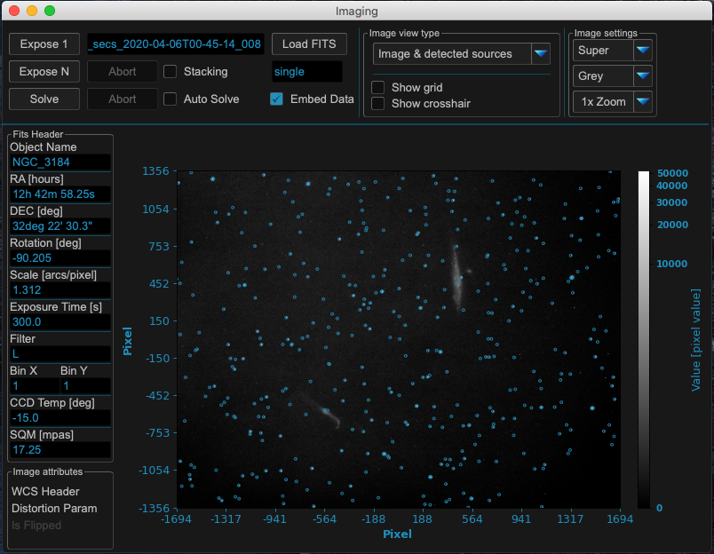
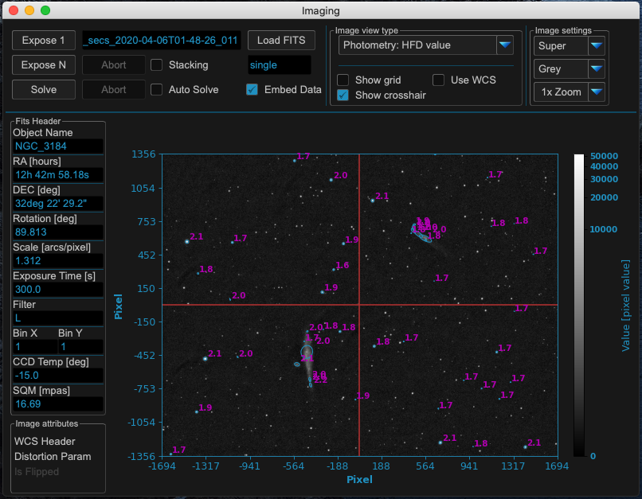
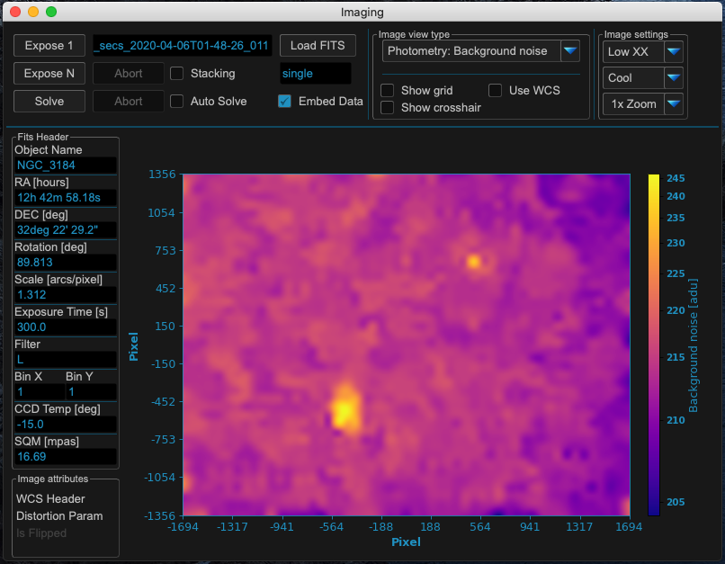
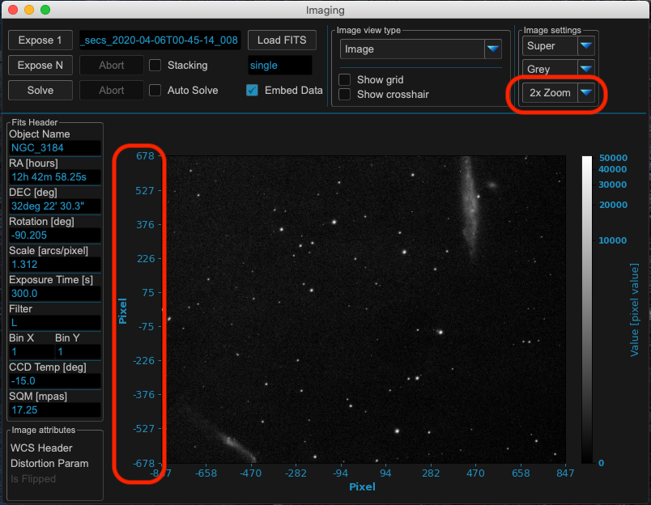
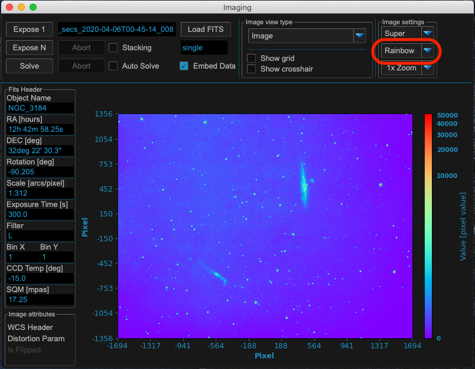

Imaging
=======

The imaging window shows FITS files loaded from disk or images exposed manually
or during model build. It is split in different areas to work with.

Area 1: Image exposing and solving
----------------------------------
MW4 supports single (expose 1) and multiple (expose N) exposures. Continuous
imaging could be stopped with abort. You also could explicitly load a fits file
(extension .fit or .fits). If you have a plate solver (e.g. ASTAP) installed, you
could solve the actual displayed image. The solved results are shown in message
window. If you would like to add the results to the image, please check "embed
data". This will make MW4 to write the plate solving results in the fits header of
the file.

.. warning:: Please be aware that MW4 will write the data to be embedded directly
             in the FITS file without making a copy of the file!

When "auto solve" is checked, MW4 will automatically plate solve every new
picture and show or embed the results in the message window or fits header.

A simple stacking method is available when mount is in tracking and keeps point
accurate. When "stacking" is checked, MW4 will add all exposed images (expose N
running) and calculate the mean of the image.

Area 2: FITS Header entries
---------------------------
Some of the FITS header entry of the actual image are shown.

Area 3: Image attributes
------------------------
MW4 calculates and extracts some image attributes. For example if a WCS header
information is available, the distortion parameters are present or the actual
image is flipped with regard to real position in sky.

Area 4: Image display
---------------------
Show the image and it's different view selected in area 5. For standard view the
scale is pixel with 0/0 to be the center of the image. There will be a colorbar in
each view with the values of the image.

Area 5: View options
--------------------
For the image you have different options to alter the main view of the image:

.. list-table:: Image views
    :widths: 30, 70
    :header-rows: 1

    *   - Drop down entry
        - Explanation
    *   - Image Raw
        - Standard visualization of the image in greyscale. MW4 does not support
          colors
    *   - Image with Sources
        - An overlay of the image with the extracted sources (stars) as circles
    *   - Photometry: HFD Value
        - SEP: 50 top Sources with HFD values
    *   - Photometry: Background level
        - SEP: Image of the background level
    *   - Photometry: Background noise
        - SEP: Image of the background oise level
    *   - Photometry: Flux
        - SEP: Value for flux of the detected sources

If distortion parameters are included, you could check "UseWCS" and MW4 will show
the RA / DEC coordinates for the first threed image view options.

Some examples for the windows
-----------------------------

View Image with WCS distortion:

View Image with sources:

View image with HFD values

View image with background level

.. image:: image/show_bk.png
    :align: center
    :scale: 71%

View image with background noise

View image with photometry flux

.. image:: image/show_flux.png
    :align: center
    :scale: 71%

View image with different zoom

View image with different color scheme

