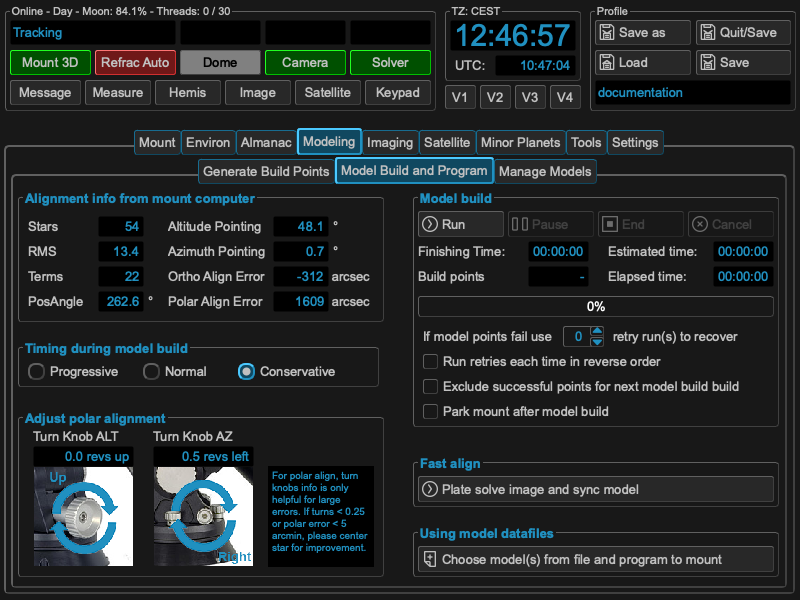

Build a model
=============

After you have selected you build points, MountWizzard4 could automatically run
through the points and generate the data to generate a model. These are steps
you could basically all manual as the final model calculation itself is done in
the mount computer! There are two different ways offered from 10micron to build
a model:

.. hlist::
    :columns: 1

    * Incremental
    * Batch

In incremental model build, each new point will start a recalculation of the
model in the mount. This behavior is also called sync refine, as with each point
the model is processed.

In batch model build, a complete set of point and their data are transferred to
the mount computer, which calculates from this data a new model.

In result both variant will produce the same model with the same quality. The
difference is the way and the context you are working in. MountWizzard4 uses
the batch model build as there are advantages (not in the model quality) in the
automatic handling of point data.

In the "model build and program" tab, that actual model spec from
the mount computer is shown. If you are in an early stage of your setup, you might use
some of the hints given to refine and tune your mechanical setup before building
your final model for imaging.

.. note::   All values which are show in these graphs were calculated by the
            mount computer itself and just read out and displayed by
            MountWizzard4. As the 10micron algorithm of the model optimizer is
            not know. The given hints are observations.

.. warning::    Any changes in your mechanical setup invalidates the model!

Explanation model build process:
--------------------------------
The model correct for error. Some could be removed exactly, some not. The way is
a mathematically optimization method. In max the mount could calculate 22 terms
(which means two models of a set of 11 terms, one for WEST and one for EAST
side). If you need 22 parameters for the model (for whatever reason the mount
thinks), you have to have at minimum 22 alignment stars or more. Otherwise this
will not result in 22 parameters. Again like in polar alignment: think of what
is the goal of this task. For sure you would like to remove as much of the
alignment error to be able to get unguided images.

Modeling automatics
-------------------
The automation process is explained by the next drawing. It is quite simple, but
there are some important topic, which you should care about.

.. drawio-image:: image/model_process.drawio
    :align: center

MountWizzard4 tries to do as much steps at the same time as possible to reach
the minimum model build time. So **"Take an image"** means that the signal to
do the next slew to the point is already started when the camera sends image
integration finished. During image download and image saving, slewing is already
on the way. The same happens to image solve. MountWizzard4 does not wait until
an image is plate solved, but manages as much images in the shortest time. If
your plate solver is fast, your don't see much of this asynchronous behavior, if
you use a slower one or if you are running MountWizzard4 on a slower machine,
you might experience a stack of plate solving tasks when the mount slewing and
imaging is already finished.

.. note::   For the plate solver a starting Ra/Dec and scale hint is necessary
            for a successful plate solve. Please check your environment if INDI
            or INDIGO embeds this data in the FITS header of the image file.

You could **"Pause"** the model build at any time, but MountWizzard4 will finish
after a sequence which allows safely to pause. It will not happen immediately.

You also could **"End"** the model build process at any time. In this case
MountWizzard4 will take all already existing data and tries to program a model
to the mount.

In addition you could **"Cancel"** a model build run. In this case all data is
lost.

MountWizzard4 offers a disabling of dual tracking during the model build run and
restores this state afterwards or a mount park after a model build is finished.

During a model build it might happen due to clouds or other events, that some
of the images from model point could not be solved an therefore used for model
build. For this situation you could enable a retry mechanism for the
**"missed"** points. After running through all points, MountWizzard4 will retry
the missed ones N times and will add their data if possible afterwards.

Using model datafiles
---------------------
MountWizzard4 stores for each model build run all data (and some more for
analyse) to build a mount model. With this data you could rebuild at any time
you mount model from scratch if you for example deleted to much points during
optimisation or other reasons.

In addition you have the chance to combine multiple model runs to a single mount
model! Please think of the maximum of 100 point the mount computer will handle
to calculate a mount model.

The warning about the invalidation of the model when mechanical changes are made
are true for this step as well. Combining model data from different mechanical
setups lead into an invalid model. Rebuilding a model from old data when
mechanical changes were made result also in an incorrect model.

Fast Align
----------
There is a way to adjust an existing model to a certain sphere position. If you
choose fast align, MountWizzard4 will do for the actual position an image, plate
solve it an align the model to the solved coordinates. This means the whole
model is move in a way, that the actual pointing coordinates and solved
coordinates are equal. But this changes model pointing for all other position in
the sky as well without knowing if this shift really fits there.

.. note::   Fast align is a step to adjust quickly a reasonable model to an
            actual pointing position. This action is not a model build process!
            You most probably loose the pointing accuracy of you model!

