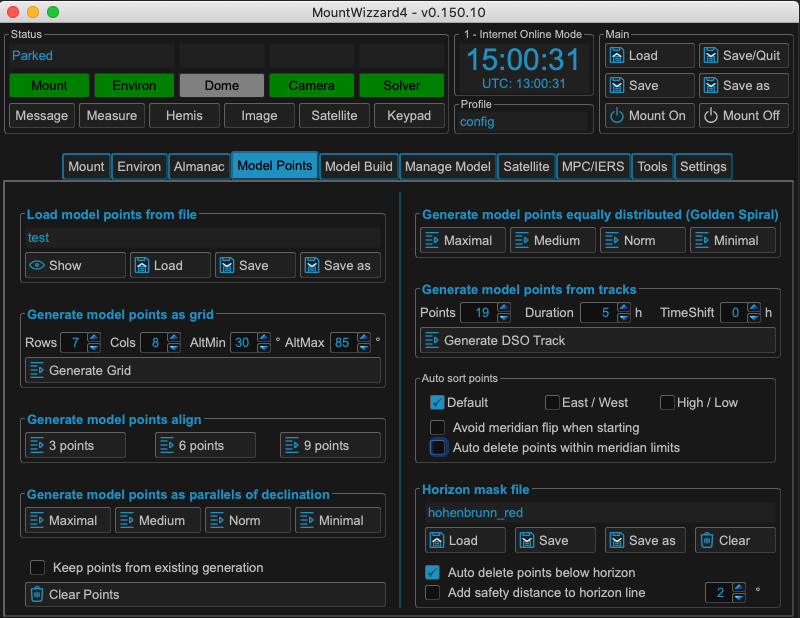

Selecting model points
======================

The first step for building a model is the selection of the desired model
points. Handling you horizon is an important step as MountWizzard4 helps you
could in finding points, which were not covered through obstacles in your
location defined by the horizon line.

There were multiple ways of setting your model points within MountWizzard4:

.. hlist::
    :columns: 1

    * From file
    * In a generated alt/az grid
    * First align points on defined alt
    * Points along the celestial slew paths
    * Equally distributed over the sphere (golden spiral)
    * Based on a DSO track of an object with define Ra/Dec
    * Manually set point (in hemisphere window)

There are multiple parameters or selections available to refine your point
selection. the best way to find out is simplest to test them.

.. note::   Please think that you distribute the model points at the end over a
            sphere! Using alt/az is convenient, but might be misleading. You
            could enable the polar view in hemisphere window to get an image
            how the points are spread in a polar diagram.

It makes a lot of sense if you have discovered you favourite model points setup
to store them in a file and reload them whenever you want. You could store as
many files as you want.

MountWizzard4 does a default sorting for you. If the default does not fit to
your setup, you could tweak the order and additional constraints like you want.
These settings are stored persistent in your profile.

.. hlist::
    :columns: 1

    * Auto sort point -> default
    * East / West: points from East coordinate to west coordinate (az)
    * High / Low: point from high altitude to low altitude (good for domes)
    * Avoid meridian flip: modeling start at the actual pier side
    * Auto delete point below horizon
    * Add safety distance: adds selected degrees safety margin to horizon
    * Auto delete within meridian limits

.. warning::    Regardless what you select, the 10micron mount computer could
                only handle a maximum of 100 points

In addition you could also mix different types of model point generation by
checking

.. epigraph::   **keep points from existing generation**

MountWizzard4 will not cleanup the point map before adding new point, but add
them.

