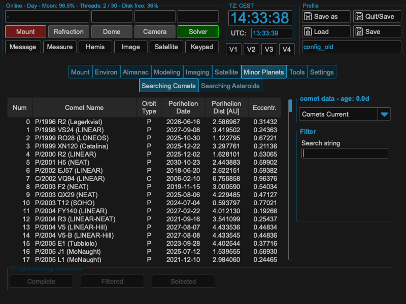
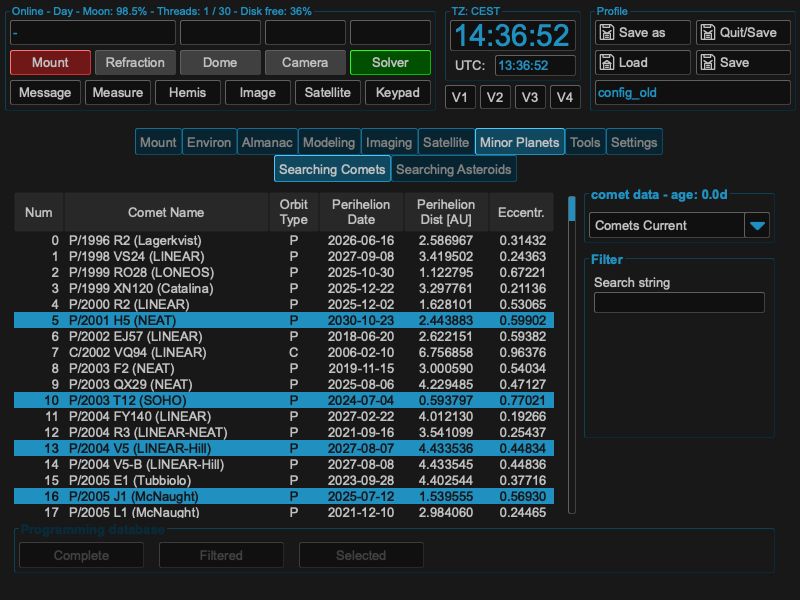
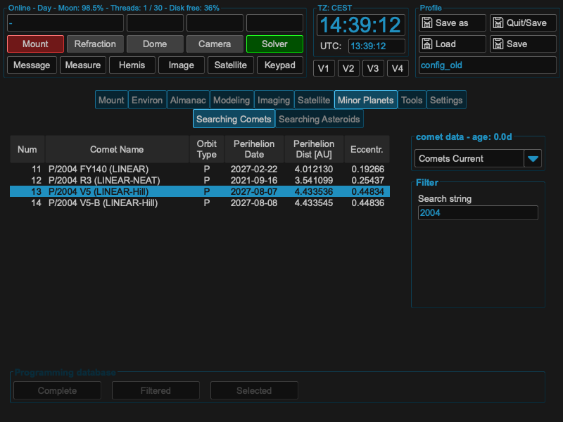
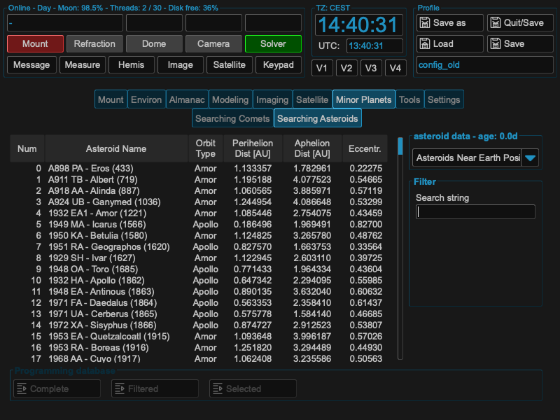

Minor Planets
=============
Under module `Minor Planets` you can download and visualize the data of comets and
asteroids. The data is downloaded from the `Minor Planet Center <http://www
.minorplanetcenter.net/iau/mpc.html>`_.

The data is stored in a local database and can be used for various purposes. The
comets you will be able to select under the comets tab. By clicking ont the header
of each type of data, you will be able to sort the list by the selected column.

Once downloaded, you can select a comet by text search or by clicking in the list,
also selecting multiple comets is possible:

You also could filter the list by text search or even combine methods:

After selection, you could upload the selected / filtered or complete database to
the mount computer. The mount computer will use the data for tracking. Programming
will be only possible if the mount is connected to the computer.

The same is valid for asteroids:

Within asteroids, you could select different databases to download the data from
via the drop down selector.

In both cases, comets and asteroids, the local databases will be updated every day
to offer actual data.