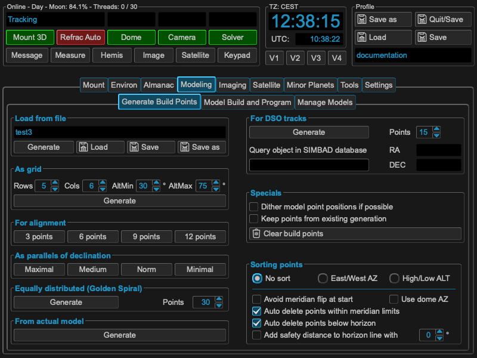
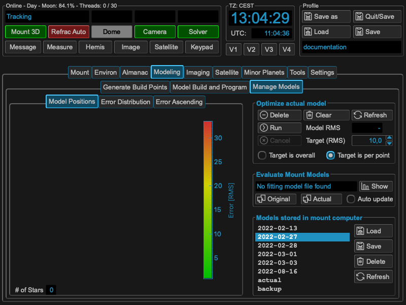

Modeling
========
I only focus on model building with tool support, so no words about manual model
building. I don't know the internal algorithms of the 10micron mount how the
calculate their corrections. So many of the hints derive from pure logical or
mathematical approaches and even there I personally might have some
misconceptions or make some errors.

So my goal in model building is quite simple: I'm lazy in doing setups, so I
want a solutions which gives me a correction model most accurate in minimum of
time automatically. I rely heavily on the corrections capability on the 10micron
mounts, so I use them always with dual tracking on. For doing a setup there are
many things to think of beside the model (leveling, rigidity etc.). Keep them
perfect, but I don't talk about them. So this results in two tasks I have to do
to get a model to do unguided images: Polar alignment and the model for
correction itself. I refer to the Blog Filippo Riccio from 10micron:

https://www.10micron.eu/forum/viewtopic.php?f=16&t=846

All the hints you get from the mount (how to turn knobs, alignment star) improve
the alignment. As the model is only an approximation for the error correction,
it will be not an one step approach. If you aim for the best result, please
think of 2-3 iterations of the whole procedure. In my setup I normally need 2
iterations for doing an alignment which is good for 20-30 min exposures and have
round stars.

The following sections describe each step in detail.

.. toctree::
    :maxdepth: 1

    polar_align
    build_points
    model_build
    manage_model

As Overview: MountWizzard4 has a straight forward approach for building models.
The following chart shows each basic step.

.. drawio-image:: image/workflow.drawio
    :align: center
    :scale: 71%

Step 1: Polar alignment
-----------------------
Detailed description: :doc:`Polar align your mount <./polar_align>`

.. image:: image/polar_align.png
    :align: center
    :scale: 50%

Step 2: Selecting build points
------------------------------
Detailed description: :doc:`Selecting build points <./build_points>`

Step 3: Running the model build
-------------------------------
Detailed description: :doc:`Build a model <./model_build>`

.. image:: image/model_build.png
    :align: center
    :scale: 50%

Step 4: Managing mount models
-----------------------------
Detailed description: :doc:`Managing mount models <./manage_model>`

