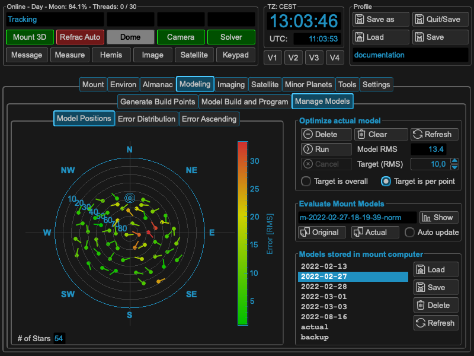
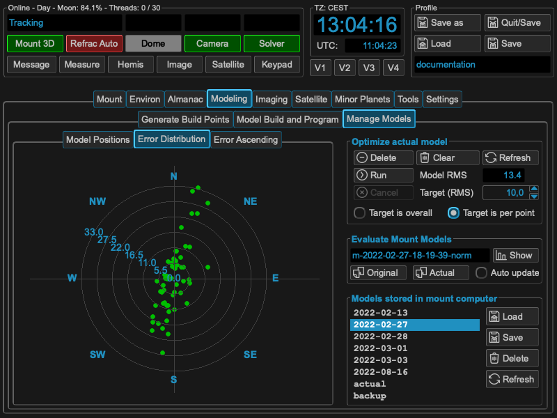
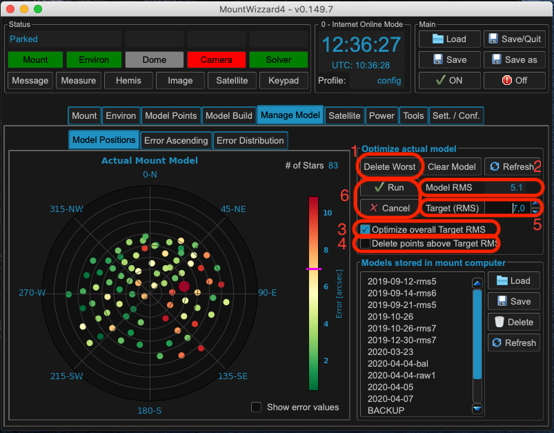
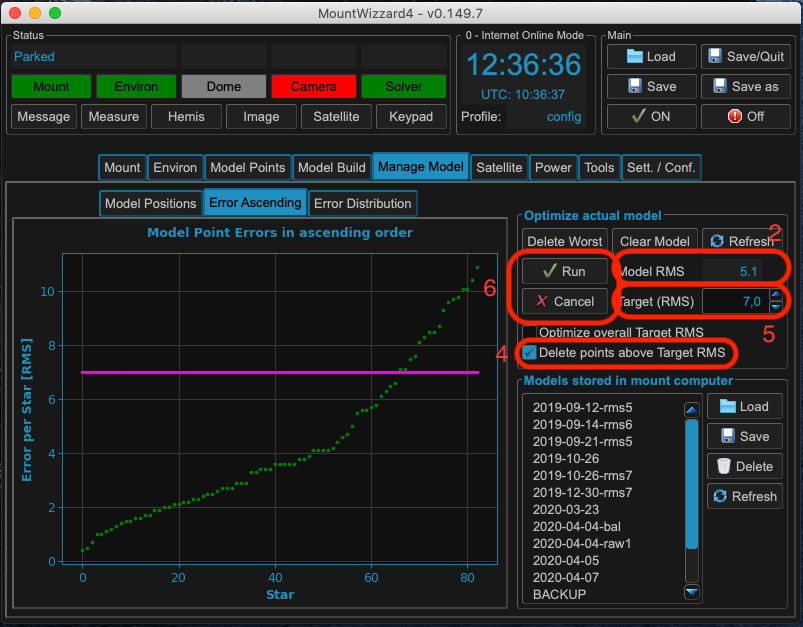

Step 4: Managing mount models
=============================
Managing your models is a central task especially if you image in a mobile
environment. MountWizzard4 supports this in the Manage Model Tab in the main
window. All functions there are related to the actual mount model or the models
stored in the mount.

Three graphs are available for checking the model:

.. hlist::
    :columns: 1

    * Model Positions
    * Error ascending
    * Error Distribution

.. note::   All values which are show in these graphs were calculated by the
            mount computer itself and just read out and displayed by
            MountWizzard4. As the 10micron algorithm of the model optimizer is
            not know. The given hints are observations.

The Model Positions graph shows in a polar plot how the model point were
distributed over the hemisphere and how large the errors of each point is in a
color scheme. If necessary you could check "Show error values" and numerical
values will label each point.

In the give example you see the western point are in general better than the
eastern ones, so in the setup there might be differences in setup depending on
the pier side.

The Error Ascending graph show all model points sorted by ascending error values.
You might see some outside points which differ a lot from other ones or
recognize an elbow type of curve which also might lead to some issues with you
setup.

The Error Distribution graph shows in a polar plot how the error values (higher
values on outer rings) and the polar angle of the error value.

.. image:: image/manage_model_3.png
    :align: center
    :scale: 71%

In all graphs you will see the pink lines which show the value of the Target
(RMS) setting in the "Optimize actual model" box. This helps in adjusting a
cut-off value for automatic model point removal.

Optimizing the model
^^^^^^^^^^^^^^^^^^^^

I some cases you will discover that some model points and their errors are
outside a reasonable area. In that case three different model optimization
scenarios come into place. The first and the obvious one is to remove manually
the worst point of the model (1).

If you have more than a single point to remove, the second and third come into
place, an automation process within MountWizzard4. With setting the checkbox
"Optimize overall Target RMS" (3) and starting the optimization run (6),
MountWizzard4 will delete as many point until the Model RMS (2) is below the
selected threshold (5).

Checking "Delete point above Target RMS" (4) and run (6) the optimization,
MountWizzard4 will delete all points where their individual Error is above the
selected threshold (5). Please note that this will lead to a different Model
RMS (2).

Explanation of optimization of process:
^^^^^^^^^^^^^^^^^^^^^^^^^^^^^^^^^^^^^^^
Yes you could remove bad points from the model. But does it help ? Again from
mathematics: you bend an error curve like a metal plate over a rough surface to
equalize it. If the is a single stone under this plate -> approximation might be
bad. So removing this stone might help in getting a better approximation for the
rest of the surface. But it is not good to remove the gravel under the plate to
improve just numbers in RMS! If I see large outliers in alignment errors within
an area which shows good numbers around, I remove that single point. But not to
much. In average I remove 2-5 points from a 60 point model max. Yes if you
remove a point the over RMS could rise ! That's because the whole model is newly
calculated and that's no subtraction of a bad point.