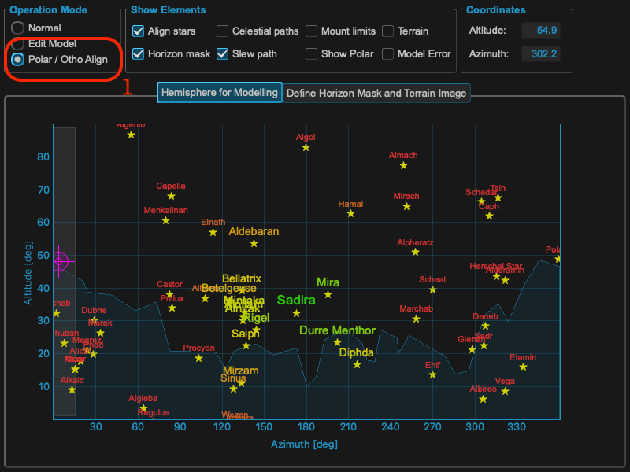

Step 1: Polar alignment
=======================

All credits for explaining the following section go to 10micron and many experts
using the mount.

Initial alignment
^^^^^^^^^^^^^^^^^
Initial three star alignment insufficient to get a good polar alignment error
(PAE) value. A two star alignment can only give a poor PAE estimate as the cone
error correction is missing, can be many arc minutes off true value Minimum that
can be used is 3 stars but they recommend at least 5 and ideally 10 points
(ideally based on experiments say that 12 to 20 points have better convergence
without spending too much effort).

.. note::   20 points in MountWizzard4 using the fast ASTAP plate solver will do
            20 points in around 7 minutes - not too onerous for a good PAE
            measurement.

Pay attention also that the stars are not near to the same maximum circle (i.e.
not all near the same right ascension, or all near the same azimuth, etc.). When
using few stars, how the stars are chosen is critical.

.. note::   MountWizzard4 helps here by automating the spread of points to avoid
            the problems listed through its various point layout patterns.

The hemisphere window is showing different colors and sizes for selecting the
right stars once the Polar/Ortho mode is selected. You need a valid first model
in the mount to use this feature!

As you add stars, more and more model terms will be added um of either
(# points - 1) or 11 terms for a single all sky model - 11 terms meaning all
required terms have a solution. Note that this may be split into two models for
east side and west side in which case the number of terms shown by the mount is
doubled.

A polar alignment error less than maybe one arcminute will be possible.
If you are using Dual Axis Tracking it sorts all this out for you. (A 10 minute
exposure with a 10 arc minute (1/6 degree) PAE will not show field rotation on a
large full frame sensor up to latitude 60 north or south)

How polar align works
^^^^^^^^^^^^^^^^^^^^^
The polar align function works in a really easy way. It removes the polar axis
error from the model before pointing at the star, so when you center the star
with the azimuth/altitude movements the right ascension axis will be
automatically aligned with the celestial pole.

Choosing location in the sky of the star to use to do the polar alignment
correction is critical. The choice of the star is made so you avoid the zones
where the manual movements have no effect. Avoid the zenith (this is where the
azimuth knob has no effect). Avoid the East-West axis (this is where the
altitude adjustment knob has no effect)

.. note::   MountWizzard4 will help you selecting the right location by marking
            the right regions and tight stars. In addition you don't need to use
            the handpad for selecting the stars: in MountWizzard4 you could
            select the reference star with a mouse click and start the polar
            alignment.

In MountWizzard4 the polar alignment works by changing the mode to polar/ortho
alignment. In this mode, you could select a star in the hemisphere window with
a mouse click and start slew the mount to the reference star. All you need is
to center the selected reference star in you image.

.. note::   For centering a star you could use the image window, select for
            continuous exposure and enable the crosshair. You could also magnify
            the region around the crosshair center to improve the precision.

Should I deactivate the dual axis tracking?
^^^^^^^^^^^^^^^^^^^^^^^^^^^^^^^^^^^^^^^^^^^
If you have the dual axis tracking active, the mount will track using the model
built in the initial phase (the initial 3 points generates a minimum model with
2 terms - its not a good model).

You will not be getting the correct tracking rate while you adjust the alt/az
knobs. So if you wait too much before centering the star and giving confirmation
to the mount controller, or if the initial error is very large, there will be a
drift. Therefore you must turn off dual tracking while performing the PA
procedure.

.. image:: image/model_disable_dat.png
    :align: center
    :scale: 71%

Effects of polar misalignment
^^^^^^^^^^^^^^^^^^^^^^^^^^^^^
Even if your mount is wildly away from a correct polar alignment, when you make
a model the correction of the polar misalignment will be performed exactly when
Dual Axis Tracking is activated. This means that the pointing error and the
tracking error will be the same - if you make a model with the same number of
stars and the same accuracy - whether the mount is aligned with the celestial
pole or not. When dual axis tracking is deactivated, the mount will track like
a normal equatorial mount, by moving the right ascension axis at a constant
sidereal speed.

The only important thing that will change with increasing PAE is the field
rotation.
