Satellite tracking
==================
MountWizzard4 supports the mount capability of tracking satellites. The planning
is based on Two Line Elements (TLE), which are provided by organisations (e.g.
http://www.celestrak.com) and deliver a set of orbital parameters for
calculating the satellite track with regard to your location in Alt / Az
coordinates. Since the introduction, 10micron does the calculation internally.
Therefore it is needed to upload the satellite TLE data to the mount and let it
calculate. Before FW 3.x this is the only possibility (using the internal
satellite database works similar) to do tracking.

.. note::   As the orbital elements of a satellite change over time, it is
            necessary to get most actual data for get a good tracking. Data
            which is older than 10 days is definitely outdated. MountWizzard4
            marks them red. Older than 3 days may work, MountWizzard4 marks them
            yellow. Ideal is to get them right in time.

You could select different databases on the right upper part of "Searching
Database" tab {1}. Once selected and online enabled, MountWizzard4 will download
the newest data and offers the list of included satellites. For finding the
satellite of your choice you could use the search field (2) to reduce the list.
The string is *not* case sensitive and will be stored persistent.

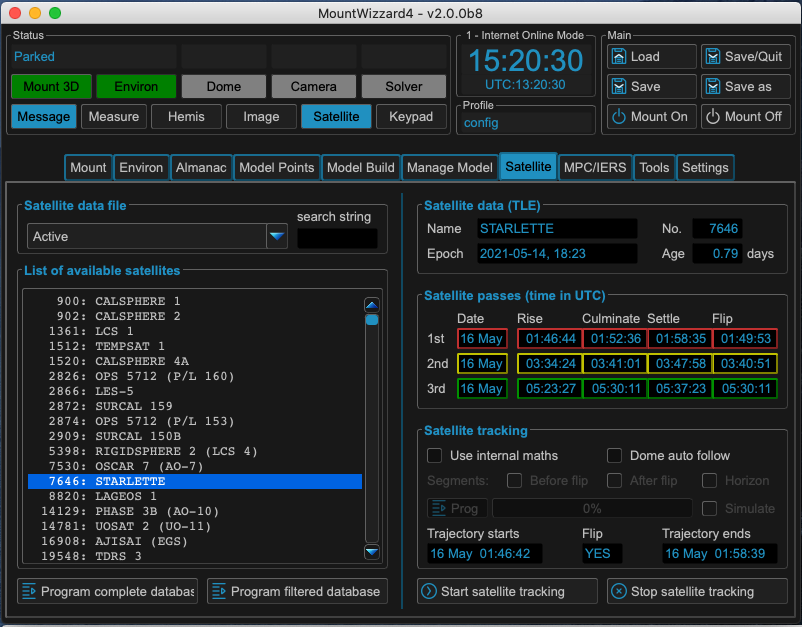

There are many more selection criteria available to filter the list of
satellites with real-time calculations of some properties like velocity,
distance and a glimpse of the apparent magnitude. This calculation takes some
time and you will see a yellow frame and progress counter in the filter area.

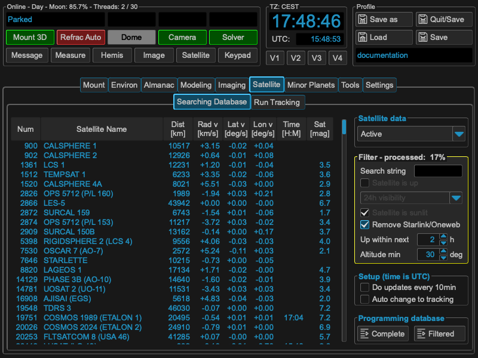

Once you choose a satellite with double click, data is programmed to mount
controller, parameters are displayed, MountWizzard4 calculated the next 3 orbits
of the satellite with rise / culminate / settle and if it occurs the flip time
when crossing the meridian.

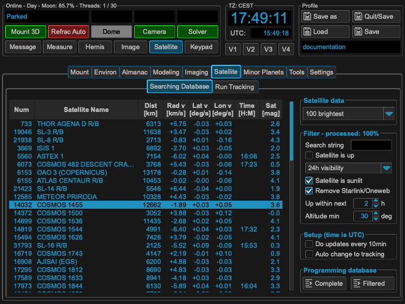

The selected satellite will also be shown in the **Satellite** window:

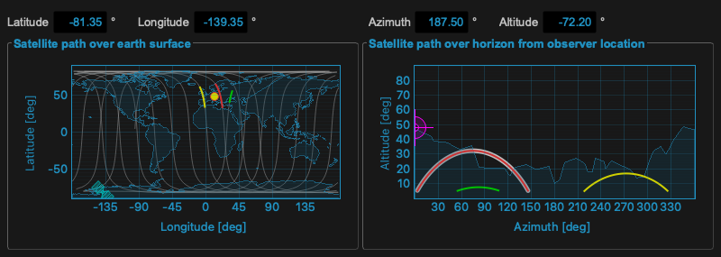

After the mount has done it's calculations as well, the result will be shown in
the **Trajectory starts** and **Trajectory ends** fields and a possible flip
will be announced on the "Run Tracking" tab, MountWizzard4 offers now (need
Firmware 3.x) some adjustments for centering the satellites in you imaging FOV.

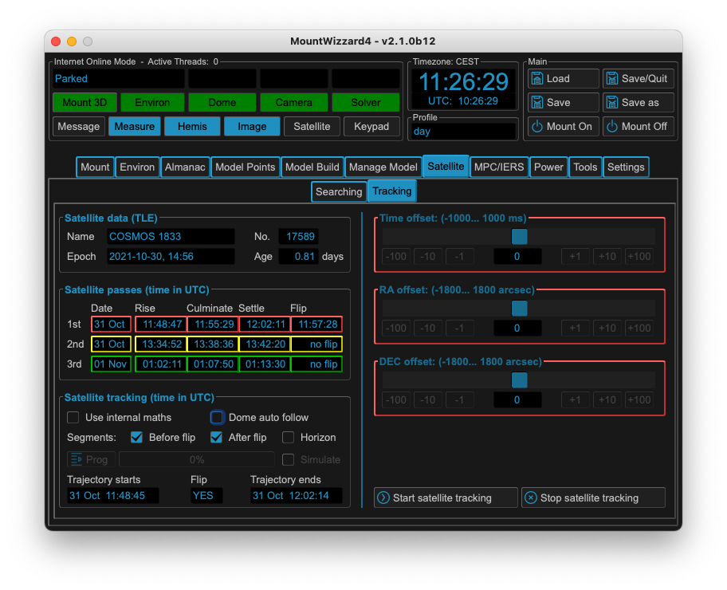

As soon as a valid tracking path is present in the mount, the **Start satellite
tracking** and **Stop satellite tracking** button are enabled. Once started,
the mount will slew to the begin of the tracking path and wait for the satellite
to rise. Selecting partial tracks and respecting constraints is not possible.

Since FW 3.x the command protocol offers the programming of a custom satellite
track. This offers the capability of takings care of avoiding flips, respect
horizon and other constraints. The operation is different to the classic
approach: Instead of programming TLE data to the mount, MountWizzard4 programs
Alt / Az coordinates in a one second interval to the mount (max. 900s) which the
mount after start tracking will follow. You could enable this feature with
checking **Use internal maths** if the firmware is 3.x or higher. After
enabling, additional elements will be enabled.

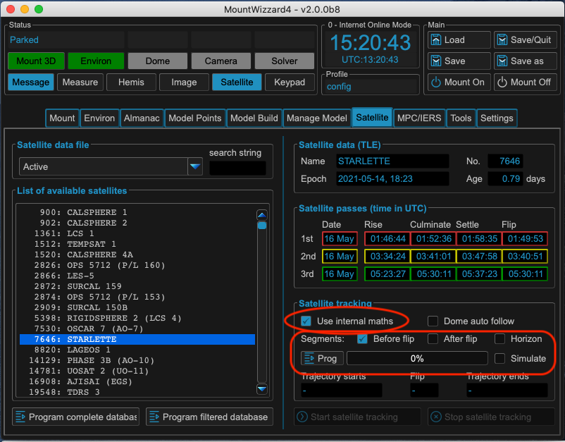

As the calculation now happens outside the mount, we could take a look to the
difference between tracks calculated by the 10micron mount and MountWizzard4
based on the same satellite TLE data! You will find some comparison under the
architecture / math section:
:doc:`precision of internal calculations <../../architecture/calculations>`.

If you are using the internal math as well as classic mode, you could open the
satellite window. There you could see the next three orbits and for internal
math the resulting satellite track with an white underlay. If you change any
setup, MountWizzard4 will recalculate all data and updates the plots accordingly.

.. note::   The solid line shows the track before meridian transit, the dotted
            line the track after meridian transit. The resulting white
            background shows the resulting track, which takes flip track
            tolerance into account. If you change settings in satellite (or
            even limits), MountWizzard4 will update the tracks path in plot
            accordingly and reset the prog state.

Select only a segment before a meridian transit (and therefore avoiding a flip
during tracking):

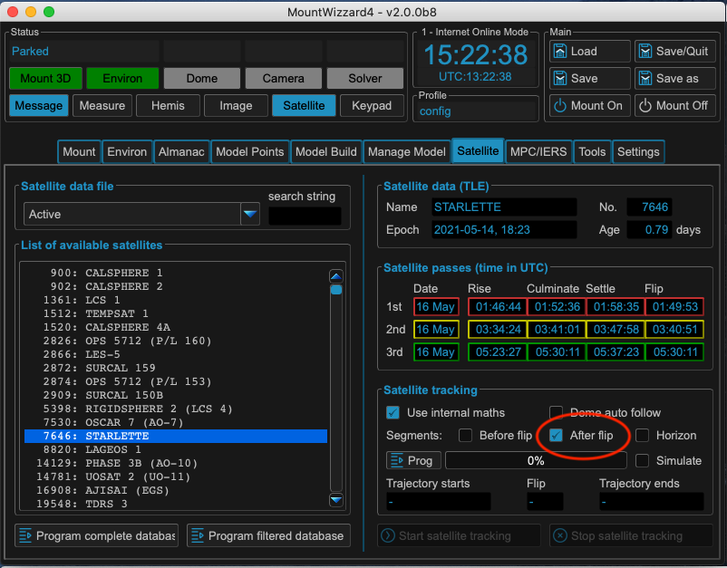

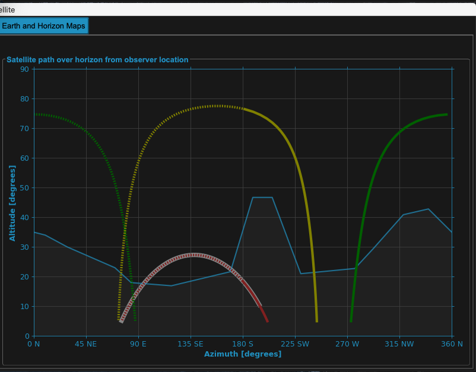

Select only a segment after a meridian transit (and therefore avoiding a flip
during tracking):

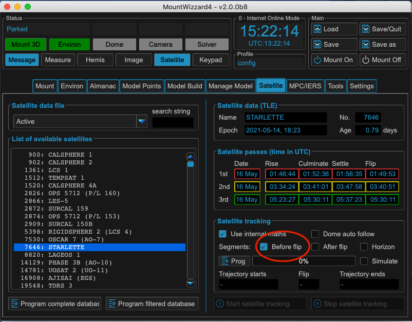

.. image:: image/sat_be_track.png
    :align: center
    :scale: 71%

Select both segments of the meridian (this might cause a flip during tracking):

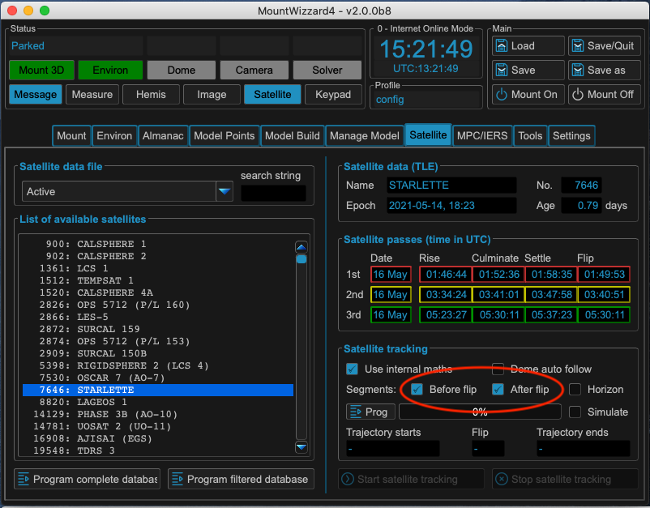

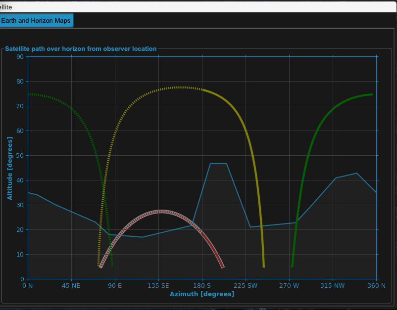

Select respecting the horizon line. This filters out additional all segments,
which are below the given horizon mask.

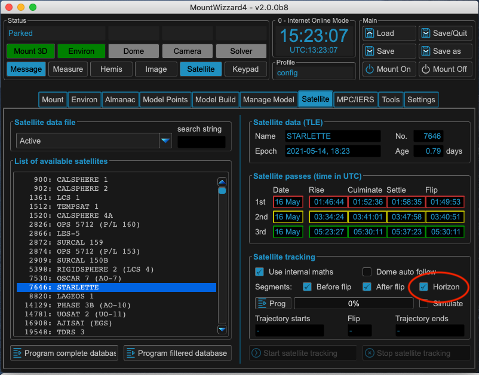

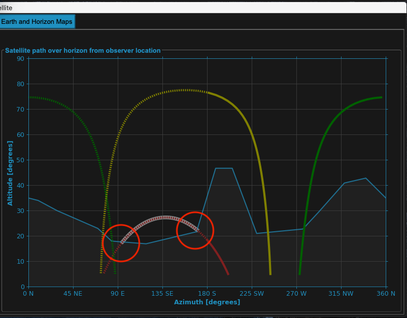

MountWizzard4 will take into account the meridian track limits of your mount.
Here set to 1 degree (which is close to meridian)

.. image:: image/sat_lim_1.png
    :align: center
    :scale: 71%

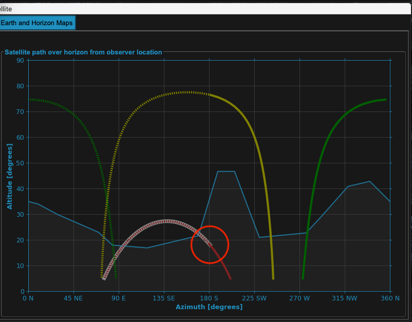

MountWizzard4 will take into account the meridian track limits of your mount.
Here set to 15 degrees (which could avoid a meridian flip or at least extend
the tracking time)

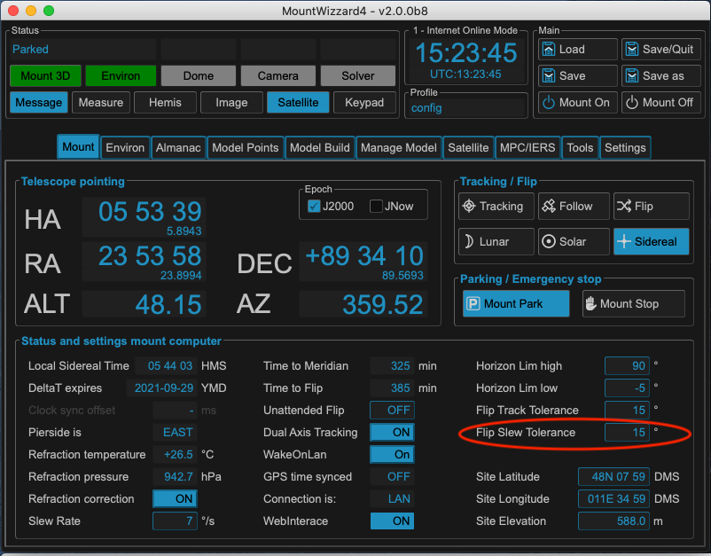

.. image:: image/sat_lim_15_track.png
    :align: center
    :scale: 71%

.. warning:: The meridian track limits have to be chosen carefully as the mount
             might hit your setup !

The biggest change in using satellite tracking with the new implementation is
how the data is handled to the mount: whereas in classic mode only the TLE data
has to be uploaded (which is quick) now the whole track coordinates have to be
programmed . As this takes up to 10 seconds, MountWizzard4 does not
automatically start the transfer. Once your setup (choice of segment, horizon
etc.) is made, you have to start the programming by pushing the **Prog** button.

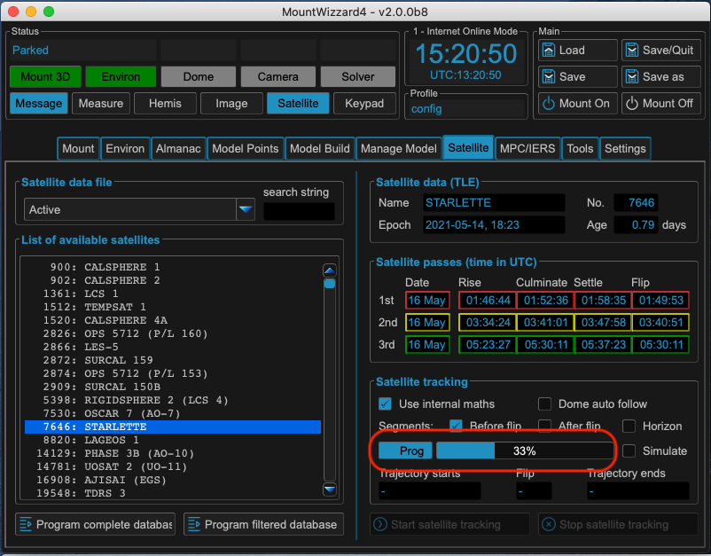

After a successful upload, the trajectory data is populated and the Start / Stop
tracking buttons are enable like in classic mode.

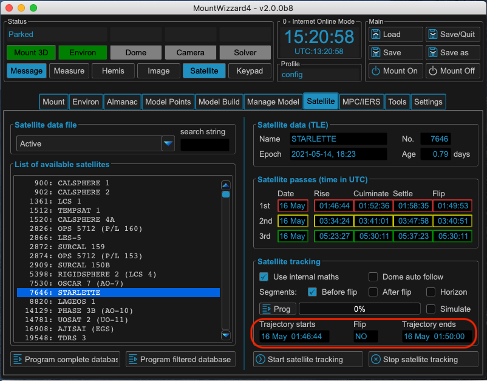

