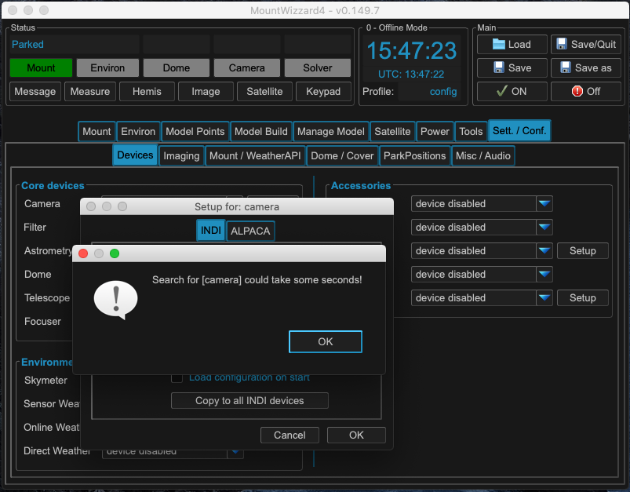

Adding the camera
=================
For adding devices like the camera select the Sett. / Conf. tab in the main menu
and there select the devices tab. For the following explanation we would like to
connect a camera, a filter and adding a link to the mount as well. The mount link
is only used for reading the parameters of the mount driver of your setup (e.g.
focal length, aperture).

.. image:: image/camera_01.png
    :align: center
    :scale: 71%

In core devices select Setup für Camera. A popup shows up. Please fill in the ip
address of the INDI or ALPACA server, where your devices are connected to.

.. image:: image/camera_02.png
    :align: center
    :scale: 71%

If you are using INDI, you search for INDI camera devices by clicking on the search
button. Once you finished searching by pressing OK button, a list of available
devices will be populated. From the list choose the device and finish the setup
with OK button.

The selected camera will be highlighted green in the drop down menu and in the
status as well. Once you configured the camera, the selection list will be stored
for later use. If you want to disable the camera, please select device disabled in
the menu.

.. image:: image/camera_04.png
    :align: center
    :scale: 71%

MW4 will now try to connect to the device and show green light whenever a
connection is established.

Do the steps 1 - 5 for all devices you need to configure. All configuration are
save when leaving MW4 with Save/Quit button or just when saving the profile. You
can add or change any config later on at any time.