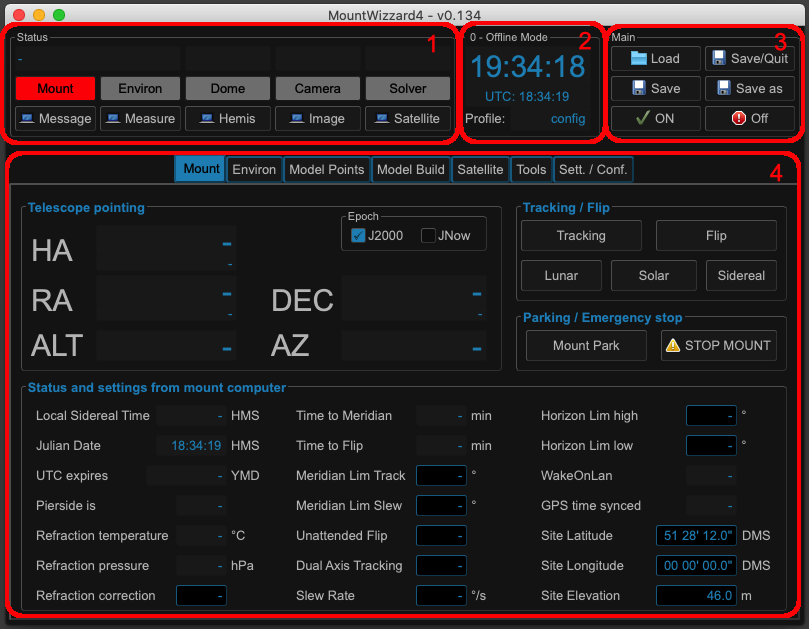
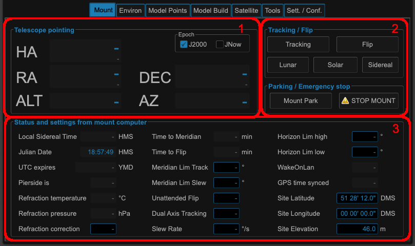
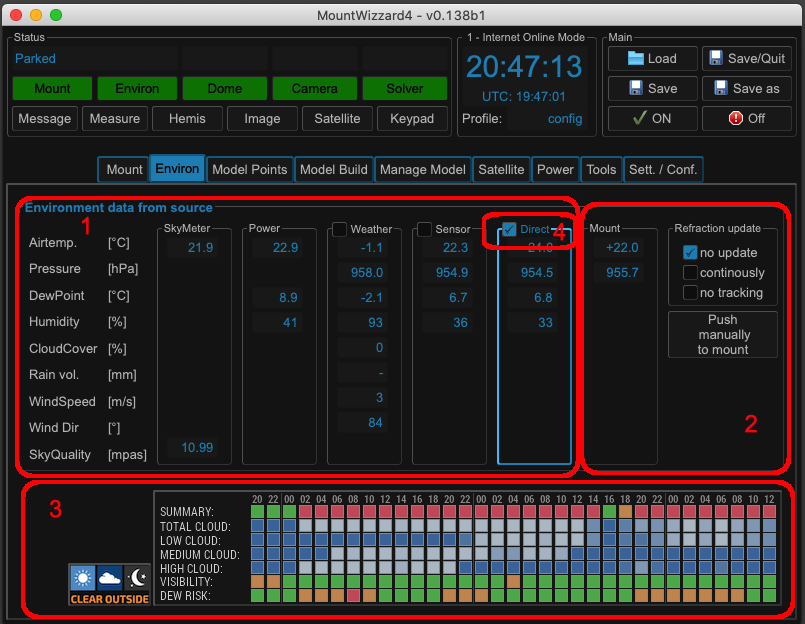
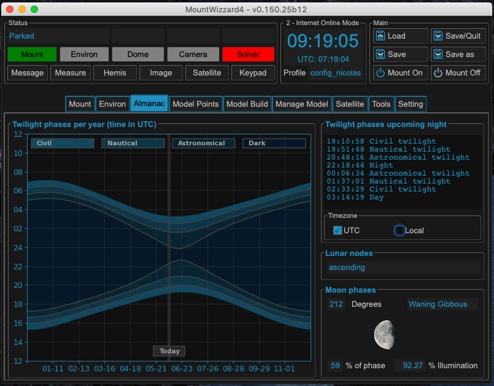
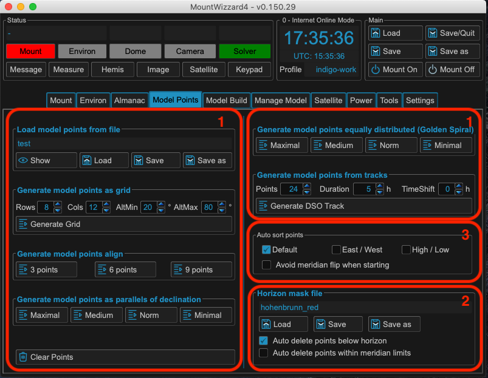
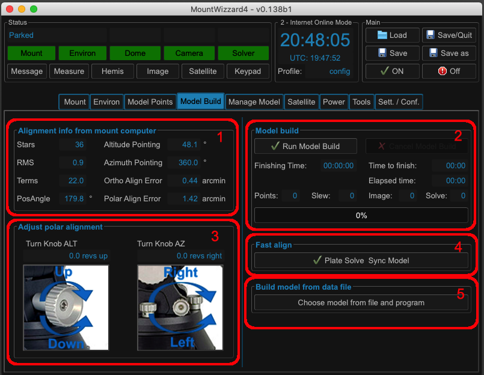
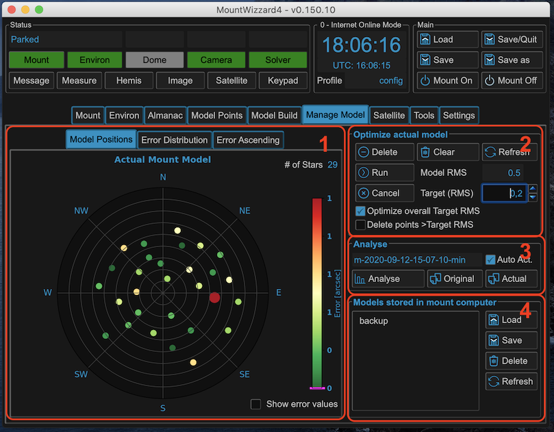
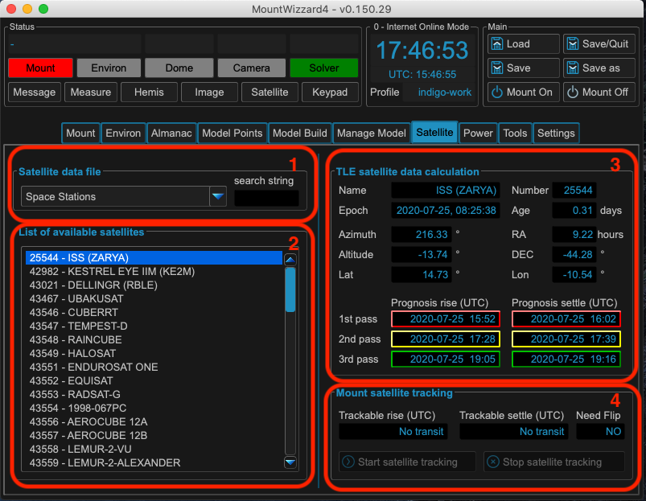
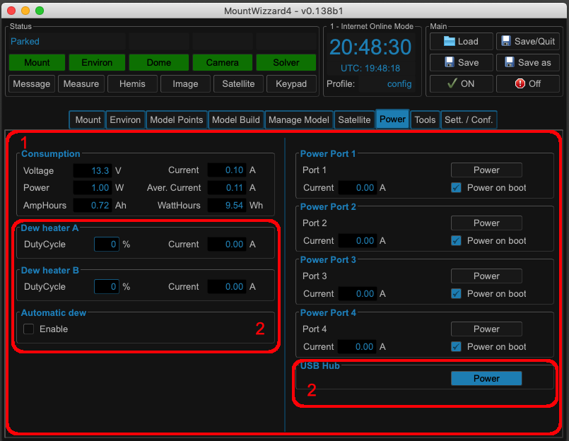

Main Window Tab
===============

Layout of main window
---------------------

After starting MW4 the first time you will see the main window. It consists of 4
areas to be
used:

Area 1: Devices and Windows
^^^^^^^^^^^^^^^^^^^^^^^^^^^
...describes the actual status of the important devices used in modeling (red shows
disconnected, green shows connected devices), and shows status text output from
devices. Buttons below the status indicators can open, show additional status, or
close additional windows for advanced features.

Area 2: Overview and time
^^^^^^^^^^^^^^^^^^^^^^^^^
...shows actual computer time, UTC, and the actual profile. In header section
there is hint if MW4 work actually in online (internet connected) or offline mode.

Area 3: Start / Stop / Boot / Shutdown
^^^^^^^^^^^^^^^^^^^^^^^^^^^^^^^^^^^^^^
...manages loading / saving profiles, boot and shutdown of the mount (if WOL -Wake
on LAN) is enabled and the MAC address of the mount is known)

Area 4: Functions area
^^^^^^^^^^^^^^^^^^^^^^
...shows different tabs for different use cases.

MW4 comes uses tooltips which should help you understand which button or widget is
used for which purposes.

MW4 uses a direct IP connection to the mount computer. This can be done via
ethernet cable or wireless. An RS-232 connection is not supported! The IP
connection is used heavily to send and update data quickly, so there is real
amount of traffic on this line.

.. note::
    Recommendation: If possible use MW4 with a wired IP connection (ethernet
    cable). This enables the WOL (wake on lan) function and has lower latency for
    the IP traffic. Using a bad WiFi connection might cause timeouts in
    communication.

When connected, MW4 is used for all functions (except the computer time shown in
area 2) the timebase of the mount. This is also valid for the UTC shown in area 2
as well for other functions or data that use time. You can choose, how the time
base of the mount if tracked by using an NTP solution, the 10micron tool, or using
GPS during boot also for time update.

Mount tab overview
------------------

Area 1: Pointing
^^^^^^^^^^^^^^^^
Altitude (ALT) and azimuth (AZ) are shown in degrees. As soon as the mount is
connected, the mount tab shows the telescope pointing in hour angle (HA), right
ascension (RA), declination (DEC) in hours / degrees HMS/DMS as well in decimals.
You can choose to see the coordinates in JNow, the mount representation or in
J2000 Epoch for better compatibility with other programs. The handling of
coordinates between MW4 and the mount computer is done in JNow. But this is
transparent when in use.

Area 2: Track and Flip
^^^^^^^^^^^^^^^^^^^^^^
In the tracking / flip section, the tracking can be switched on / off and if
possible a flip can be forced. The main tracking speed (lunar, solar or sidereal)
is highlighted and can be changed.

Parking / emergency stop puts the mount in park position or stops and movement
immediately.

Area 3: Mount Status
^^^^^^^^^^^^^^^^^^^^
In Status and settings from the mount computer, many parameters are visible and
can be altered. Whenever you see a frame around a value, you can click on it to
change the parameter. Some of the parameters can only be changed if the mount is
connected.

Environ Tab
-----------
If you have environment sensors connected and configured, you can see the overview
in the environment tab. The tab content is dynamic. The more connections you have,
the more you will see. The example below is the maximum MW4 can support.

Area 1: Data Sources
^^^^^^^^^^^^^^^^^^^^
Data of all different configured sources are shown here. If a source has no
connection or receives no data, the frame will turn red.

+----------+----------------+-----------------------------------------------------+
| source   | device         | remarks                                             |
+----------+----------------+-----------------------------------------------------+
| SkyMeter | Unihedron SQM  | for compensation it's gathering temperature as well |
+----------+----------------+-----------------------------------------------------+
| Power    | Pegasus UPB1/2 | both version are supported                          |
+----------+----------------+-----------------------------------------------------+
| Weather  | OpenWeatherMap | API needed, the pressure is at mount level !        |
+----------+----------------+-----------------------------------------------------+
| Sensor   | MBox, MGBox    | if connected as INDI external device, compatibles   |
+----------+----------------+-----------------------------------------------------+
| Direct   | MGBox          | if connected via GPS connector to mount             |
+----------+----------------+-----------------------------------------------------+

Area 2: Mount Refraction Data
^^^^^^^^^^^^^^^^^^^^^^^^^^^^^
This is the data the mount is working with. The mount box display shows the actual
refraction data the mount knows. You can set the refraction update method in this
area or push the data manually to the mount. Continuously means at any state, but
filtered with a moving average filter of 60s length. No tracking means updating
whenever new data is acquired, but only when the mount is not in a tracking state.

If no source for updating the refraction data is available, but needed, this part
will turn red. The update mode (to accept data at the mount) is set in the mount
computer if "Direct" source is selected or done through MW4 for all others sources.

Area 3: Online Forecast
^^^^^^^^^^^^^^^^^^^^^^^
If you have an online connection enabled, you could see the weather forecast for
your location from clearoutside. Thanks to these guys for agreeing on this
integration. The location is automatically set to the location of your mount.

Area 4: Source Selection
^^^^^^^^^^^^^^^^^^^^^^^^
If a source frame has a checkbox, this source can be chosen for using it's data
for the refraction update. As you may have different options in this window, you
have the choice to pick a source.

Almanac Tab
-----------
MW4 assists you in getting some context information what's going on during the
night imaging conditions. The almanac shows local time with DST settings. The
current date is always in the center of the image

Model Points Tab
----------------
Before starting the model build, you need to choose which set of reference points
you would like to use for your model. The model calculation is done by the mount
computer itself. MW4 only automates the procedure for you. Generally speaking you
should set your references points in areas you might use for imaging later on. In
a fixed setup, you should distribute points equally over the sky. MW4 allows
multiple choices to automatically select the reference points.

.. note:: The mount computer only processes max 100 points.

Area 1: Reference Types
^^^^^^^^^^^^^^^^^^^^^^^
The following type of placing the reference points in the hemisphere are available:

+-------------------+-----------------------------------------------------+
| type of reference | remarks                                             |
+-------------------+-----------------------------------------------------+
| file              | loading from a file                                 |
+-------------------+-----------------------------------------------------+
| grid              | grid in alt / az equally spaced                     |
+-------------------+-----------------------------------------------------+
| align             | subset of grid with 3 / 6 / 9 points                |
+-------------------+-----------------------------------------------------+
| greater circles   | references along ra / dec movements                 |
+-------------------+-----------------------------------------------------+
| golden spiral     | algorithm for placing it equally over hemisphere    |
+-------------------+-----------------------------------------------------+
| DSO tracks        | placing along dec movement from actual position     |
+-------------------+-----------------------------------------------------+

Sorting should be done automatically in a way to reduce slewing times.

Area 2: Horizon Management
^^^^^^^^^^^^^^^^^^^^^^^^^^
You might add a horizon mask to avoid placing reference points in positions where
you have obstacles in your sky view. When auto delete is checked, MW4 will remove
automatically all not visible reference points from modeling list. In addition you
could choose a sorting of your own, if you prefer or need different optimisations.

Area 3: Point sorting
^^^^^^^^^^^^^^^^^^^^^
Depending on your preferences in which order you walk over the hemisphere for model
building, MW4 supports different sortings.

Model Build Tab
---------------
Starting / Stopping, status and the progress of modeling is shown on this tab. MW4
tries to gives you some help to adjust the alignment easily, and the correct way.

Area 1: Alignment Status
^^^^^^^^^^^^^^^^^^^^^^^^
Actual alignment model of the mount in use. It shows the parameters of the actual
model and it's errors regarding orthogonal and polar align.

Area 2: Model Build Progress
^^^^^^^^^^^^^^^^^^^^^^^^^^^^
Shows the modeling process and some estimations about timing of the overall process.

Area 3: Alignment Helper
^^^^^^^^^^^^^^^^^^^^^^^^
If you are starting polar align, the deviations might be too big, such that
focusing a reference star might be impossible because this star is not within the
FOV of the camera. The mount gives you some hints how to tweak the mechanical
setup to get you alignment. The pictures show you the direction to turn based on a
GM1000 mount in revolutions of these knobs.

.. warning:: After you changed you mechanical setup by turning knows on your
             mount, the mount model is invalid! You have to do a new model build
             process to get a valid one.

Area 4: Fast Align
^^^^^^^^^^^^^^^^^^
If you simply want to readjust an existing model for a single reference point, you
can use plate solve sync model. Please take into account, that no new model is
calculated, but the existing model is shifted to match the actual reference point.
This might lead to larger errors in other areas of the sky. From my point of view
it is not recommended to use this type of model syncing. It is only useful if you
need a quick align on a single point.

Area 5: Programming Models
^^^^^^^^^^^^^^^^^^^^^^^^^^
For all the models you made with MW4, the necessary data is stored on your
computer. With this data you can reprogram the model without doing any imaging or
plate solving process, because it's already captured. MW4 can also combine
multiple model setups to a new one.

This is a very powerful function: You can use it for reprogramming models you lost
due to mount error, or use it as a backup if you tweaked the model. But you can
also combine different types of models to possibly improve your model for certain
use cases. For example if you have a 50 point model for the overall sky, you could
add a DSO track for you current object to improve accuracy by modeling more points
in your area of interest during this night.

A new feature: if you use Open analyse model build window, you could select any
model build file and check conditions and model build results.

Manage Model Tab
----------------
Once you have made a model or you have an actual model in the mount, MW4 will
download the data and the name list of all in the stored mount models. You then
can work with this data.

Area 1: Model Errors
^^^^^^^^^^^^^^^^^^^^
A polar diagram shows the distribution of the model points and it's errors. The
errors are absolute numbers.

Area 2: Optimizing Model
^^^^^^^^^^^^^^^^^^^^^^^^
Once you have the model downloaded (which MW4 does automatically when starting up),
optimizations can then be done. There might be some really bad points in the model
that you would like to remove. You can also do it automatically until you reach a
certain target RMS.

.. note::   It is not recommended to overshoot the optimization and only go for
            lowest numbers. As the model should reflect all deviations from
            reproducible errors to ground truth, the model errors are real.

Area 3: Analyse Models
^^^^^^^^^^^^^^^^^^^^^^
MW4 stores all data which was used for building the model in a separate model
file (extension .model, located in the model subdirectory). If it load the actual
model from the mount, it searches in the model subdirectory for the corresponding
model file if present and displays it's name. As model optimizations will change
the read model data, mw4 will automatically store an updated file (adding a
postfix -opt to the filename). You can display this optimised data automatically
(check auto act.)

Area 4: Models in Mount
^^^^^^^^^^^^^^^^^^^^^^^
The 10micron mount can store a recent number of models internally. The actual
active model has no name. So loading or saving means loading a stored model to the
actual space or saving the actual space to a certain name. You can't save a model
to disk. All models stored in the mount itself, and will stay there. I do not know
the maximum number, but over time it does not make sense to keep every model. If
you store models to disk, please refer to build model: MW4 stored any build model
to disk in parallel. So you can access the data even without having the model
stored in the mount computer.

How to use the manage model is described in :ref:`Managing Mount Models`.

Satellite Tab
-------------
The mount supports satellite tracking. There is a database in the mount (which
can be updated), from where you select the database.

MW4 works differently: As this satellite data is out-of-date within 2 weeks or
less and looses precision very quickly, it maintains the databases outside the
mount and only programs the single satellite data from a satellite you have
selected. MW4 won't touch the internal database.

Area 1: Select Satellite Database
^^^^^^^^^^^^^^^^^^^^^^^^^^^^^^^^^
MW4 needs an online connection for updating the database. Still there will be data
for testing and experiencing the functions there, but this data will be
out-of-date from the beginning.

.. note::
    Satellite tracking data should be not older than some days. You will loose
    precision and might not see the satellite in your FOV. So internet connection
    is strongly recommended for using satellite tracking.

MW4 provides some recent online databases that you can select from. The satellites
in the database are shown in area 2.

Area 2: Select active Satellite
^^^^^^^^^^^^^^^^^^^^^^^^^^^^^^^
All available satellites are shown in this list in order of the satellite number.
If there is already a satellite selected in your mount, MW4 will retrieve this
data and makes a selection accordingly.

Selecting a new satellite out of this list will immediately program its data to
the mount computer and calculate the necessary data shown in area 3.

Area 3: Calculation and Data
^^^^^^^^^^^^^^^^^^^^^^^^^^^^
The selected satellite data is shown. Please have a look at the age of the data.
MW4 will show in colors if that data is too old for good tracking. Some of the
calculations (like the actual satellite position is calculated by MW4, some of
this data like Start / End time is retrieved from mount computer. But you should
not need to care about it. Once a correct data set is calculated and is valid, the
tracking commands (area 4) are enabled.

Area 4: Satellite Tracking
^^^^^^^^^^^^^^^^^^^^^^^^^^
With the start of satellite tracking, the mount will slew directly to the
satellite position in orbit. If the satellite is below the horizon or your horizon
limits, the mount will slew to the point where the satellite will rise over
horizon the first time and will wait for that moment. As soon as the satellite
rises, the mount will track the satellite.

Stop satellite track should stop tracking the satellite immediately. for some
reasons this might happen correctly as there is no dedicated mount commend for
this behaviour. You might need to "Stop" the mount or try it multiple times. This
will be improved with future firmware versions.

Some remarks:
The 10micro allows to update the satellite data as the time out quite fast.
There is no "the sat database", but you could collect as many as you want (I do
not know where the memory limit in the mount is). When you use MW4, you should be
able to select between different choices of sa databases from the internet (there
are many, I only offer the most used). Now there are three ways to work with the
mount:

1.) Complete database: Say if you have selected "space stations", MW4 will program
all space station data available to the mount. For this you need the 10micron
updater installed and MW4 has to run in windows. As there is no command protocol
for downloading the database, MW4 automates this process.

2.) Filtered database: coming from 1) the list may be very long. MW4 offers a
filter (field close to database selection), which enables a search string in the
database. This filters the list shown in MW4. If you program with filter only the
satellite data from the filtered database is programmed to the mount. Procedure is
the same as 1) using the updater.

In both cases MW4 will generate the programming data needed on all platforms
(ubuntu, macOS, Windows), only the automation process work on windows due to the
updater topic.

3.) You select a satellite from the list: In this case the TLE data from the
satellite is programmed directly to the mount, track data is calculated in the
mount, MW4 does some calculations as well and makes some nice drawings and you
could start tracking a satellite. As this is done via command protocol. this works
on all platforms.

Actually I did not implement more advanced sat function like search for next
satellites etc. as I do not track sat that much and there was limited use for
these features. If you program a database to the mount, it allows doing this
already. So MW4 would double an existing function in the mount.

MPC Data:
Works like 1) and 2) for satellites.

IERS Data:
This is the earth rotation data. Actually the 10micron updater uses a selection of
files, which are hard to get on the internet (sites closed, need registration etc)
. But: the master data for all this is public available, the file finals2000A.all.
MW4 compiles the 10micron files for the updater from it and if you are on windows,
could automate the process for you like in satellites / mpc database programming.

For all this, MW4 need an internet connection. Some files have a "built-In"
version, but for short living data this does not make sense and therefore is
missing.

Power Tab
---------
If you have a Pegasus UPB (version 1 or version 2) configured, this tab will
show up. It enables you to review some data and uses the functionality of UPB
directly from MW4.

Area 1: Data UPB
^^^^^^^^^^^^^^^^
Most of the data and functions are available on this part.

Area 2: Changing UPB
^^^^^^^^^^^^^^^^^^^^
The functions / data in this area is adapted to the version of UPB and changes
depending to which version you have in use.

Relay Tab
---------

Should be added later.

Tools Tab
---------
MW4 provides some small tools to make life a little bit easier.

.. image:: image/tools_tab.png
    :align: center
    :scale: 71%

Area 1: Renaming FITS
^^^^^^^^^^^^^^^^^^^^^
MW4 can rename FITS files (extension .fit or .fits) to a filename which is build
from a set of data out of the FITS header and a text string. This can be done through
subdirectories in batch mode.

.. warning::    MW4 renames the files directly without making a copy!

Area 2: Park Positions
^^^^^^^^^^^^^^^^^^^^^^
In MW4 you could program up to 10 park positions under settings. You could
recall them just with a button press.

Area 3: Mount Moving
^^^^^^^^^^^^^^^^^^^^
As normally with MW4 you don't use the key pad, you can slew the mount in different
directions at different speeds. A button press starts slewing and the mount moves
as long as you press stop or it reaches some limit.
