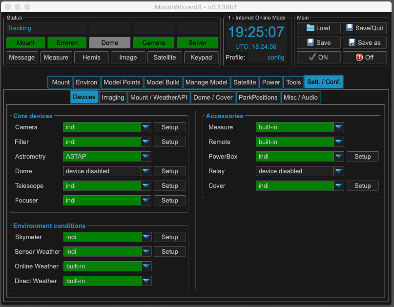
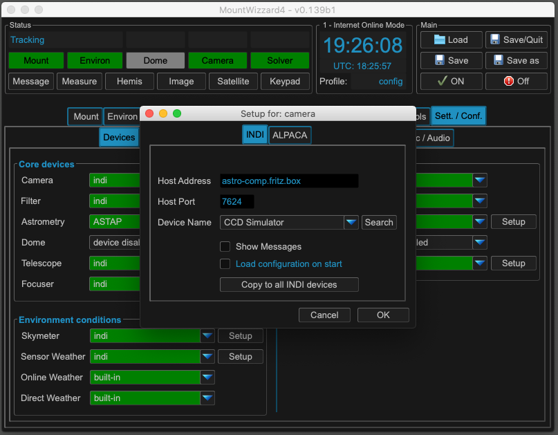
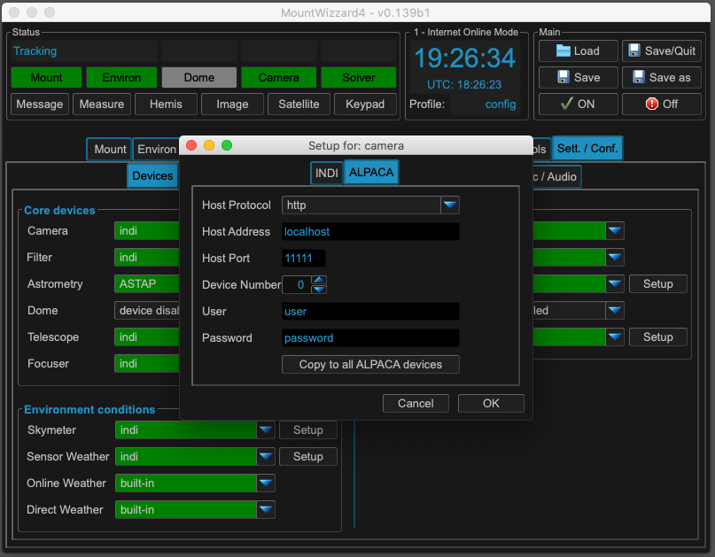
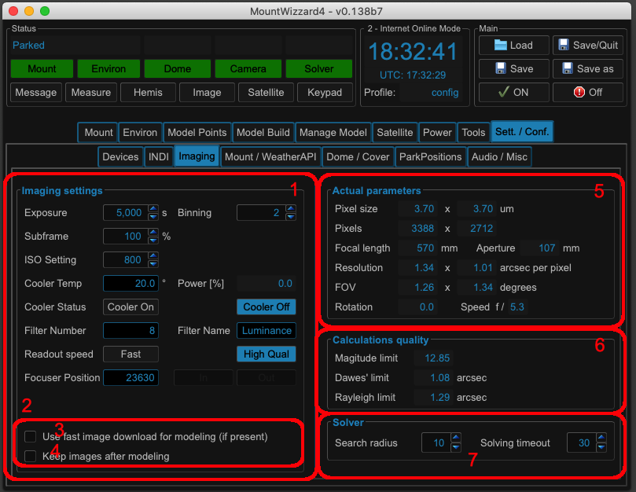
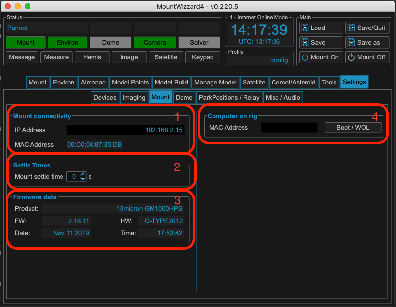
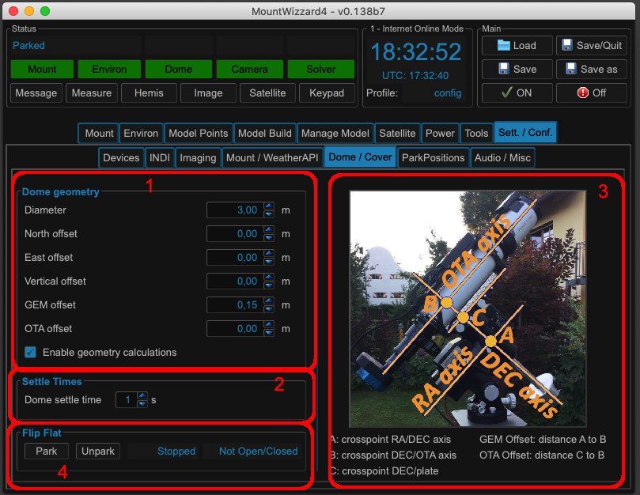

Main Window Settings Tab
========================
In the main window the last tab called "Sett. / Conf." points to menu where all
the settings for MW4 could be configured. It is like the main window split into
multiple Tabs.

Devices Tab
-----------
The devices tab is the central point for MW4 to define the devices, which are used
within the program. Drop down lists let you select the appropriate device source
or disable it. Disabled devices might occur gray in the menu or are even removed
(like Relay or Power)

The drop down lists are colored in green, whenever a device could be connected. A
status change could take some seconds to connect to a server or to start runtime.
There is no need to get all devices populated if not needed.

The following different device types are present:

.. list-table:: Device Types
    :widths: 25, 75
    :header-rows: 1

    *   - type of device
        - remarks
    *   - device disabled
        - disabling device usage
    *   - Built-In
        - functionality is built in MW4
    *   - indi
        - device is connected to an INDI server
    *   - alpaca
        - device is connected to an ASCOM ALPACA server
    *   - Astrometry
        - shows local programs like ASTAP, astrometry.net

A snoop device is only read for information, but not needed for active functions.

Some of the devices have a setup button. When selecting, a popup window will show
up. You have to make selections for an INDI server:

For the INDI configuration you could search for devices of the given type and
select them via drop down menu. In addition you could copy the settings for host
address, host port, showing indi messages in main message window to all INDI devices.

MW4 supports ASCOM ALPACA as well:

For ALPACA you setup the parameter accordingly. Like in INDI you could copy the
protocol, host address, host port, user and password to all other alpaca device.

Imaging Tab
-----------
The imaging tab is central setup for all things related to gather images.

Area 1: Imaging Settings
^^^^^^^^^^^^^^^^^^^^^^^^
The most important functions needed for the camera, cooler, filter wheel is set
there. Some of the functions are only available when your device supports it (like
ISO, sub frame etc.).

Area 2: Image handling
^^^^^^^^^^^^^^^^^^^^^^
You could enable fast download of images from your camera (3) - if supported and
decide and check if you would like to keep the images from model build on your
disk. Normally all data after a model build is stored anyway. So if you dont need
the images for analyse later, there is no need for keep them.

Area 3: Imaging Parameters
^^^^^^^^^^^^^^^^^^^^^^^^^^
Parameters of you imaging train are collected, calculated and shown there. For
accessing all parameters, MW4 needs the telescope snooping set and the parameters
set in your INDI server.

Area 4: Imaging Quality
^^^^^^^^^^^^^^^^^^^^^^^
Out of literature there are some known quality parameters, which MW4 calculates
for you. It might help you in choosing the right setup, it's for information only.

Area 5: Solver
^^^^^^^^^^^^^^
There aren't much setting for the solver to be made. MW4 uses external programs
for plate solving an image. You should set the search radius and the solving
timeout. Good value are 30 degrees for radius and 30 seconds for timeout.

Mount Tab
-------------------

Area 1: Mount Connectivity
^^^^^^^^^^^^^^^^^^^^^^^^^^
For MW4, the mount has to be connected via an IP connection. A serial link is not
supported!

.. note::
    I recommend a wired connected (ethernet cable) as there is heavy communication
    with the mount computer when running a rich feature set.

You could enter the ip address numerical but as well in general host name string.
Once you connect the mount and booted it manually, the MAC address field and the
connection type will be populated automatically. If you enabled wake on lan (WOL)
for booting the mount, MW4 from then on could boot the mount with this command.

.. note::
    Wake on lan functionality is only available on a wired connection and if you
    mount computer and the device your are running MW4 on is in the same subnet of
    you network.

Area 2: Mount Settle Time
^^^^^^^^^^^^^^^^^^^^^^^^^
After slewing your setup might need some time for settle before starting imaging
again. With this parameter you could choose the waiting time.

Area 3: Mount Firmware data
^^^^^^^^^^^^^^^^^^^^^^^^^^^
All firmware information from you mount is displayed here.

Area 4: Computer on rig
^^^^^^^^^^^^^^^^^^^^^^^
If you have a computer on your rig, which could be booted via wake on lan as well,
you could enter the MAC address here and remote boot this computer from MW4. There
are the same limitations for WOL like for the mount.

Dome / Cover Tab
----------------
MW4 could handle a dome which is connected via INDI.

Area 1: Dome geometry
^^^^^^^^^^^^^^^^^^^^^
If a dome is connected and as device setup, MW4 will slew the dome to the azimuth,
the mount is slewed to automatically. If you own an all sky dome this is
sufficient. In other setups there is the need to calculate the right dome opening
for the appropriate geometry in your setup. In this case, please check the enable
geometry calculations box and setup the geometry parameters of your dome and the
position of your mount in relation to the dome. If you think of the center point
of the dome as a hemisphere, the distances (offsets) from your mount to this point
have to be entered. The base point of the mount is the center of the mount adapter
ring.

For setting up the GEM and OTA offset the picture (3) should help you. There is no
need for setting both of them. GEM offset is the more known parameter whereas OTA
offset might be easier to measure. As they are dependant on each other, MW4 will
calculate the other parameter automatically for you.

Area 2: Dome Settle time
^^^^^^^^^^^^^^^^^^^^^^^^
After moving your dome, your setup might need some time for settle before starting
imaging again. With this parameter you could choose the waiting time.

Area 4: Cover
^^^^^^^^^^^^^
If you have a telescope cover device setup, you could open and close your cover.

Park Position Tab
-----------------
MW4 stores up to 10 different park positions for you. You could setup these
positions with text (the text will be displayed in the tools menu), and altitude
and azimuth for the position.

The fill in button in each line allows to directly set altitude and azimuth of the
actual position in the according fields.

Audio / Misc Tab
----------------
.. image:: image/sett_misc_tab.png
    :align: center
    :scale: 71%

Area 1: Internet Connection
^^^^^^^^^^^^^^^^^^^^^^^^^^^
You could tell MW4 to get online and update data or stay in unconnected mode.
There are some functions, which need an online connection to work properly:

.. list-table:: Online related Services
    :widths: 25, 75
    :header-rows: 1

    *   - function
        - remarks
    *   - open weather map
        - downloading weather data
    *   - satellite
        - update satellite TLE elements
    *   - deltaT updates
        - update time base for calculations
    *   - MW4 updater
        - accessing pypi.org for updates

Area 2: Updater
^^^^^^^^^^^^^^^
MW4 is able to handle updates via the python package management. You see the actual
installed version and the available version. Pressing install will update MW4. You
need to restart MW4 to run the new version.

MW4 offers to install alpha or beta releases as well. If you would like to do so,
please check the according box.

Area 3: Clock-Sync
^^^^^^^^^^^^^^^^^^
Sync of clocks could be done in two ways:

As the timebase for MW4 is the mount
clock, MW4 could set the computer clock to the actual mount clock. This also could
be done on a regular base when auto update is checked. The precision is limited so
it is really setting the clock not syncing the time base.

In the other direction, the mount clock could be synced to the PC time base like
the 10 micron clock sync tool does. When enabled MW4 starts to measure the
difference with a long filter and compares it. If you enable sync, MW4 will adjust
the mount clock in intervals until the difference is below 10 ms. When enabled the
UTC (mount time) in main window will show a status of the sync: Green (like
10micron) when difference is below 200ms, yellow if below 500ms and red if exceeds
this delta. Normally you should see a difference below 10ms after 2-3 minutes.
Syncing is always tricky as the time base is relevant for precision in tracking or
pointing, so you could force MW4 to sync clocks only when not in "working" mode,
means tracking or following satellite.

Area 4: Logging Levels
^^^^^^^^^^^^^^^^^^^^^^
As MW4 is not perfect things might happen and to review the situation and review
it, MW4 writes log files. For all release versions information setting is ok, for
alpha and beta version debugging should be set. The log file could become big as
MW4 tries to log all data needed for bugfixing.

.. note::
    If you experience problems or want to file a bug, please attach the log file
    from your work directory. The best way to file a problem is to open an issue on:

    https://github.com/mworion/MountWizzard4/issues.

    Please take the time for a explanation what happened and drop the log file to
    this issue as well. It's easy to do and the size of the log file should not
    matter. Using issues on GitHub help me to improve MW4.

Area 5: Audio Signals
^^^^^^^^^^^^^^^^^^^^^
MW4 could play audio signals for some events to giv you an audio feedback what is
happening. Event and audio could be setup.