Extended Windows
================

MW4 has some more windows to show and use. Some of them are necessary for full
functionality. These windows could be opened on the main window with dedicated
button in the upper left part described here: :ref:`Layout of main window`.

Message Window
--------------
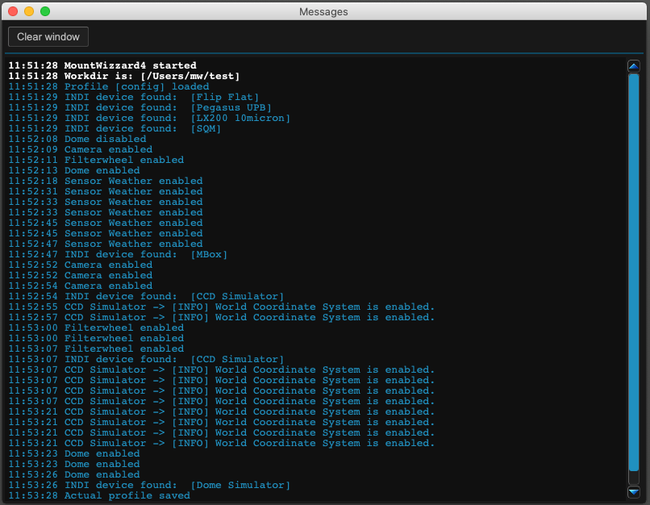

the message window shows all messages during the work of MW4. You could scroll
through the content and clear the window. All messages are logged in the logfile
for later analyse if needed. The window is sizable in height.

.. hint:: See also on youtube:  https://youtu.be/6jiCOqKgzZY

Measure Window
--------------
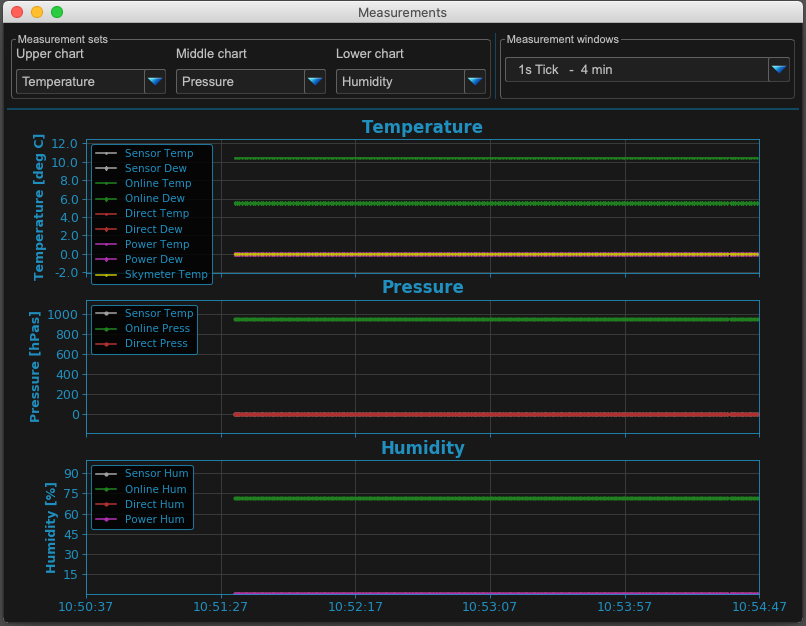

The measure windows supports displaying many different values if the measure
device is used (see :ref:`Devices Tab`). You could display up to 3 different
charts in this window and selecting the time range / update interval of the
measures. Sources are:

.. list-table:: Measurement Values
    :widths: 25, 75
    :header-rows: 1

    *   - source
        - remarks
    *   - temperature
        - temperatures from sensors as well as dew temps
    *   - pressure
        - pressure from sensors
    *   - humidity
        - humidity from sensors
    *   - RA stability
        - shows deviations RA increments during tracking
    *   - DEC stability
        - shows deviations DEC increments during tracking
    *   - Sky Quality
        - SQM Value if a sensor is attached
    *   - Voltage
        - Output Voltages if Pegasus UPB is installed
    *   - Current
        - Output Currents if Pegasus UPB is installed

The time interval range varies from 1s ticks (makes 4 minute view) to 128s
ticks (makes 9 hour view) and they double every step in between. The window is
sizable in width and height.

.. hint:: See also on youtube: https://youtu.be/ZWQBa714DjE

Hemisphere Windows
------------------
The hemisphere window is on of the central windows for model building. It is
oriented to a ALT/AZ view from your observation location.

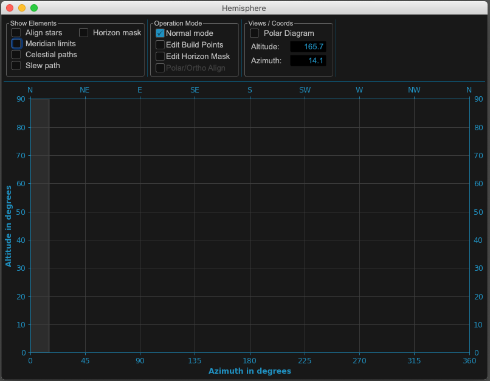

Hemisphere Full
^^^^^^^^^^^^^^^
It shows the horizon, the selected model points, celestial and slew paths for
the mount, align stars (for polar and ortho alignment) and much more.

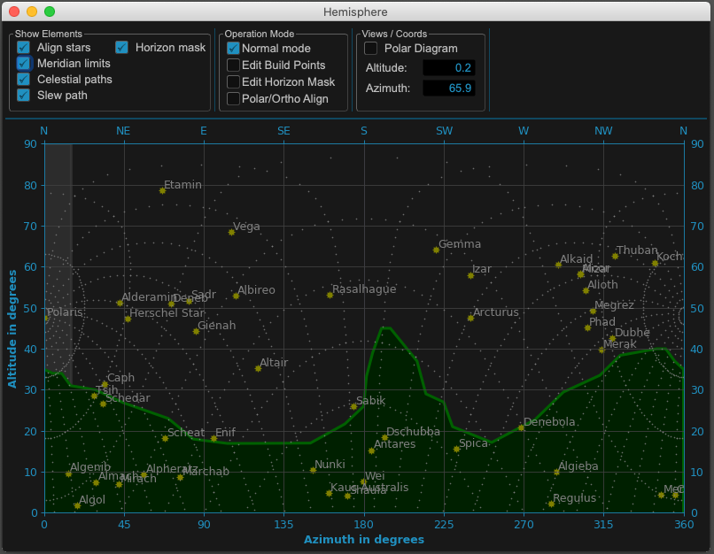

Hemisphere Slew
^^^^^^^^^^^^^^^
If you are in normal operation mode, clicking in the hemisphere window will open
a popup window to slew to the selected coordinates. The value of the coordinates
of the mouse pointer is shows under Views / Coords.

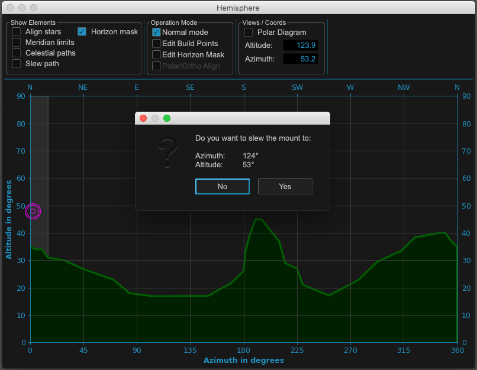

Hemisphere Points
^^^^^^^^^^^^^^^^^
Once you added model build points, you will see the actual valid points numbered
in the hemisphere window. If Slew path is checked, the slew path between the
points is shown. In the picture below no "auto delete below horizon" is checked.
Therefore some model points are below the horizon line. If checked, MW4 will
remove them automatically.

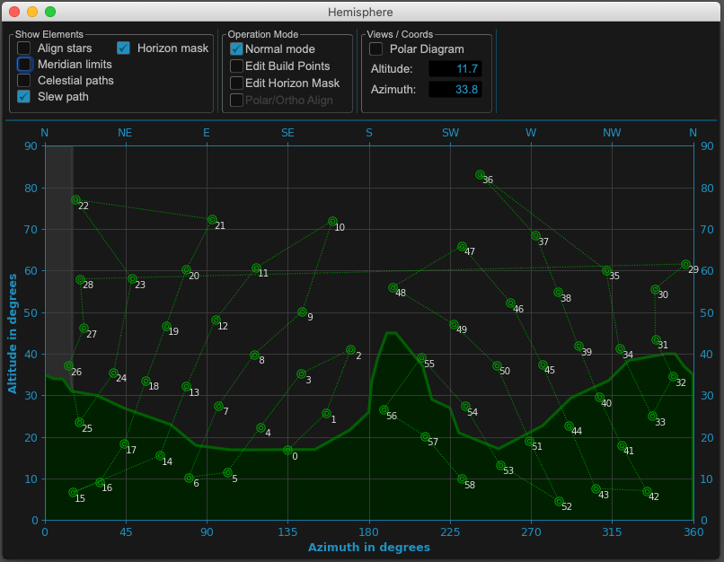

Hemisphere Points Edit
^^^^^^^^^^^^^^^^^^^^^^
Changing the operation mode to "Edit Build Points" will change the point color
to pink of all points. Now you can add new build point with a left mouse click and
remove point with a right mouse click. When deleting, MW4 will search for the
closest point to the mouse pointer.

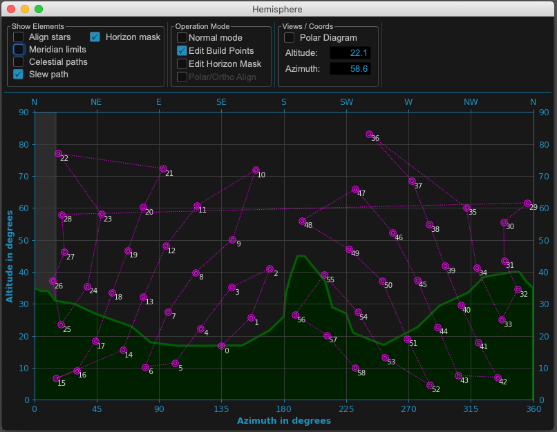

.. hint:: See also on youtube: https://youtu.be/PPG-aCEZZxE

Hemisphere Points Polar
^^^^^^^^^^^^^^^^^^^^^^^
Beside the ALT/AZ view - which is the standard view for modeling - you can add a
polar diagram as well. It basically shows similar information. You can't edit
point or horizon line in the polar diagram !

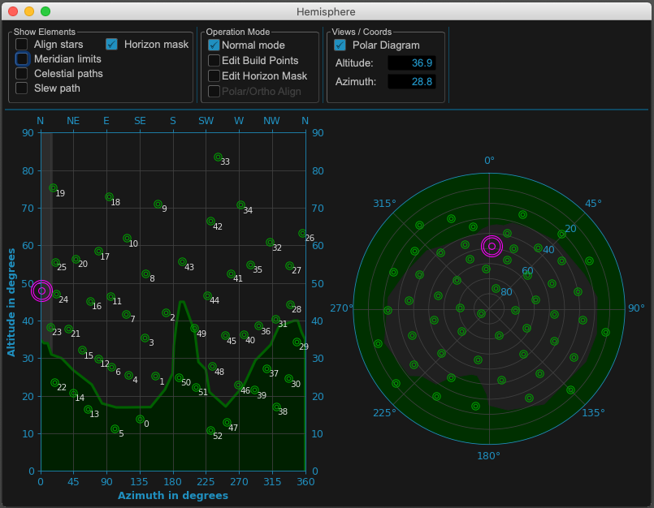

Hemisphere Horizon Edit
^^^^^^^^^^^^^^^^^^^^^^^
Changing operation mode to "Edit Horizon Mask" will change the horizon color to
pink. You can now edit the horizon line like the model point with adding a point
with left mouse click and removing a point with right mouse click. If you don't
need a horizon mask, simply switch it of by unchecking "Horizon Mask" on the top.

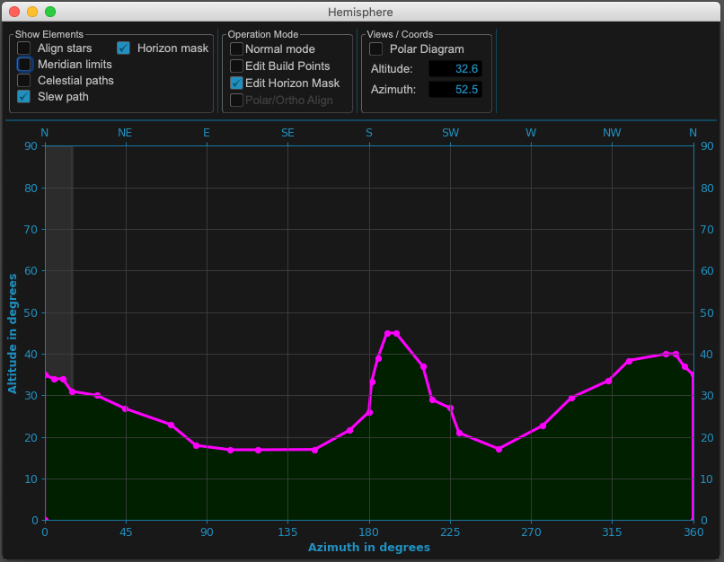

There is a video on youtube with sme explanations about edit modes:
https://youtu.be/PPG-aCEZZxE

Image Windows
-------------
With the image window you could follow the imaging process during model build
which runs normally in background. If necessary you could do single or continuous
exposures with the parameters set under Setting/Imaging in the main window. The
image window could also be used as fits viewer. It loads the FITS file and shows
the main FITS header keywords on the left side. You are able to plate solve this
image when a plate solver is configured. MW4 show images in b/w, colored images
will be debayered but also shown in b/w.

The continuous exposure mode (Expose N) enables imaging while adjusting the
mechanical setting of the mount (e.g. for polar alignment). A cross hair and grid
is available. When "Auto solve" is checked every received or loaded image is plate
solved automatically. If "Embed Data" is checked as well, the solving result will
be written in the header of the FITS image.

.. warning:: The will be no copy of the image saved. The data is saved is the
             original image header!

When using the continuous exposure mode, MW4 will stack the received images when
"Stacking" is checked. There is no alignment routine behind the scene working.
It's a quick adding images and calculating mean routine. So good stacking results
rely on the tracking quality of the mount.

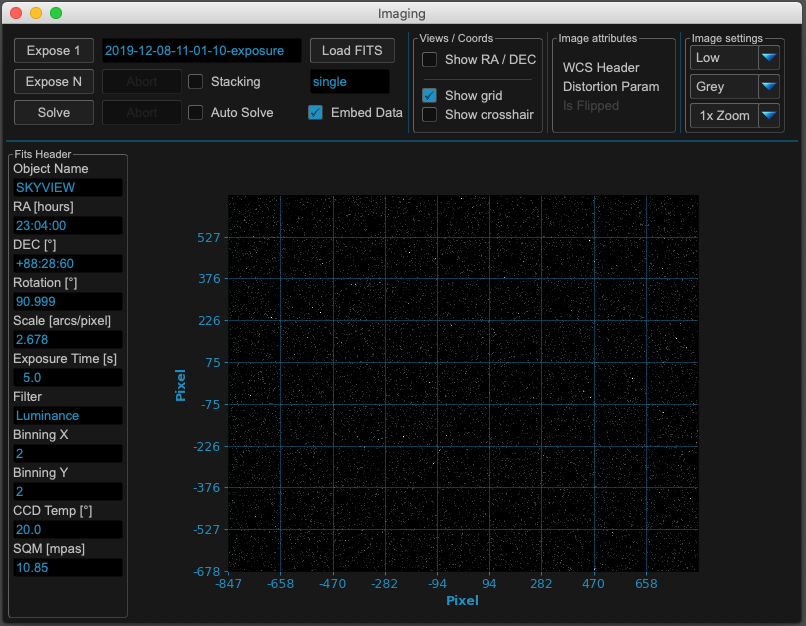

.. hint:: See also on youtube: https://youtu.be/I5i8ihvtbgY

Image Distortion Coordinates
^^^^^^^^^^^^^^^^^^^^^^^^^^^^
If you have a FITS image with distortion parameters stored in the FITS header
or you add them by plate solving and embedding the parameters yourself, MW4 can
show the image with distortion parameters used.

.. hint:: Some plate solvers calculate the coordinates of the images, but no
          distortion parameters! For example astrometry.net does calculate them,
          whereas ASTAP does not!

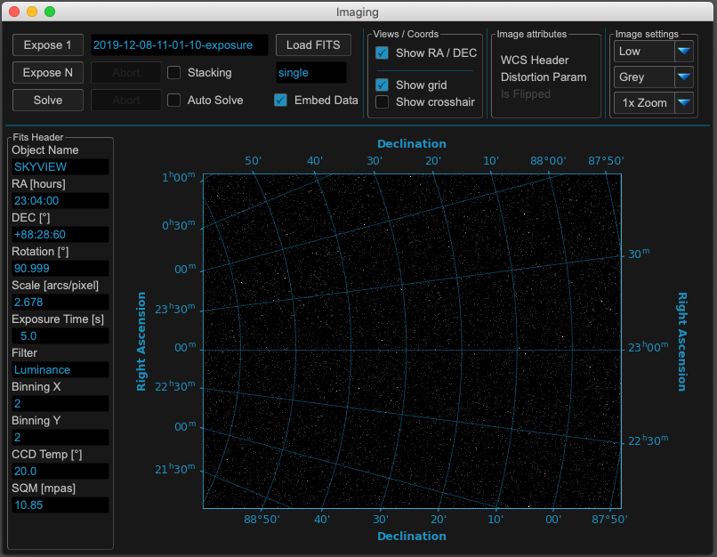

Satellite Windows
-----------------
The satellite window is split in four quadrants. The left side shows the the
earth fixed and rotating, the right side the earth map and your horizon view (like
the hemisphere view) with your horizon line (if checked). Red dots show your
location.

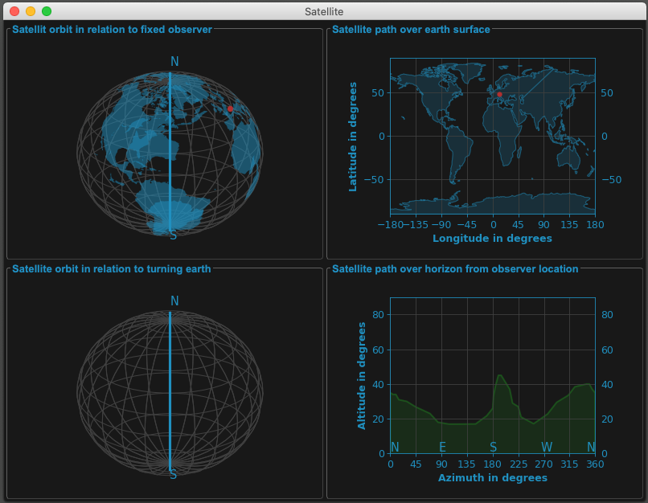

Satellite Visible
^^^^^^^^^^^^^^^^^
If you have an active satellite (selecting in satellite tab in main window), MW4
will show the satellite track and position in all quadrants. Satellite position is
cyclic updated, so you could see the satellite moving. If the satellite is visible
and above horizon, you will see it's track in the fourth quadrant.

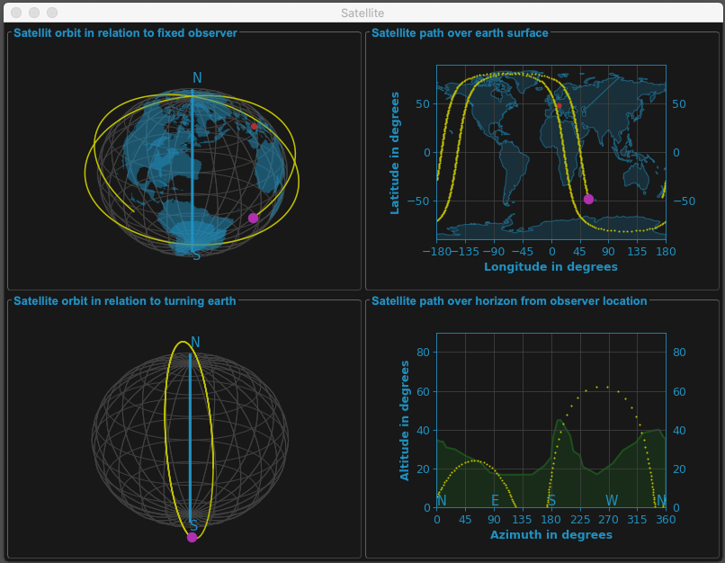

.. hint:: See also on youtube: https://youtu.be/3QCJRAfSaaY

Satellite Visible Turned
^^^^^^^^^^^^^^^^^^^^^^^^
In the satellite windows you can change the perspective for the left quadrants
showing the earth by clicking in the window, holding the left mouse button and
shifting tilt etc.

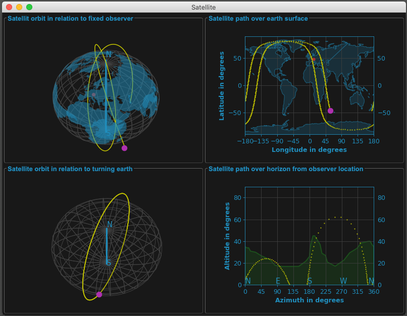

Keypad Window
-------------
The keypad window is just a copy of the original virtual keypad or the web based
keypad on newer firmware version (starting with firmware 2.16.11). Please make sure
that web service is enabled in your mount (under settings/network in the keypad),
otherwise you can't connect to themount.

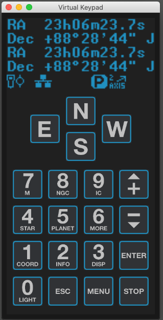

Analyse Window
--------------
The analyse window a collection of charts which show the actual model and how it
performs. This should help in finding problems in your setup.

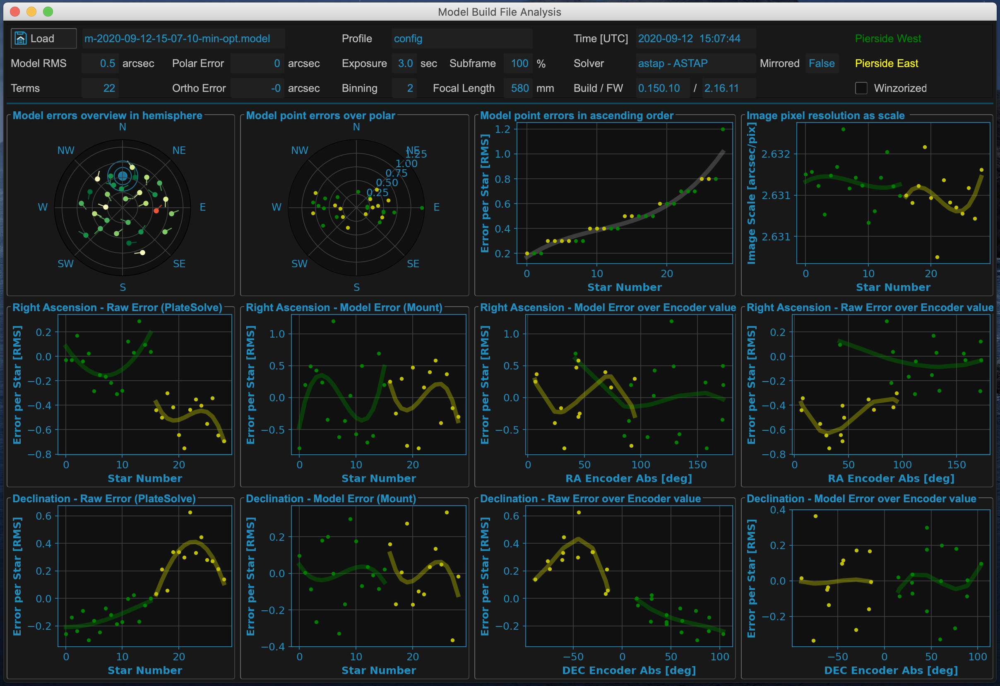

.. hint:: See also on youtube:  https://youtu.be/6jiCOqKgzZY
