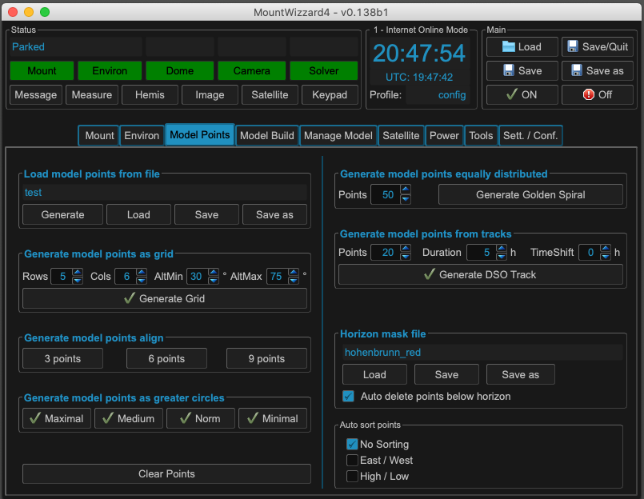
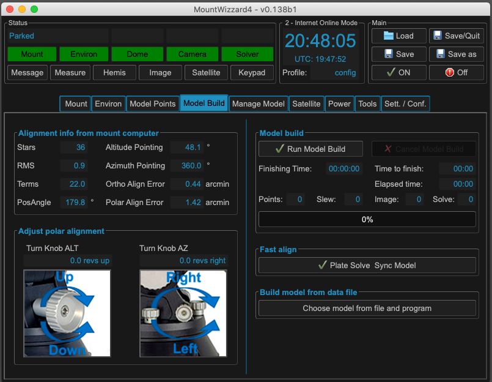
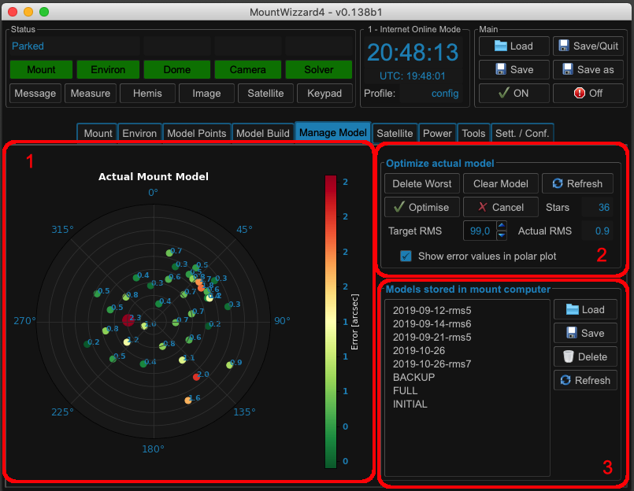
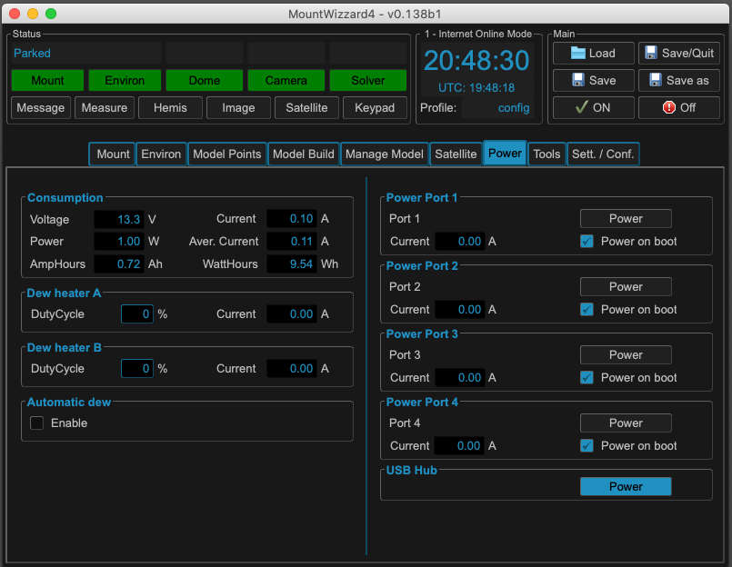
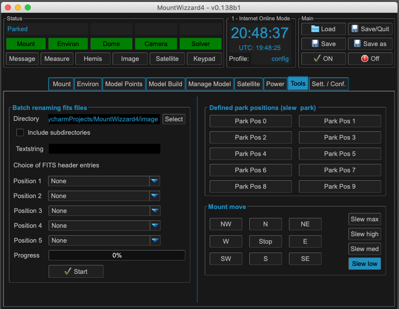

Explaining MW4
==============

Layout of main window
---------------------

After starting MW4 the first time you will see the main window. It consists of 4 areas to be
used:

.. image:: _static/explain_main_1.png
    :align: center

Area 1
^^^^^^

...describes the actual status of the important devices for modeling, shows status text
outputs from devices and open / shows status / closes additional windows for further work.

Area 2
^^^^^^
...shows actual computer time, UTC, and the actual profile. In header section there is
hint if MW4 work actually in online (internet connected) or offline mode.

Area 3
^^^^^^
...manages loading / saving profiles, boot and shutdown of the mount (if WOL is enabled
and the MAC address of the mount is known)

Area 4
^^^^^^
...shows different tabs for different use cases.

MW4 comes with tooltips which should help you to understand which button or widget is used
for what.

MW4 uses a direct IP connection to the mount computer. This could be done via ethernet cable
or wireless. A RS-232 connection is not supported ! The IP connection is heavily used to
make things happening and updating quick, so there is real traffic on this line.

.. note::
    Recommendation: If possible use MW4 with a wired IP connection (ethernet cable). This
    enables the WOL (wake on lan) function and has lower latency for the IP traffic. Using a
    bad WiFi connection might cause timeouts in communication.

When connected MW4 uses for all functions (except the computer time shown in area 2) the
timebase of the mount. This is also valid for the UTC shown in area 2 as well for other
functions or data using time. You could choose yourself, how the time base of the mount is
tracked by using a NTP solution, the 10micron tool or using GPS during boot also for time
update.

Mount tab
---------

.. image:: _static/explain_mount_tab.png
    :align: center

Area 1: Pointing
^^^^^^^^^^^^^^^^
In addition altitude (ALT) and azimuth (AZ) is shown in degrees.As soon as the mount is connected, the mount tab shows the telescope pointing in hour angle
(HA), right ascension (RA), declination (DEC) in hours / degrees HMS/DMS as well in decimals
. You could choose if you want to see the coordinates in JNow, the mount representation or
in J2000 Epoch for better compatibility to other programs. The handling of coordinates
between MW4 and the mount computer is done in JNow. But this is folly transparent for the
usage.

Area 2: Track and Flip
^^^^^^^^^^^^^^^^^^^^^^
In the tracking / flip section the tracking could be switch on / off and if possible a flip
could be forced. The main tracking speed (lunar, solar or sidereal) is highlighted and could
be changed.

Parking / emergency stop put the mount in park position or stops and movement immediately.

Area 3: Mount Status
^^^^^^^^^^^^^^^^^^^^
In Status and settings from mount computer many parameters are visible and could be altered.
Whenever you see a frame around a value, you could click on it and change the parameter.
Some of the parameters could only be changed if the mount is connected.

Environ Tab
-----------
If you have environment sensors connected and configured you could see the overview in the
environment tab. The tab content is dynamically, the more connections you have, the more you
will see. The example is the maximum MW4 could support.

.. image:: _static/explain_environ_tab.png
    :align: center

Area 1: Data Sources
^^^^^^^^^^^^^^^^^^^^
Data of all different configured sources are shown here. If a source has no connection or
receives no data, the frame will turn red.

+----------+----------------+-----------------------------------------------------+
| source   | device         | remarks                                             |
+----------+----------------+-----------------------------------------------------+
| SkyMeter | Unihedron SQM  | for compensation it's gathering temperature as well |
+----------+----------------+-----------------------------------------------------+
| Power    | Pegasus UPB1/2 | both version are supported                          |
+----------+----------------+-----------------------------------------------------+
| Weather  | OpenWeatherMap | API needed, the pressure is at mount level !        |
+----------+----------------+-----------------------------------------------------+
| Sensor   | MBox, MGBox    | if connected as INDI external device, compatibles   |
+----------+----------------+-----------------------------------------------------+
| Direct   | MGBox          | if connected via GPS connector to mount             |
+----------+----------------+-----------------------------------------------------+

Area 2: Mount Refraction Data
^^^^^^^^^^^^^^^^^^^^^^^^^^^^^
This is the data the mount is working with. In the mount box there is the actual refraction
data the mount knows. You could set the refraction update method in this area or push the
data manually to the mount. Continuously means at any state, but filtered with a moving
average filter of 60s length. No tracking means updating whenever new data is coming, but
only when the mount is not in tracking state.

If no source for updating the refraction data is available, but needed, this part will turn
red. The update mode is set in mount computer if "Direct" source is selected or done through
MW4 for all others sources.

Area 3: Online Forecast
^^^^^^^^^^^^^^^^^^^^^^^
If you have a online connection enabled, you could see the weather forecast for your
location from clearoutside. Thanks to these guy to agree on this integration. The location
is automatically set to the location of your mount.

Area 4: Source Selection
^^^^^^^^^^^^^^^^^^^^^^^^
If a source frame has a checkbox, this source could be chosen for using it's data for
refraction update. As you might have different ones, you have the choice.

Model Points Tab
----------------
Before starting model build, you need to choose which set of reference location you would
like to use for your model. The model calculation is done by the mount computer itself. MW4
only automates the procedure for you. Generally speaking you should set you references in
areas you need for imaging later on. In a fixed setup you would like to distribute it
equally over the sky. MW4 allows multiple choices to automatically select the references.

.. note:: The mount computer only processes max 100 points.

Area 1: Reference Types
^^^^^^^^^^^^^^^^^^^^^^^
The following type of placing the reference points in the hemisphere are available:

+-------------------+-----------------------------------------------------+
| type of reference | remarks                                             |
+-------------------+-----------------------------------------------------+
| file              | loading from a file                                 |
+-------------------+-----------------------------------------------------+
| grid              | grid in alt / az equally spaced                     |
+-------------------+-----------------------------------------------------+
| align             | subset of grid with 3 / 6 / 9 points                |
+-------------------+-----------------------------------------------------+
| greater circles   | references along ra / dec movements                 |
+-------------------+-----------------------------------------------------+
| golden spiral     | algorithm for placing it equally over hemisphere    |
+-------------------+-----------------------------------------------------+
| DSO tracks        | placing along dec movement from actual position     |
+-------------------+-----------------------------------------------------+

Sorting should be done automatically in a way to reduce slewing times.

Area 2: Horizon Management
^^^^^^^^^^^^^^^^^^^^^^^^^^
You might add a horizon mask to avoid placing references in positions where you have
obstacles in your sky view. When auto delete is checked, MW4 will remove automatically all
not visible reference points from modeling list. In addition you could choose a sorting of
you own, if you prefer / need different optimisations.

Model Build Tab
---------------
Starting / Stopping, status and the progress of modeling is shown on this tab. MW4 tries to
give you some help to adjust the alignment easy and right.

Area 1: Alignment Status
^^^^^^^^^^^^^^^^^^^^^^^^
Actual alignment model of the mount in use. It shows the parameters of the actual model and
it's errors regarding orthogonal and polar align.

Area 2: Model Build Progress
^^^^^^^^^^^^^^^^^^^^^^^^^^^^
Show the modeling process and some estimations about timing fo the overall process.

Area 3: Alignment Helper
^^^^^^^^^^^^^^^^^^^^^^^^
If you are starting polar align, the deviations might be that big, that focusing a reference
star might be impossible because this star is not in you FOV of the camera. The mount gives
you some hints how to tweak the mechanical setup to get you alignment. The pictures show you
the direction of turning based on a GM1000 mount in revolutions of these knows.

.. warning:: After you changed you mechanical setup by turning knows on your mount, the
             mount model is invalid! You have to do a new model build process to get a valid
             one.

Area 4: Fast Align
^^^^^^^^^^^^^^^^^^
If you simply want to readjust an existing model for a single reference point, you could
used Plat solve sync model. Please take into account, that no new model is calculated, but
the existing model is shifted to match the actual reference point. This might lead in larger
errors in other areas of the sky. From my point of view it is not recommended to use this
type of model syncing. It is only useful if you need a quick align on a single point.

Area 5: Programming Models
^^^^^^^^^^^^^^^^^^^^^^^^^^
For all the models you made with MW4, the necessary data is stored on your computer. With
this data you could reprogram the model without doing any imaging and plate solving process,
because it's already captured. MW4 could also combine multiple model setups to a new one.

This is a very powerful function: You could use is for reprogramming models you lost due to
mount error, using it as a backup if you tweaked the model. But you could also combine
different types of model to possible improve your model for certain use cases. For example
if you have a 50 point model for the overall sky, you could add a DSO track for you current
object to improve accuracy by modeling more points in your area of interest during this night.

Manage Model Tab
----------------

Satellite Tab
-------------

.. image:: _static/explain_satellite_tab.png
    :align: center

Power Tab
---------

Relay Tab
---------

Should be added later.

Tools Tab
---------

