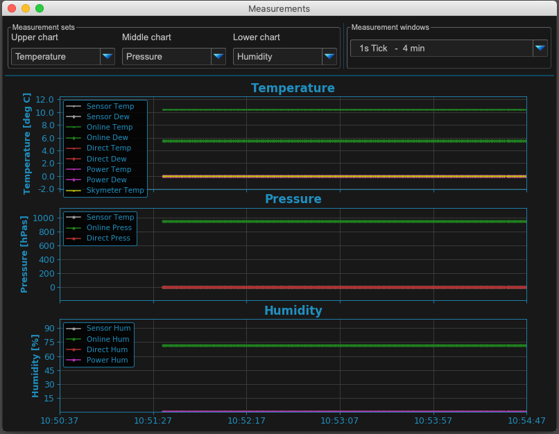
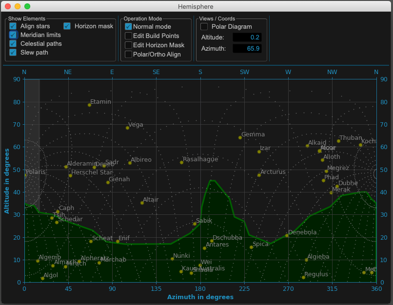
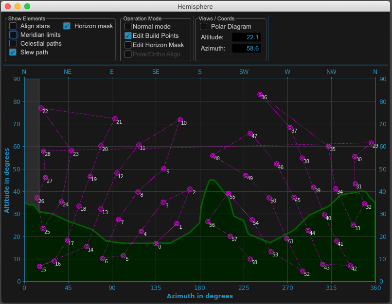
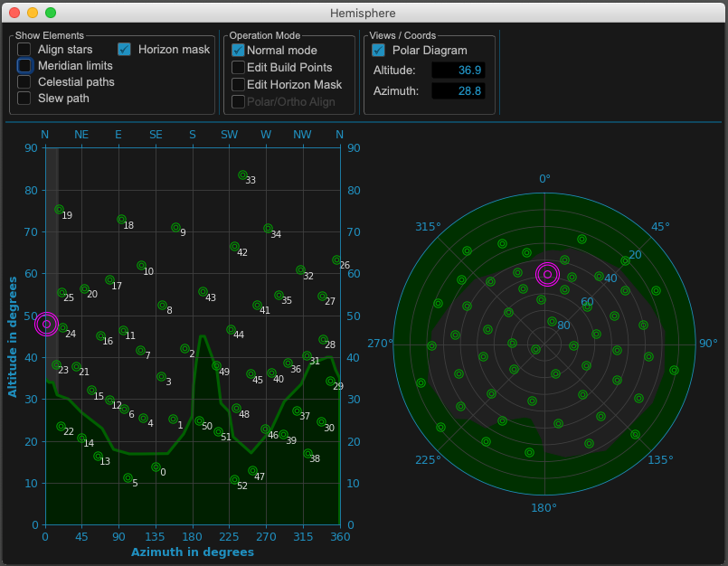
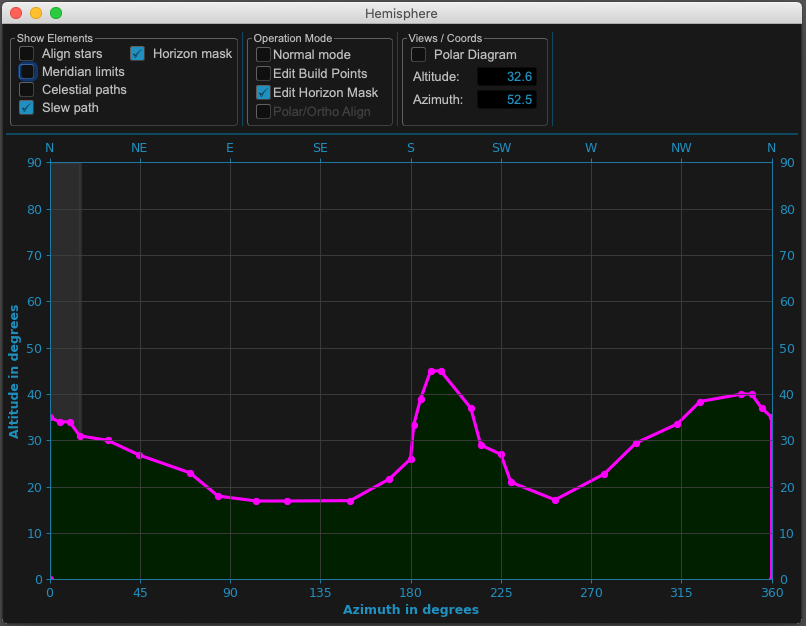
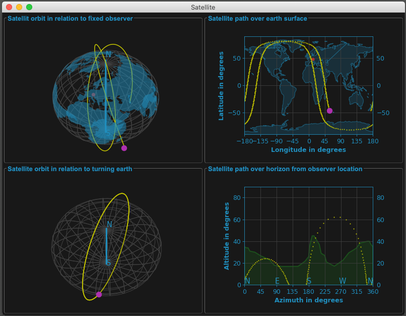
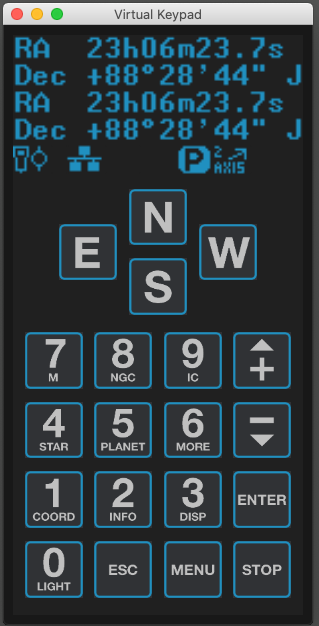

Explaining Extended Windows
===========================

Message Window
--------------
.. image:: _static/window_message.png
    :align: center

Measure Window
--------------

Hemisphere Windows
------------------
.. image:: _static/window_hemisphere_raw.png
    :align: center

Hemisphere Full
^^^^^^^^^^^^^^^

Hemisphere Slew
^^^^^^^^^^^^^^^
.. image:: _static/window_hemisphere_slew.png
    :align: center

Hemisphere Points
^^^^^^^^^^^^^^^^^
.. image:: _static/window_hemisphere_points.png
    :align: center

Hemisphere Points Edit
^^^^^^^^^^^^^^^^^^^^^^

Hemisphere Points Polar
^^^^^^^^^^^^^^^^^^^^^^^

Hemisphere Horizon Edit
^^^^^^^^^^^^^^^^^^^^^^^

Image Windows
-------------
.. image:: _static/window_image.png
    :align: center

Image Distortion Coordinates
^^^^^^^^^^^^^^^^^^^^^^^^^^^^
.. image:: _static/window_image_distortion.png
    :align: center

Satellite Windows
-----------------
.. image:: _static/window_satellite_empty.png
    :align: center

Satellite Visible
^^^^^^^^^^^^^^^^^
.. image:: _static/window_satellite_noaa.png
    :align: center

Satellite Visible Turned
^^^^^^^^^^^^^^^^^^^^^^^^

Keypad Window
-------------

