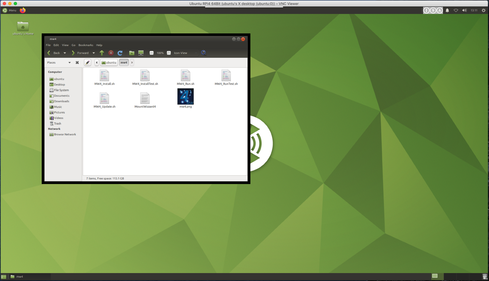
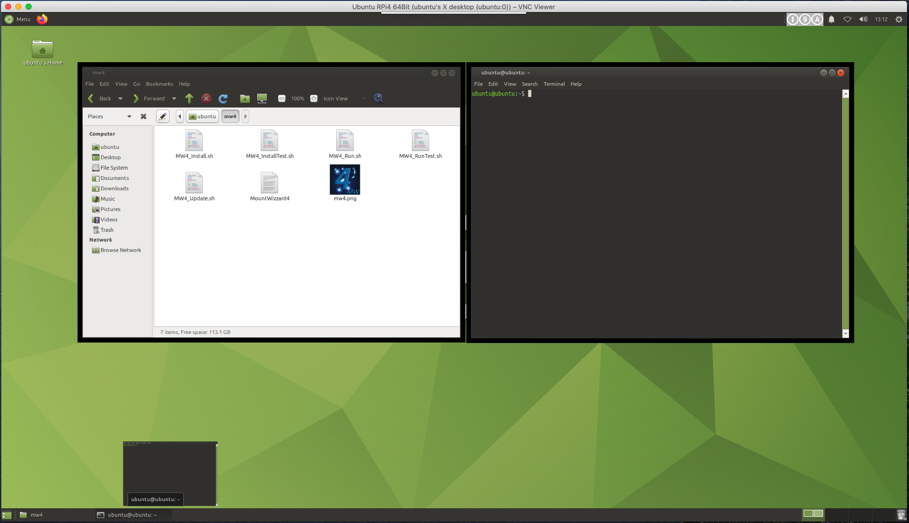

Installing MW4 on RaspberryPi 4
===============================

We are installing MW4 on an ubuntu 20.04.1LTS 64Bit system. In relation to the RPi3 it seems
to be much simpler to do. Nevertheless some of the big packages will be compiled on your
system during installation, which means this will take some time (hours).

Another big step forward is that you could use now a virtual environment for installing MW4.

Installing Python on RPi4
-------------------------

To get MW4 installed on RPi4 you will follow the instructions of Dustin Casto:

https://homenetworkguy.com/how-to/install-ubuntu-mate-20-04-lts-on-raspberry-pi-4/

to get Ubuntu Mate 20.04.1 LTS on your RPi4. After you have finished the setup and got the
desktop up and running, the command

.. code-block:: python

    python3 --version

should give you the following result 3.8.5: Please take care, that a python version 3.8.5 or
later is installed.

.. warning:: MW4 does not support python 3.9 right now because there are many precompiled
             packages missing for that version.

The actual Ubuntu mate 20.04.1LTS distribution comes with python 3.8.5, so everything should
be OK. Next we have to do is to install a virtual environment capability, the packet
manager pip and the development headers for python to be able to compile necessary packages:

.. code-block:: python

    sudo apt-get install python3-virtualenv
    sudo apt-get install python3-pip
    sudo apt-get install python3.8-dev          # for python 3.8
    sudo apt-get install python3.7-dev          # for python 3.7
    sudo apt-get install python3.6-dev          # for python 3.6

.. note:: You need to have both packages installed as otherwise the install script does not run.

If everything went fine, you could proceed like installing in Ubuntu. Attached some images
during installation:

.. image:: image/rpi4_scripts.png
    :align: center

.. image:: image/rpi4_running_install.png
    :align: center
