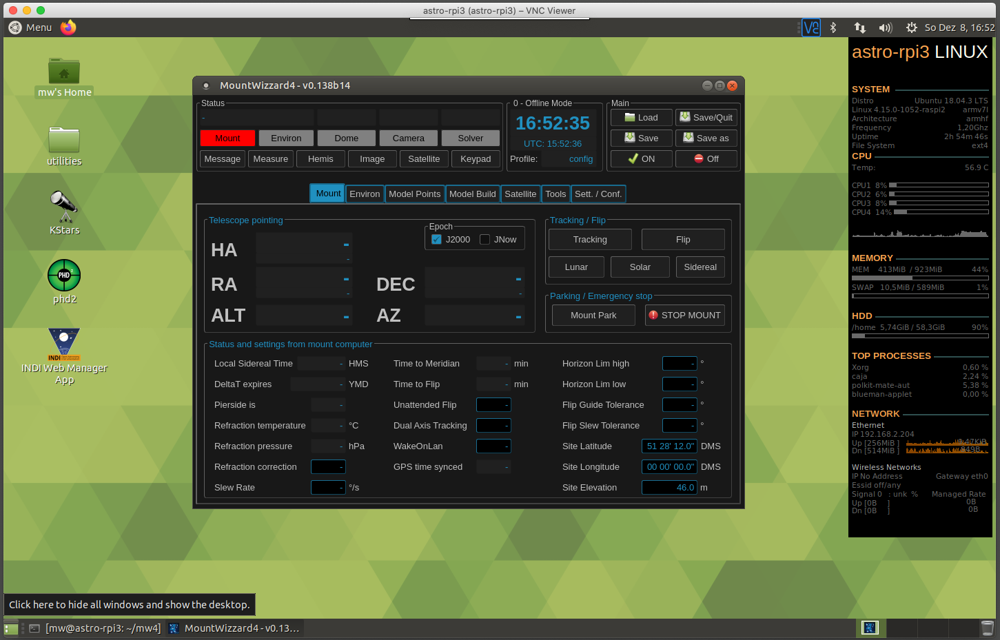

Installing MW4 on RaspberryPi 4
===============================

We are installing MW4 on an ubuntu 20.04.1LTS 64Bit system. In relation to the RPi3 it seems
to be much simpler to do. Nevertheless some of the big packages will be compiled on your
system during installation, which means this will take some time (hours).

Another big step forward is that you could use now a virtual environment for installing MW4.

Installing Python on RPi4
-------------------------

To get MW4 installed on RPi4 you will follow the instructions of Dustin Casto
https://homenetworkguy.com/how-to/install-ubuntu-mate-20-04-lts-on-raspberry-pi-4/
to get Ubuntu Mate 20.04.1 LTS on your RPi4. After you have finished the setup and got the
desktop up and running, the command

.. code-block:: python

    python3 --version

should give you the following result 3.8.5:

In addition you have to take care, that a python version 3.8.5 or following is installed.

.. warning:: MW4 does not support python 3.9 right now because there are many precompiled
             packages missing for that version.

The actual Ubuntu mate 20.04.1LTS distribution comes with python 3.8.5, so everything should
be OK. Next we have to do is to install a virtual environment capability:

.. code-block:: python

    sudo apt-get install python3-venv

If everything went fine, you could

Installing PyQt5 on RPI4
------------------------
So before you could actually run MW4 you need to install some mor libraries:

.. code-block:: python

    sudo apt-get install libgfortran5
    sudo apt-get install libjpeg-dev zlib1g-dev
    python3 -m pip install -U Pillow

Once you are set, make a work directory, cd to this directory and install MW4 by

.. code-block:: python

    python3 -m pip install mountwizzard4

and run MW4 with the command

.. code-block:: python

    python3 ~/.local/lib/python3.7/site-packages/mw4/loader.py

If everything went fine, you should see MW4 on RPi4:

