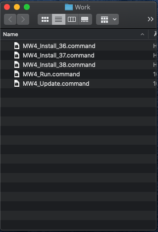
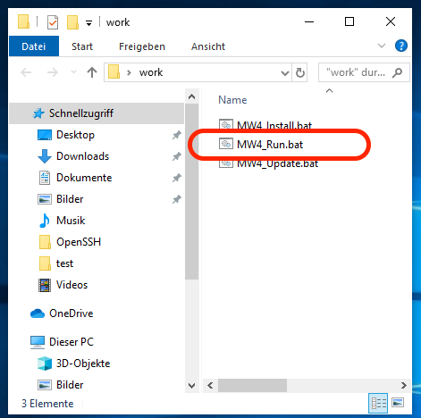
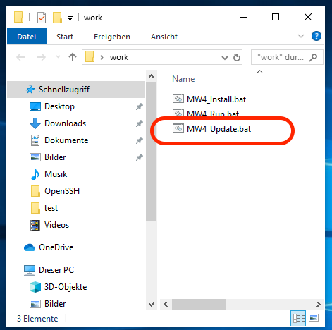

Installing MW4
==============

When starting with the installation of MW4, python3.7.x should be successful
installed. To check, open a terminal (available on all platforms) and run the command

.. code-block:: python

    python --version
    virtualenv --version

if you are on Ubuntu or Mac, you might have python 2 and python3 versions installed, please
refer to the following command:

.. code-block:: python

    python3 --version
    virtualenv --version

If you have on Ubuntu and Mac mor than one python3 version installed, please refer to the
following command:

.. code-block:: python

    python3.7 --version
    virtualenv --version

In one of the choices you should see the version number of the installed and available
packages. For python it should say 3.7.x.

To install MW4 on your computer, there are some support scripts available for Windows, OSx
and Ubuntu to make it a little bit easier to install and run MW4. The scripts are online, and
available from Github:

For Windows10: https://github.com/mworion/MountWizzard4/blob/master/support/Windows_Scripts.zip

For MacOs: https://github.com/mworion/MountWizzard4/blob/master/support/MAC_Scripts.zip

For Ubuntu: https://github.com/mworion/MountWizzard4/blob/master/support/Ubuntu_Scripts.zip

Please click the link and press download from the page:

.. image:: _static/install_mw4_scripts.png
    :align: center
    :scale: 71%

There is a video on youtube with the install process for Mac: https://youtu.be/xJxpx_SmrVc.

Step 1
------

Please create a working directory of your choice and location. The directory can
be renamed later on, it also can also be moved to any other location. Copy the scripts for your
platform into this directory.

the directory should than for OSx look like:

In Windows10 it looks like:

.. image:: _static/install_mw4_win_1.png
    :align: center
    :scale: 71%

.. warning::
    Please closely check if your working directory is writable. Otherwise MW4 could
    not work properly!

.. image:: _static/install_mw4_win_1.png
    :align: center
    :scale: 71%

Windows10 might as you the first time of execution the following question:

.. image:: _static/install_mw4_win_a.png
    :align: center
    :scale: 71%

and you could accept that by clicking "addition information" and than execute:

.. image:: _static/install_mw4_win_b.png
    :align: center
    :scale: 71%

Step 2
------

Run one of the scripts following script. During installation a terminal window might and
shows the progress of installation.

.. code-block:: python

    MW4_Install.bat         # Windows
    MW4_Install.sh          # Ubuntu
    MW4_Install.command     # OSx

With the script a virtual environment for python is installed in your working dir under the
name "venv". After that it installs all necessary libraries and MW4 itself into this virtual
environment. So any other installation of python applications is not influenced by MW4 install.

After running the install script the directory should for OSx look like:

.. image:: _static/install_mw4_mac_2.png
    :align: center
    :scale: 71%

In Windows10 it looks like:

In Windows10 for the first time you might be asked again for permission (see above).

Please use for the following step the install marked in red.

MW4 is already installed inside the virtual environment venv in your work dir.

.. warning::
    Please check if an online connection is available on your computer during installation
    as the libraries and MW4 is installed from online sources.

Step 3
------

Run one of the scripts

.. code-block:: python

    MW4_Run.bat         # Windows
    MW4_Run.sh          # Ubuntu
    MW4_Tun.command     # OSx

This script will start MW4 for the first time and it will create some subdirectories in your
working folder. When starting, a splash screen show the progress of it's initialization.
After first start the directory should for OSx look like:

.. image:: _static/install_mw4_mac_3.png
    :align: center
    :scale: 71%

In Windows10 it looks like:

In Windows10 for the first time you might be asked again for permission (see above).

With the first run you will see a log file written and you should have a first window from MW4
open. Please notice that there will be no visible terminal window, but a minimized power
shell in the menu. This might take some seconds before MW4 comes up with the splash screen:

.. image:: _static/install_mw4_first_run.png
    :align: center
    :scale: 71%

If you see the upper window, you succeed and from now on you are able to customize your
setup of MW4 and it's features.

Upgrade
-------

If you plan to upgrade MW4 to a newer release, you could use on of the

.. code-block:: python

    MW4_Update.bat         # Windows
    MW4_Update.sh          # Ubuntu
    MW4_Update.command     # OSx

scripts. In some circumstances this might be necessary, but for normal use MW4 has it's own
internal updater and using the script is not necessary.

