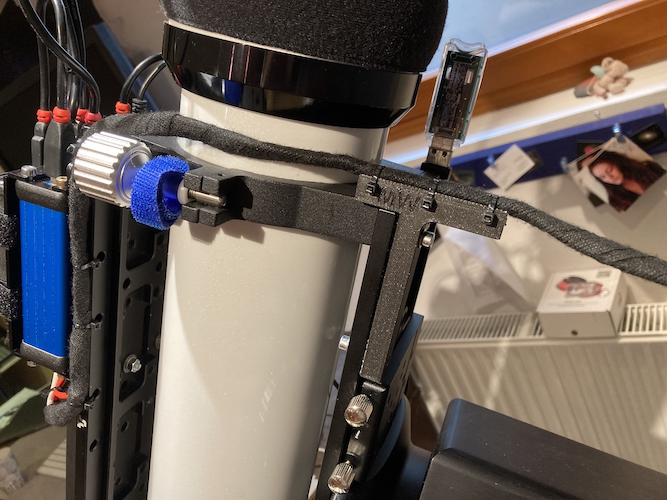
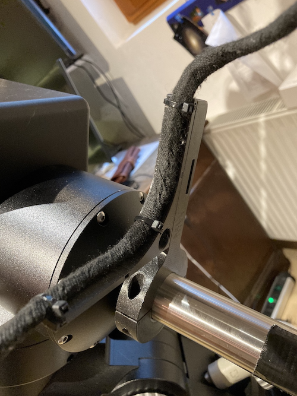
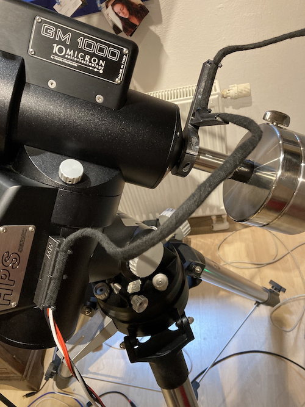
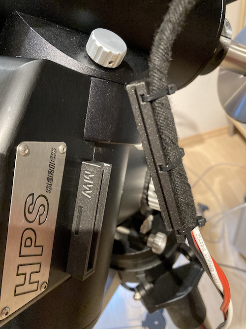
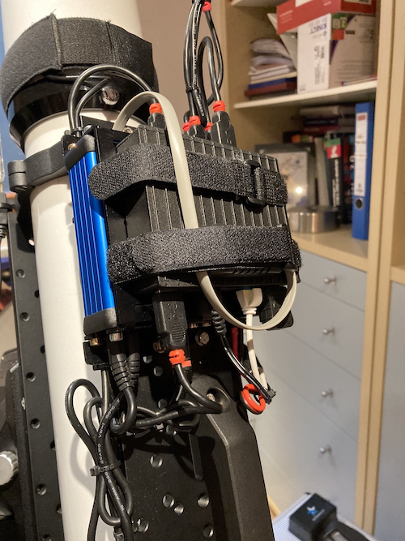
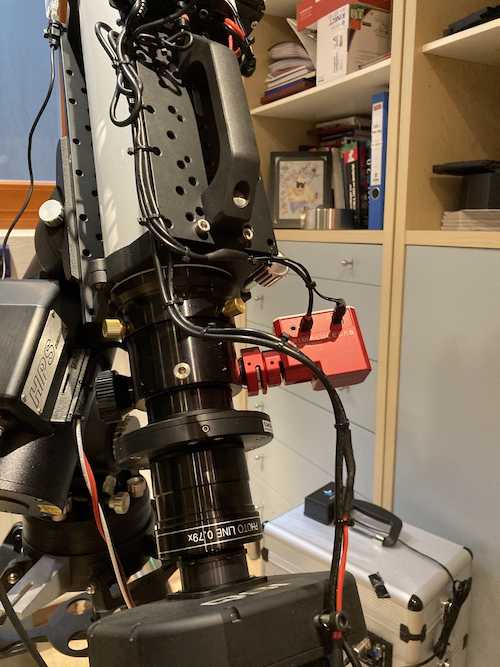

Cable Management
================
The connection to the mount consists of 3 wires power supply (one ground 2,5 mm :sup:`2`,
one 12V 1,5 mm :sup:`2` for PC, one 12V 1,5 mm :sup:`2` for UPB) and a single line
ethernet cat6 wire.,nothing else. So there is no USB connection outside the OTA on top of
the setup. I tried to use cable as short as possible.

For cable management I did some brackets and sliders with my 3D printer. for the used parts
you find the 3D STL files on https://github.com/mworion/MountWizzard4/tree/master/3D_Models

Description of parts for cable holders
--------------------------------------

..note:: Please remind the following comments from Scott:

You will need two M6-32 x 16 mm screws to attach cable-holder-part1.stl to the mount, replacing the 
much too shallow screws that are removed from the mount housing.

The T-bracket (cable-plate.stl) that you attach to your scope dovetail doesn't work for my setup and 
is likely only useful to you (specific to your scope, dovetail, and riser blocks). Requires a lot of 
vertical space between dovetail and scope and a particular hole pattern in the plate

Cable holder parts 2 and 3 (cable-holder-part3.stl) are redundant. I prefer cable-holder-part2.stl 
because it fits better.

Probably no big deal for somebody printing their own parts, but I paid for two parts that I couldn't 
use from a commercial 3D print shop.

OTA to Mount
------------
OTA is "sandwiched" between two aluminium plates for better stiffness of the OTA rings.

.. image:: image/img_9018.png
    :align: center
    :scale: 71%

T-shaped adapter for guiding the cables away from the base plate.

Cables running in arc to brackets on counterweight axe.

.. image:: image/img_9020.png
    :align: center
    :scale: 71%

Slider on bracket redirects cable to side

Cable running second arc to bracket on RA mounting. The screws fit in the place, where the
10micron laser adapter will be fitted.

With this construction there is no force to any RA / DEC axis and both rotations could be
handled separately. For an overall flexibility over the hemisphere there should be no issues.

Connection slider / bracket
---------------------------
Basic idea is that I could detach the cables when I tear down my setup. The cable is linked
to a slider, which connects to the bracket. Like other connections in astronomy it's a type of
dovetail solution.

Slider attached to bracket on mount

.. image:: image/img_9023.png
    :align: center
    :scale: 71%

Detached cable from bracket

Sliding on holder

.. image:: image/img_9025.png
    :align: center
    :scale: 71%

Cables on OTA
-------------
On top of the dew shield of the OTA the FlipFlat and an Unihedron SQM is attached.

.. image:: image/img_9026.png
    :align: center
    :scale: 71%

On tho top base plate of the OTA there is a stack of the Pegasus Ultimate Power Box and an
embedded PC (really embedded -40 to +85 degrees C) running Ubuntu 18.04. As I have more than
one temp sensor (MGBox, UPB, SQM) I
used the temp sensor of the UPB on top of the embedded PC to measure the housing temp of the
stack (important if the setup stays outside covered, but in the sun)

Connecting camera and focuser

