Mounting FlipFlat and SQR
=========================

.. warning:: Before starting please check if this solution also work for your
             environment. This means please check carefully dimensions and
             devices. Changes made are on your own risk !

Description of parts
--------------------

..note:: Please use adequate parts if you would like to follow the example. In
         my setup the diameter of the dew shield is 121.3 mm. It's a
         Teleskop-Express Photo Line TLAPO1027-FT.

2 x M4 x 30 mm for connection dew shield ring to holder attachment
2 x M4 x 15 mm for connecting the two dew shield rings
2 x UNC #6 x 1/2 for connecting the Alnitak FlipFlat to the holder
4 x M3 x 25mm self cutting screws for attaching the unihedron to the holder
1 base ring
1 attachment ring
1 holder

Parts: Unihedron and FlipFlat
-----------------------------
Back of the unihedron sqr with the USB interface.

.. image:: image/img_9482.png
    :align: center
    :scale: 71%

Front of the unihedron sqr with lens.

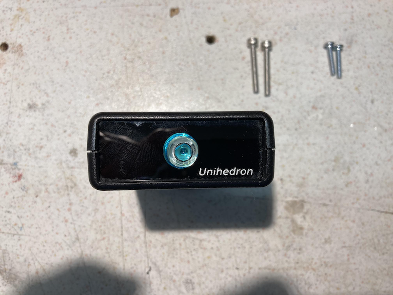

Alnitak Flip Flat device without any original holder part attached.

.. image:: image/img_9484.png
    :align: center
    :scale: 71%

The STL holder part.

.. image:: image/img_9485.png
    :align: center
    :scale: 71%

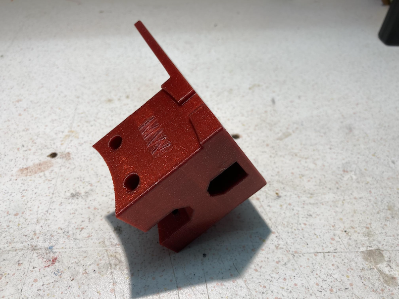

.. image:: image/img_9487.png
    :align: center
    :scale: 71%

1. Step: attaching the unihedron to the holder
----------------------------------------------
Please remove to original 4 screws, which close the package of the device from the button.
Put the device upside down below the holder part and use the 4 self cutting screws to fix
the unihedron to the holder.

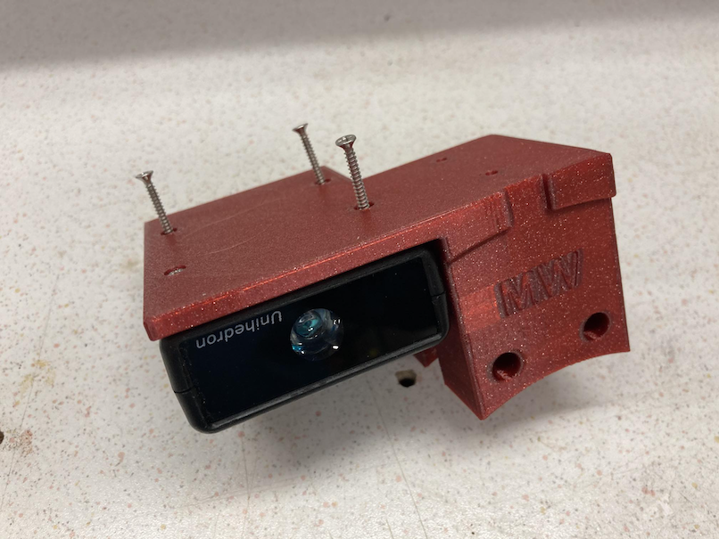

.. image:: image/img_9489.png
    :align: center
    :scale: 71%

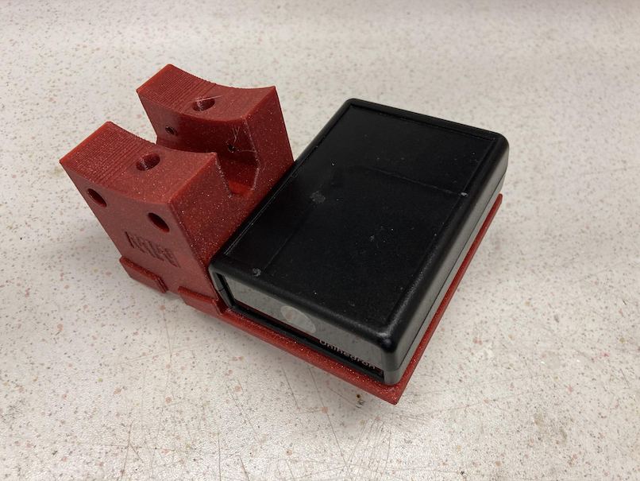

.. image:: image/img_9491.png
    :align: center
    :scale: 71%

The screws should fit easily and should not stand out of the surface.

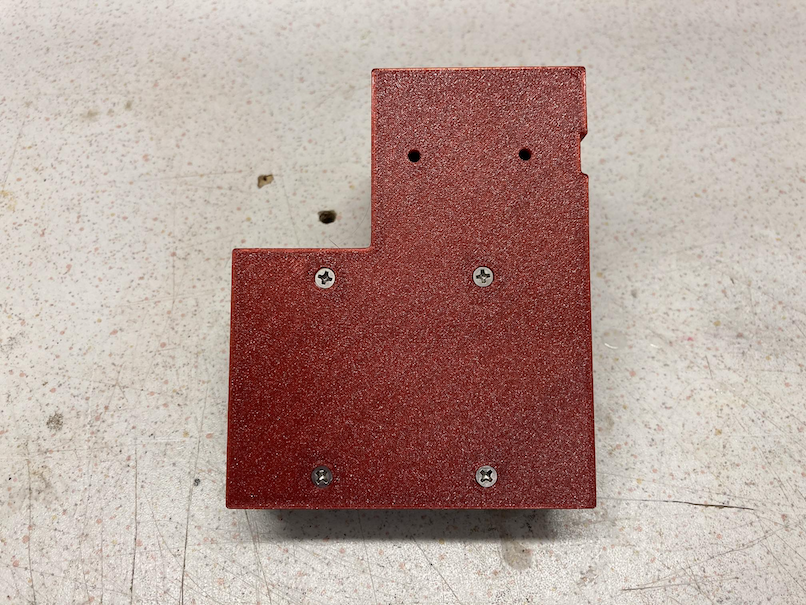

2. Step: screw on the FlipFlat to the holder
--------------------------------------------
Plug in the screws for the FlipFlat

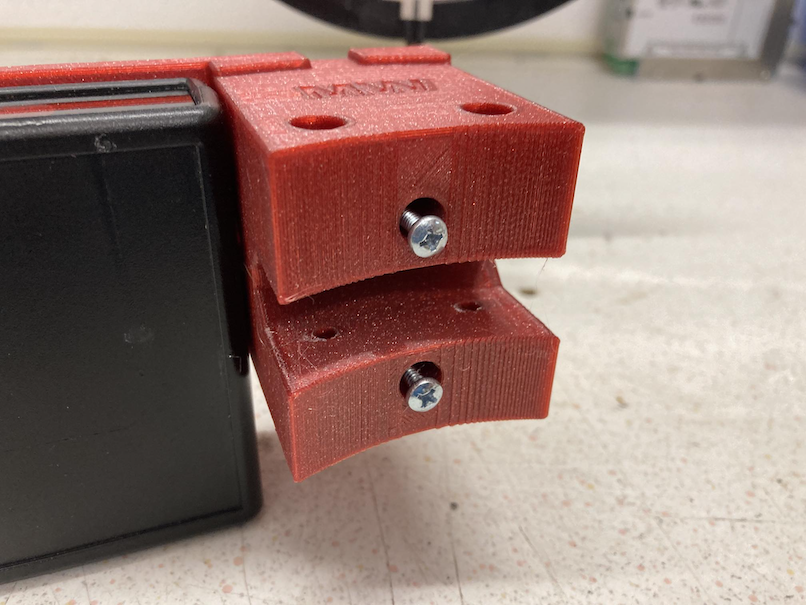

and turn them until they are equal to the surface of the holder.

.. image:: image/img_9494.png
    :align: center
    :scale: 71%

Both screws should fit into the thread nut of the FlipFlat

.. image:: image/img_9495.png
    :align: center
    :scale: 71%

Hand tighten the screws.

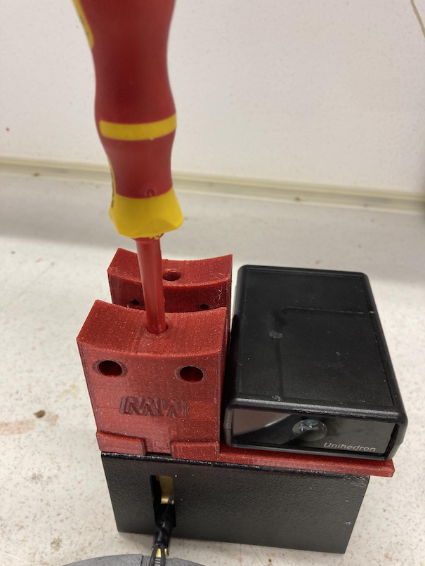

Now you got the holder with the attached devices.

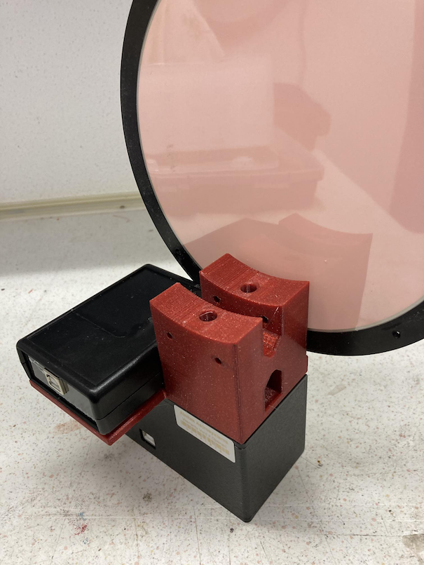

.. image:: image/img_9498.png
    :align: center
    :scale: 71%

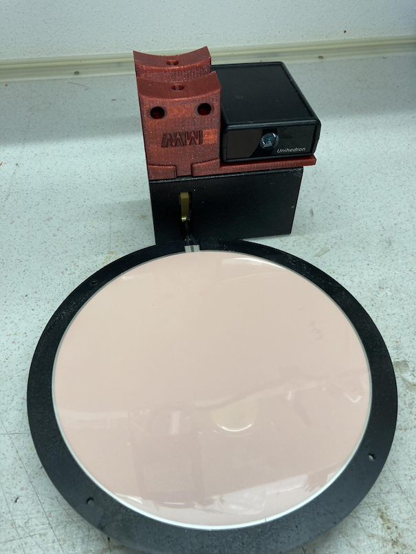

3. Step: attach the two drew shield rings
-----------------------------------------
The OTA ring with the nose should be on the upper side of the OTA the second on
the lower side. Use two M4 screws to tighten the connection. As I used PETG, I
did not need a thread nut. please check this in your case.
The OTA ring should be directly linked to the drew shield end.

.. image:: image/img_9501.png
    :align: center
    :scale: 71%

4. Step: attach the holder to the dew shield ring nose
------------------------------------------------------
The holder slips exactly on the nose of the dew shield rings.

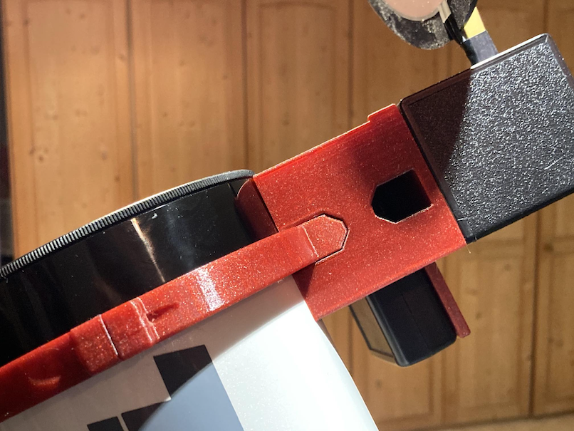

It will be fixed by 2 M4 screws. These screws are inserted from the front.

.. image:: image/img_9503.png
    :align: center
    :scale: 71%

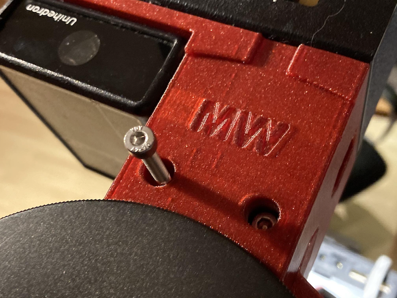

To tighten it, please use an allen key.

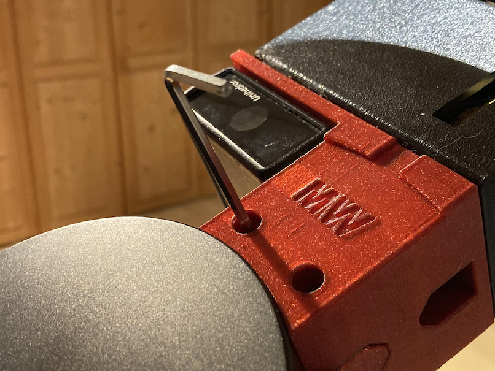

Finally you made it.

.. image:: image/img_9506.png
    :align: center
    :scale: 71%

Assembled setup:
----------------
Finally you get an clean setup which both devices connected.

.. image:: image/img_9507.png
    :align: center
    :scale: 71%

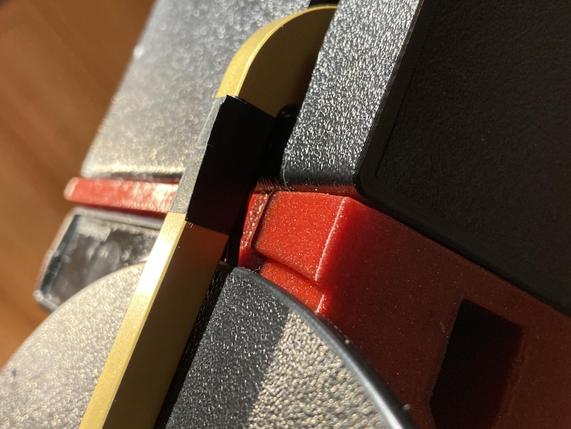

Connect the USB cables and your are set !

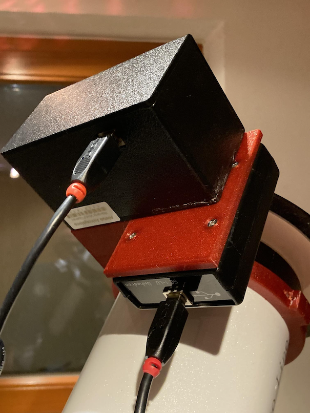

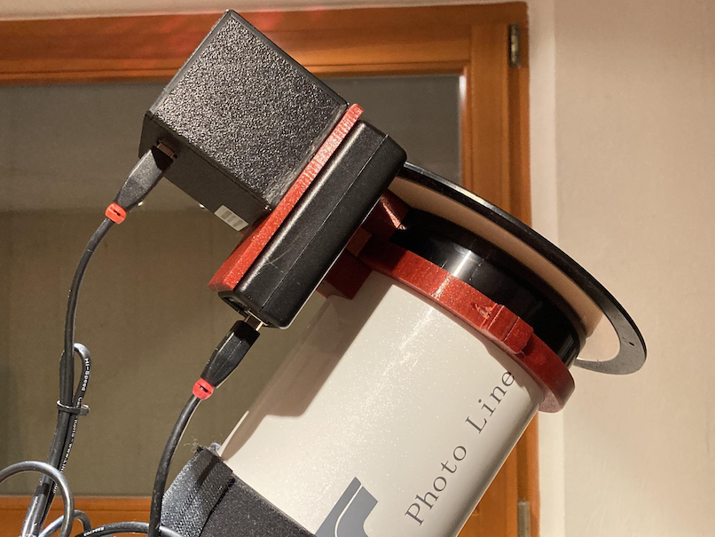
