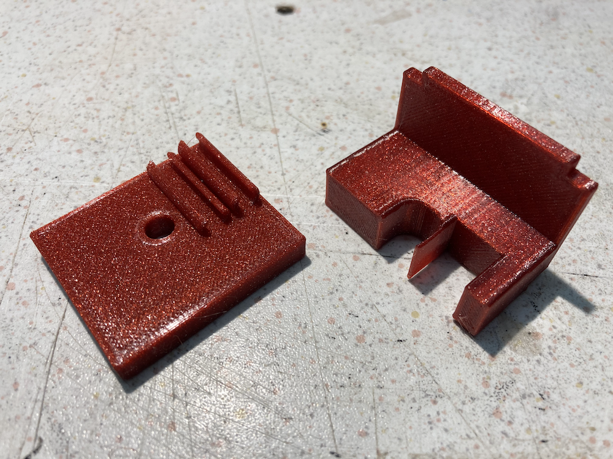
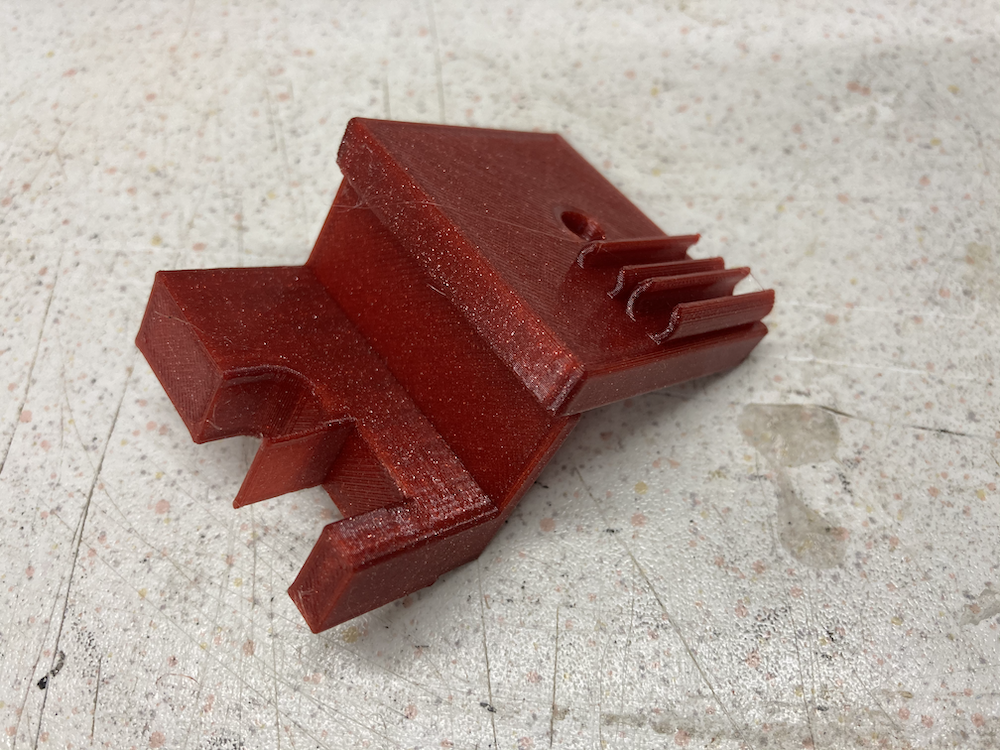
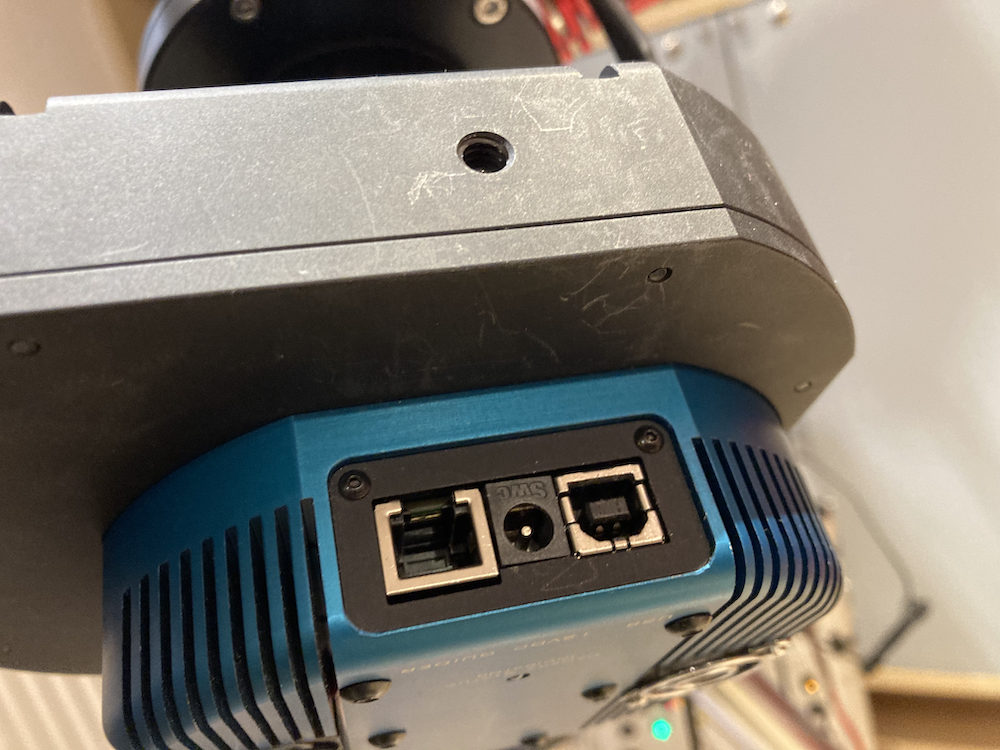
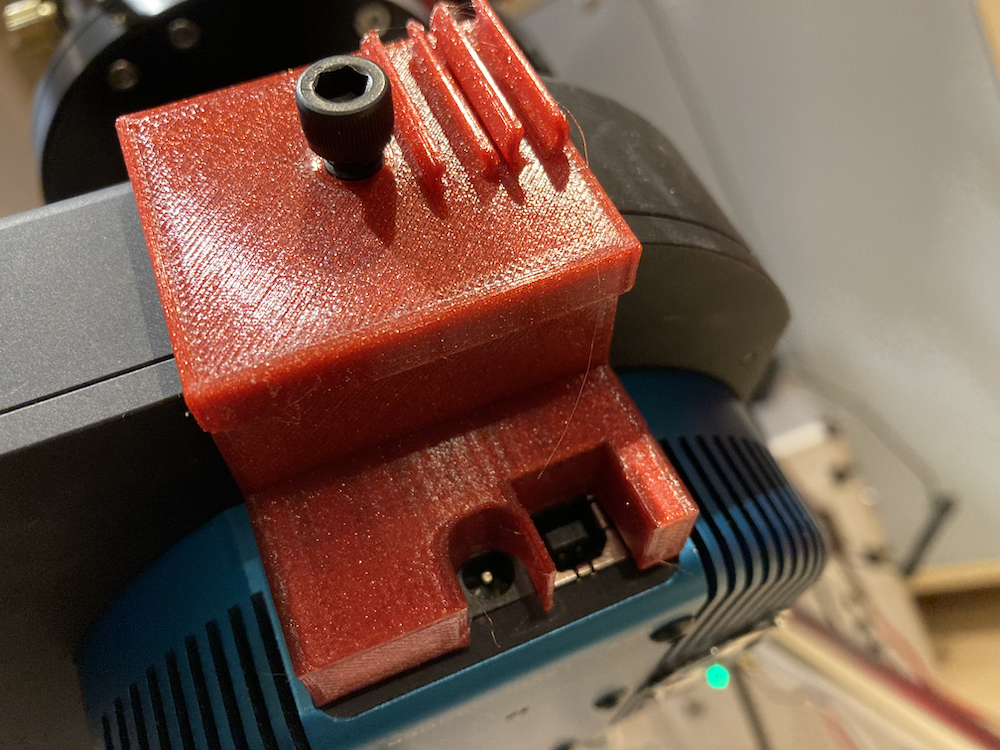
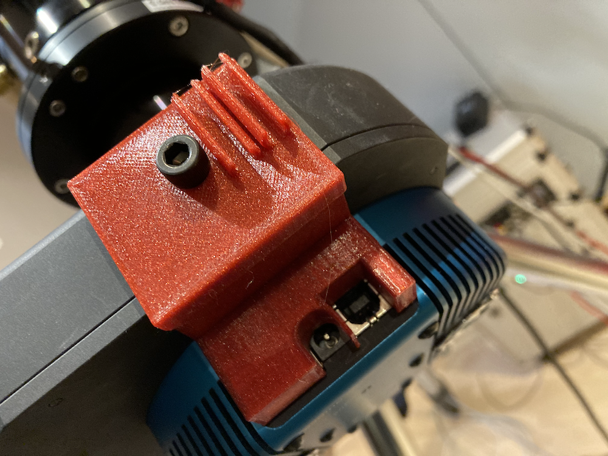
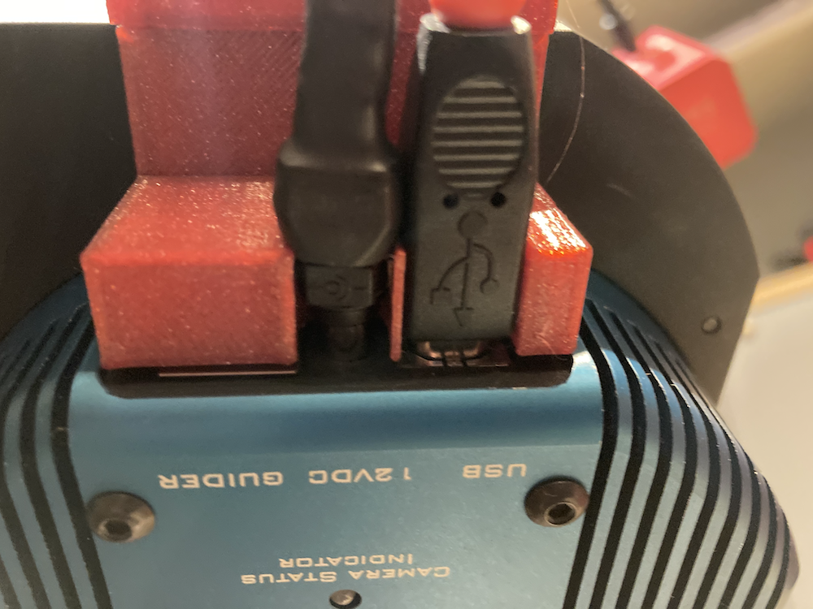
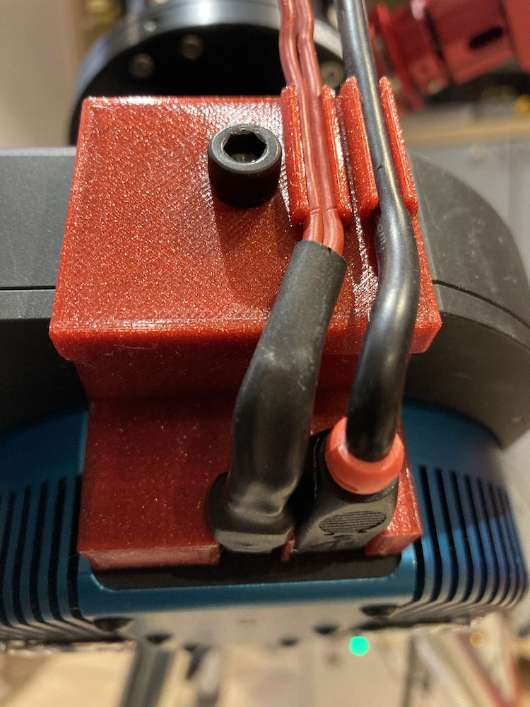

Securing power and USB connector
================================

.. warning:: Before starting please check if this solution also work for your
             environment. This means please check carefully dimensions and
             devices. This setup might not work for you.

.. warning:: Changes on all devices are made at your own risk!

Description of parts for QSI690 connectors
------------------------------------------

.. note:: Please use adequate parts if you would like to follow the example. In
          my setup the wires are used for connecting to PegasusUPBv2.

Two part for the holder and one screw fitting to the thread in the attached filter
wheel of the QSI camera

The wo holder parts

The fit together without any tool needed.

Image of the thread on the QSI690 filter wheel

1. Step: attaching the combined holder to the filter wheel
----------------------------------------------------------
Put the holder in top of the filter wheel and fit the screw

2. Step: tighten the screw and attaching the USB and power connector
--------------------------------------------------------------------

USB and power connector should fit in the designed places tight, but without
great force and keep them in the connector.

3. Step: link the wires to the brackets in top of the holder
------------------------------------------------------------

