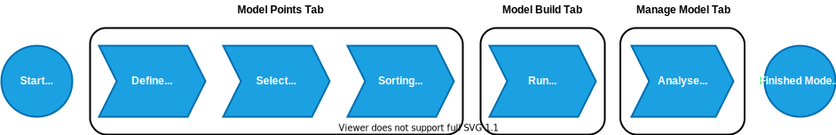
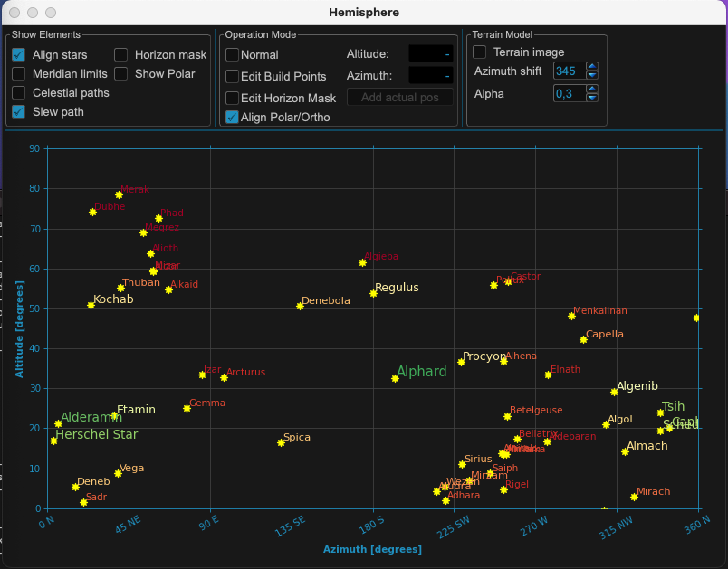
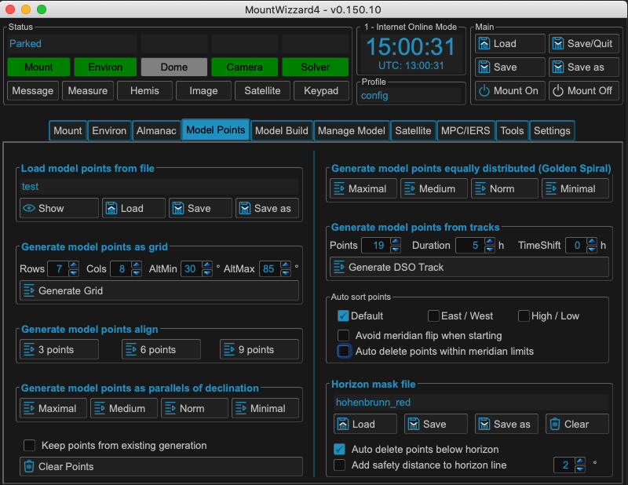
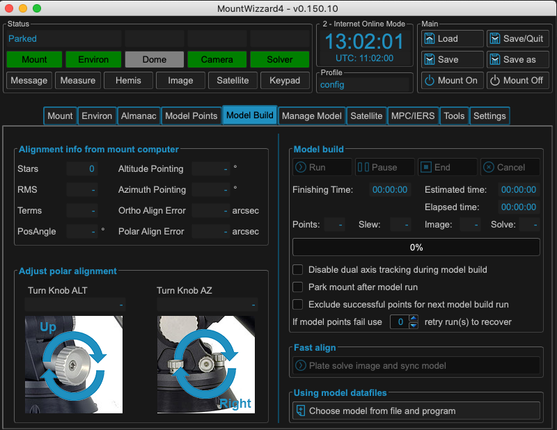
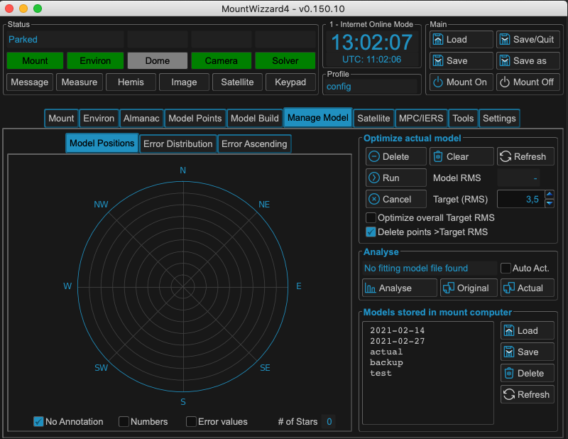

Modeling Process
================

MW4 has a straight forward approach for building models. The following chart shows
each basic step.

The necessary steps follow the order in MW4 main tab:

Step 1: polar alignment
-----------------------
Description :ref:`Polar align your mount`

Step 2: selecting model points
------------------------------
Description :ref:`Selecting model points`

Step 3: running the model build
-------------------------------
Description :ref:`Running a model build`

Step 4: managing mount models
-----------------------------
Description :ref:`Managing mount models`

General remarks:
----------------
Description :ref:`Model Building Remarks`

.. toctree::
    :maxdepth: 1

    model_polar_align
    model_points
    model_build
    manage_model
    remarks