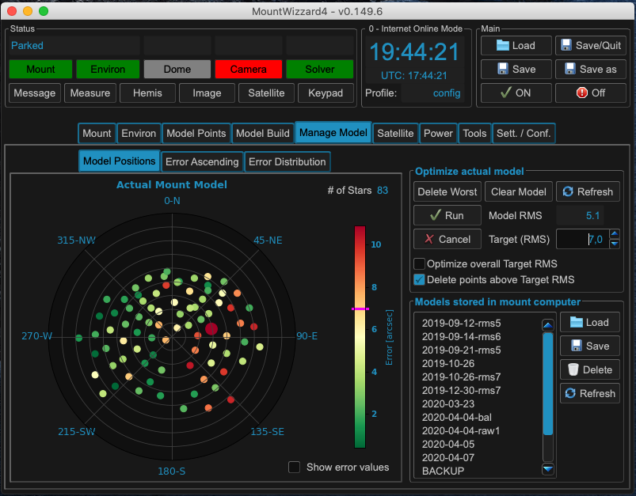

Selecting model points
======================
Managing your models is a central task especially if you image in a mobile
environment. MW4 supports this in the Manage Model Tab in the main window. All
functions there are related to the actual mount model or the models stored in the
mount.

Three graphs are available for checking the model:

.. hlist::
    :columns: 1

    * Model Positions
    * Error ascending
    * Error Distribution

.. note::   All values which are show in these graphs were calculated by the mount computer
            itself and just read out and displayed by MW4. As the 10micron algorithm of the
            model optimizer is not know. The given hints are observations.

The Model Positions graph shows in a polar plot how the model point were distributed over
the hemisphere and how large the errors of each point is in a color scheme. If necessary you
could check "Show error values" and numerical values will label each point.

