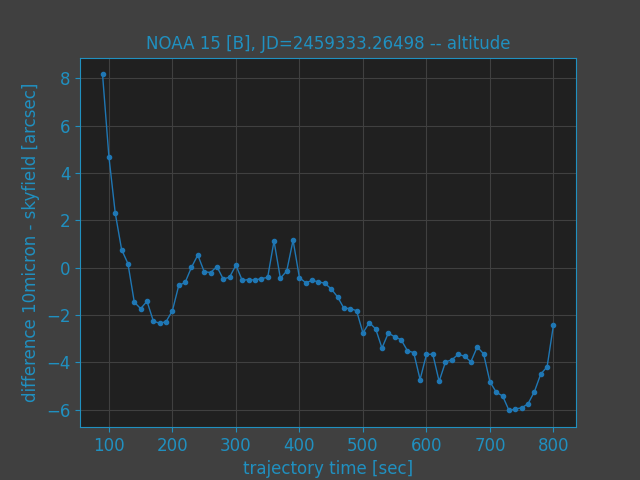
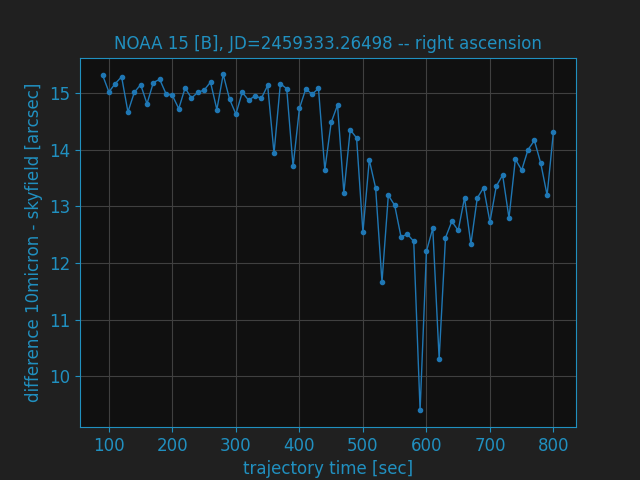
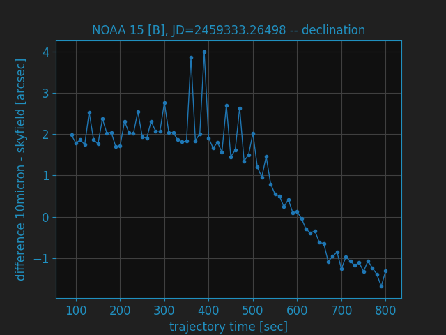

Satellite tracking
==================

Precision of the internal calculations
--------------------------------------
MW4 is using for all calculations the skyfield (https://rhodesmill.org/skyfield/)
from Brandon Rhodes. As for the new command set offered with 10microns FW3.x it
needs to calculate the alt/az coordinates for a satellite track each second for
the entire track. As you would like to follow the as precise as possible I made
some comparisons between the internal calculations done in 10micron mount and the
results provided by skyfield.

Here the charts for NOAA 15 [B] at julian date JD=2459333.26498 for the transit
happening. You could see the alt/az of the sat track.

.. image:: image/sat_track.png
    :align: center
    :scale: 71%

the difference for altitude between 10micron and skyfield

the difference for azimuth between 10micron and skyfield

.. image:: image/sat_azimuth.png
    :align: center
    :scale: 71%

the difference for right ascension between 10micron and skyfield

the difference for declination between 10micron and skyfield

For all calculations is valid:

- they are using refraction correction with the same values.

- the coordinates from 10micron are gathered with :TLEGEQJD#, :TLEGAZJD# commands

- julian date is in UTC time system

- 10micron firmware 3.0.4

- skyfield version 1.39

The used TLE data was:

.. code-block:: python

    NOAA 15 [B]
    1 25338U 98030A   21104.44658620  .00000027  00000-0  29723-4 0  9990
    2 25338  98.6888 133.5239 0011555 106.3612 253.8839 14.26021970192127

